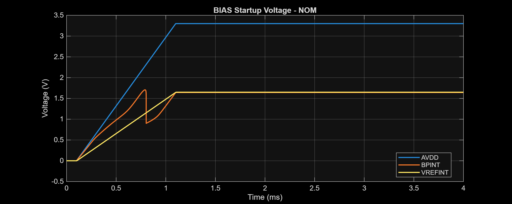
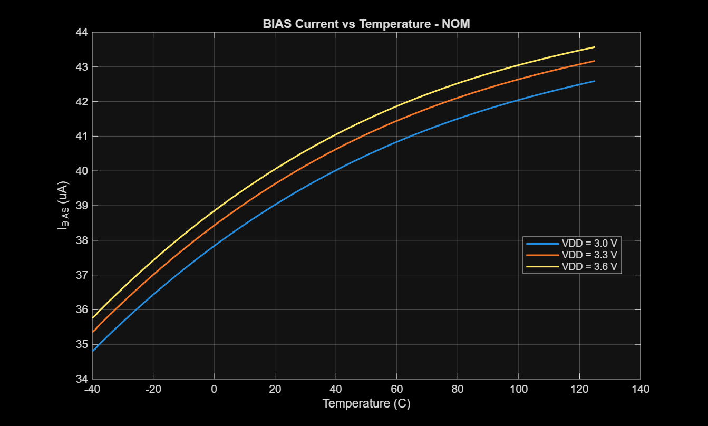
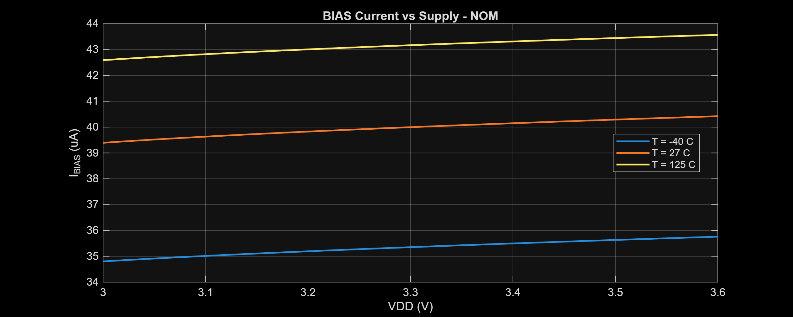
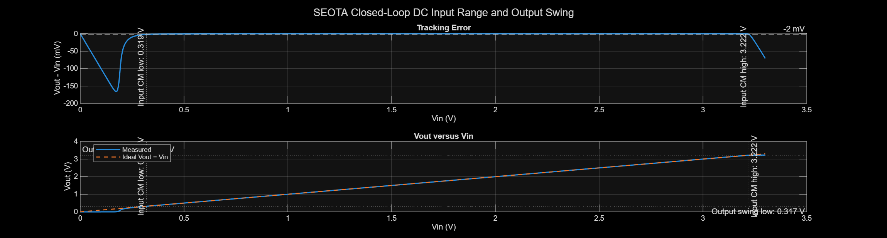

# ECG Acquisition IC Project Report

Last updated: 2026-08-16

Project stage: pre-layout schematic design and block-level verification

## 1. Executive Summary

This project develops a GF180 integrated circuit for electrocardiogram acquisition in the SSCS Chipathon 2026 flow. The repository contains the analog building blocks, an integrated AFE schematic, Xschem/ngspice testbenches, MATLAB analyzers, generated block-level reports, and gm/Id sizing data.

Current generated verification is strongest for three areas:

1. BIAS/SEL characterization across process, supply, temperature, startup, selector operation, and two-dimensional DC grids.
2. Single-ended OTA characterization over 45 process/voltage/temperature points using 450 raw open-loop and closed-loop exports.
3. Nominal fully differential OTA, differential core, and common-mode feedback characterization.

The AFE schematic and AC/noise/transient testbenches are present, but no current generated AFE CSV or plot set is stored in the repository. Therefore this report does not claim integrated AFE performance. The SAR ADC in the system specification is also not implemented in the verified design.

All reported values are deterministic pre-layout schematic simulations. No mismatch, Monte Carlo, extracted-parasitic, package, pad, PCB, or measured-silicon results are available.

## 2. Repository Scope

### 2.1 System Files

| File | Purpose |
| --- | --- |
| `Design_Files/System Design/ECG Acquisition IC with 10-bit SAR ADC SPEC.xlsx` | System-level specification |
| `Design_Files/System Design/System_Block.drawio` | Editable system diagram |
| `Design_Files/System Design/System_Block.png` | Rendered system diagram |


### 2.2 Schematic Blocks

The project-owned schematic tree contains:

- AFE integration.
- BIAS, MIRROR, and SEL reference circuitry.
- INA, SE OTA, FD OTA, FDC, CMFB, LPF, PGA, and BUFFER signal-chain blocks.
- RLD, transmission-gate, and inverter support blocks.

### 2.3 Testbench and Analyzer Coverage

| Area | Testbenches | Analyzer and generated evidence |
| --- | --- | --- |
| BIAS/SEL | Five process testbenches | `BIAS_Analyze.m`, seven CSV reports, six NOM plots |
| SE OTA | OL and CL testbenches for NOM/FF/SS/FS/SF | `SEOTA_Analyze.m`, 450 TXT inputs, two primary CSV reports, eight NOM plots |
| FD OTA | Nominal OL, CL, ICMR, and noise testbenches | `FDOTA_Analyze.m`, summary CSV, nine plots |
| FDC | Nominal differential, plant, and CMFB testbenches | `FDC_Analyze.m`, summary CSV, six plots |
| CMFB | Nominal OL and CL testbenches | `CMFB_Analyze.m`, summary CSV, three plots |
| AFE | AC, noise, and transient testbenches | Analyzer source present; generated report set absent |
| gm/Id | NMOS and PMOS characterization testbenches | Sizing scripts and generated plots |

## 3. Nominal Conditions

The common nominal conditions used by the currently generated OTA reports are:

| Condition | Value |
| --- | ---: |
| Process | NOM |
| AVDD | 3.3 V |
| Common-mode voltage | 1.65 V |
| Bias target | 40 uA |
| Load capacitance | 10 pF |
| ECG noise integration band | 0.05-150 Hz for SE OTA |

Individual testbenches remain the source of truth for stimulus timing and node definitions.

## 4. Verification Methodology

### 4.1 BIAS/SEL

The BIAS flow reports nominal and corner operating quantities, 35 startup runs, selector errors, and five process-dependent temperature/supply grids. The DC grid spans -40 C to 125 C and 3.0 V to 3.6 V. Global extrema include the process, temperature, and supply location.

### 4.2 SE OTA PVT Grid

The SE OTA flow covers five processes:

`NOM`, `FF`, `SS`, `FS`, `SF`

Each process contains nine environmental cases:

`nom`, `vl`, `vh`, `tl`, `th`, `vltl`, `vlth`, `vhtl`, `vhth`

Each PVT point generates seven open-loop and three closed-loop TXT files, giving 45 points and 450 files total.

The compact comparison report follows the BIAS convention:

- `NOM`, `FF`, `SS`, `FS`, and `SF` use each process at nominal supply and temperature.
- `VL`, `VH`, `TL`, and `TH` use the NOM process at the named environmental case.

The full-PVT worst-case report searches all 45 points. Corner names combine process, supply, and temperature. For example:

- `FFVHTL`: FF process, high supply, low temperature.
- `SFNOMTL`: SF process, nominal supply, low temperature.
- `NOMNOMNOM`: nominal process, nominal supply, nominal temperature.

### 4.3 SE OTA Calculations

Open-loop files provide:

- Operating current and power.
- Differential gain, UGF, and phase margin.
- CMRR and PSRR at 60 Hz and 150 Hz.
- Input offset from the differential-input VTC crossing at `VOUT = VDD/2`.
- Input-referred noise integrated from 0.05 Hz to 150 Hz.

`IDD_TOTAL` already includes BIAS, the bias mirror, and the SE OTA. The analyzer therefore uses:

$$
I_{TOTAL}=|I_{DD,TOTAL}|,
\qquad
P=V_{DD}I_{TOTAL}
$$

It does not add the exported bias current a second time. The ngspice input-noise density is used directly without dividing by OTA gain again.

Closed-loop files provide:

- Local unity-follower gain and gain error around `VDD/2`.
- Input common-mode range and output swing from the continuous region satisfying `|VOUT-VIN| <= 2 mV`.
- Average 10-90% rise and fall slew rates.
- Worst rise/fall settling time into the 2 mV tracking band.

### 4.4 FD OTA, FDC, and CMFB

The available FD OTA, FDC, and CMFB results are nominal-only. Their analyzers calculate operating point, AC stability, noise/offset, and the closed-loop metrics supported by their respective exported datasets. Very large CMRR and PSRR values are deterministic schematic results and should not be interpreted as mismatch-limited production performance.

## 5. Simulation Results

### 5.1 BIAS/SEL

| Metric | Result | Location |
| --- | ---: | --- |
| NOM bias current | 39.997 uA | NOM |
| Bias-current minimum | 31.054 uA | SS, -40 C, 3.0 V |
| Bias-current maximum | 49.441 uA | FF, 125 C, 3.6 V |
| Worst absolute bias-current error | 23.603% | FF, 125 C, 3.6 V |
| BP minimum / maximum | 1.138 V / 2.146 V | FS, 125 C, 3.0 V / SF, -40 C, 3.6 V |
| Maximum absolute VREF error | 6.154 uV | SS, -40 C, 3.6 V |
| Maximum absolute mirror error | 0.149% | FS, 125 C, 3.0 V |
| Minimum startup-device margin | 0.7415 V | FF, 125 C, 3.6 V |
| Maximum current / power | 103.971 uA / 374.297 uW | FF, 125 C, 3.6 V |
| Worst startup time | 1180.281 us | SS, TLVL |
| Startup failures | 0 of 35 | All tested runs |
| Maximum selector error | 25.466 nV | SS, TH |










### 5.2 SE OTA Nominal Results

| Metric | NOM result |
| --- | ---: |
| Bias current | 40.090 uA |
| Total current / power | 912.690 uA / 3.012 mW |
| DC gain | 93.850 dB |
| UGF | 12.103 MHz |
| Phase margin | 70.811 deg |
| Input offset | 14.555 uV |
| CMRR at 60 Hz / 150 Hz | 110.814 dB / 110.814 dB |
| PSRR+ at 60 Hz / 150 Hz | 103.772 dB / 99.332 dB |
| PSRR- at 60 Hz / 150 Hz | 103.772 dB / 99.332 dB |
| Input noise, 0.05-150 Hz | 1.876 uVrms |
| Input CM range | 0.319-3.222 V |
| Output swing | 0.317-3.220 V |
| Rise / fall slew rate | 10.052 V/us / 7.827 V/us |
| Settling time | 163.400 ns |

### 5.3 SE OTA Full-PVT Worst Cases

| Metric | Worst result | Corner |
| --- | ---: | --- |
| Bias current | 49.581 uA | FFVHTH |
| Total current | 1211.955 uA | FFVHTH |
| Total power | 4.363 mW | FFVHTH |
| Minimum DC gain | 89.687 dB | FSVLTH |
| Minimum UGF | 8.921 MHz | SSVLTH |
| Minimum phase margin | 64.399 deg | SSVLTH |
| Maximum absolute input offset | 21.441 uV | FSVLTH |
| Minimum CMRR at 60 Hz / 150 Hz | 108.153 dB / 108.153 dB | SSVLTH |
| Minimum PSRR+ at 60 Hz | 101.605 dB | SFVLTH |
| Minimum PSRR+ at 150 Hz | 97.250 dB | SSNOMTH |
| Minimum PSRR- at 60 Hz | 101.605 dB | SFVLTH |
| Minimum PSRR- at 150 Hz | 97.250 dB | SSNOMTH |
| Maximum input noise, 0.05-150 Hz | 2.188 uVrms | SSVLTH |
| Maximum absolute gain error | 0.001733% | FSVLTH |
| Maximum absolute Vout DC error | 21.439 uV | FSVLTH |
| Highest input CM low limit | 0.546 V | SSVHTL |
| Lowest input CM high limit | 2.787 V | FSVLTH |
| Highest output-swing low limit | 0.544 V | SSVHTL |
| Lowest output-swing high limit | 2.785 V | FSVLTH |
| Minimum rise slew rate | 7.695 V/us | SSVLTL |
| Minimum fall slew rate | 6.021 V/us | SSVLTL |
| Maximum settling time | 194.900 ns | SSVLTL |





### 5.4 Fully Differential OTA

| Metric | NOM result |
| --- | ---: |
| Total current / power | 1750.96 uA / 5.77816 mW |
| Differential gain | 87.1911 dB |
| Differential UGF | 12.1876 MHz |
| Differential phase margin | 72.989 deg |
| Input noise | 2.19977 uVrms |
| Closed-loop gain error | -0.0108885% |
| Input CM range | 0.691-3.190 V |
| Differential output swing | -3.06601 to 3.06601 V |
| Differential rise / fall slew rate | 7.40507 / 7.29644 V/us |
| Differential settling time | 284.1 ns |

The reported CMRR and PSRR values above 240 dB are dominated by ideal schematic symmetry and numerical precision. They are not realistic mismatch-limited specifications.

### 5.5 Differential Core

| Metric | NOM result |
| --- | ---: |
| Total current / power | 1631.19 uA / 5.38293 mW |
| Differential gain | 88.3619 dB |
| Differential UGF | 12.2358 MHz |
| Differential phase margin | 72.8937 deg |
| Plant gain | 18831 V/V |
| Input noise, 1-150 Hz | 2.46147 uVrms |

### 5.6 Common-Mode Feedback

| Metric | NOM result |
| --- | ---: |
| Total current / power | 39.7732 uA / 0.131252 mW |
| Open-loop gain | 43.9118 dB |
| UGF | 800.932 MHz |
| Phase margin | 86.4277 deg |
| Valid reference range | 1.12-2.76 V |
| Low/high settling time | 5.2 ns / 5.2 ns |

## 6. Generated Reports and Plots

### 6.1 BIAS/SEL

- `BIAS_table_report.csv`
- `BIAS_startup_report.csv`
- `BIAS_startup_summary.csv`
- `BIAS_sel_report.csv`
- `BIAS_dc2d_report.csv`
- `BIAS_global_worst_case.csv`
- `BIAS_reference_report.csv`
- Six NOM figures under `Measurement_Results/IC_Simulation/BIAS/Plots/`

### 6.2 SE OTA

- `SEOTA_table_report.csv`: nine-column compact comparison.
- `SEOTA_worst_case_report.csv`: full 45-point extrema and corner locations.
- `NOM.SEOTA_summary.csv`: compatibility copy of the compact comparison.
- Eight NOM figures under `Measurement_Results/IC_Simulation/SE_OTA/Plots/`.

### 6.3 FD OTA, FDC, and CMFB

- `NOM.FDOTA_summary.csv` and nine FD OTA plots.
- `NOM.FDC_summary.csv` and six FDC plots.
- `NOM.CMFB_summary.csv` and three CMFB plots.

## 7. Reproducibility

Run the corresponding Xschem/ngspice testbenches before MATLAB. From the repository root:

```bash
matlab -batch "addpath(fullfile(pwd,'Measurement_Results','IC_Simulation','BIAS')); BIAS_Analyze"
```

```bash
matlab -batch "run(fullfile(pwd,'Measurement_Results','IC_Simulation','SE_OTA','SEOTA_Analyze.m'))"
```

```bash
matlab -batch "run(fullfile(pwd,'Measurement_Results','IC_Simulation','FD_OTA','CMFB','CMFB_Analyze.m'))"
matlab -batch "run(fullfile(pwd,'Measurement_Results','IC_Simulation','FD_OTA','FDC','FDC_Analyze.m'))"
matlab -batch "run(fullfile(pwd,'Measurement_Results','IC_Simulation','FD_OTA','FDOTA','FDOTA_Analyze.m'))"
```

The SE OTA analyzer reads the full PVT grid once, derives the compact comparison from that cache, and searches the same cache for worst cases. MATLAB R2026a static analysis reports zero issues for the current script, and the complete 450-file analysis executes successfully.

Raw ngspice exports, schematic revision, generated CSV timestamp, and plot timestamp should be recorded together for formal reviews.

## 8. Limitations and Next Steps

| Priority | Item | Completion criterion |
| --- | --- | --- |
| P0 | Generate and review AFE results | Current AFE CSV reports and plots produced from the checked-in schematic/testbenches |
| P1 | Add mismatch and Monte Carlo | Statistical offset, gain, CMRR, PSRR, noise, and yield results |
| P1 | Complete layout and extraction | DRC/LVS-clean layout plus extracted block and AFE simulations |
| P1 | Reassess ideal rejection | Mismatch-aware and extracted CMRR/PSRR results |
| P2 | Integrate the SAR ADC | End-to-end analog-plus-ADC verification against the specification |
| P2 | Develop PCB and measurement plan | Supplies, interfaces, test points, equipment, and acceptance criteria documented |

No result in this report should be treated as measured or production-qualified performance.
