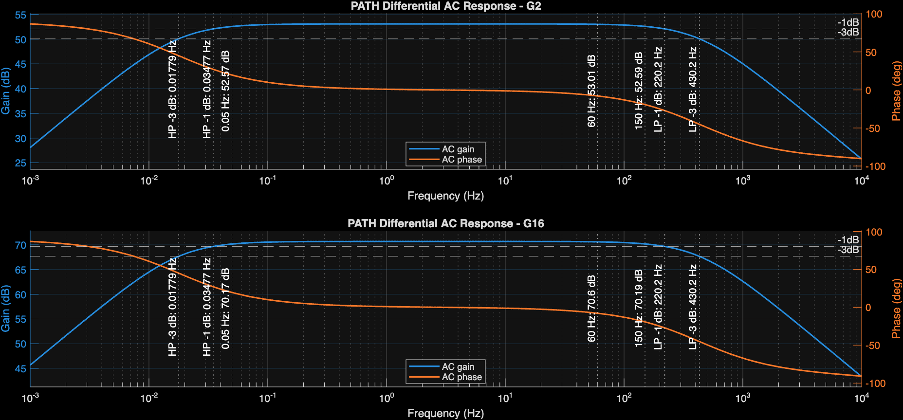
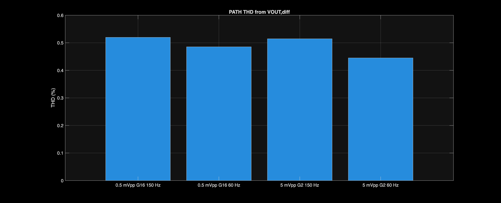

# ECG Acquisition IC Project Report

Last updated: 2026-08-14

Project stage: nominal pre-layout schematic verification

## 1. Executive Summary

This project develops a GF180 integrated circuit for electrocardiogram (ECG) acquisition in the SSCS Chipathon 2026 flow. The current verified scope is the analog signal path (`PATH`), including the input amplifier, switched filter and selection network, programmable gain, output buffering, common-mode control, reset behavior, and right-leg drive (RLD).

The integrated path has two gain settings:

- G2: nominal overall differential gain of 480 V/V (53.625 dB).
- G16: nominal overall differential gain of 3840 V/V (71.687 dB).

Nominal schematic simulations cover operating point, differential AC response, differential transient response, CMRR, PSRR+/PSRR-, input-referred noise, common-mode and differential input offset, startup with and without reset, RLD, THD, and SNR. MATLAB post-processing generates a complete CSV summary, a compact terminal/CSV table, and 12 current report figures.

The latest results show approximately 8.857 mA total current, 29.23 mW total power, 3.245 uVrms input-referred noise over 0.05-150 Hz, about 20.25 dB RLD common-mode suppression at 60 Hz, and less than 0.101% THD in the tested 60 Hz and 150 Hz cases. The most important unresolved issue is the very low transient gain at 0.05 Hz and 0.1 Hz compared with ordinary AC analysis. This discrepancy requires dedicated validation of the periodically switched path before low-frequency performance can be considered final.

## 2. Design Scope and Conditions

### 2.1 Objective

The intended signal chain amplifies low-amplitude differential ECG signals while rejecting electrode common mode, supply ripple, and interference. The front end is fully differential through `OUTP` and `OUTN`, maintains an output common mode near 1.65 V, supports two gain configurations, and uses RLD feedback to reduce input common-mode interference.

The 10-bit SAR ADC shown in the system-level specification is not yet integrated into the verified analog path. This report therefore describes the analog front end only.

### 2.2 Nominal Simulation Conditions

| Condition | Value | Status |
| --- | ---: | --- |
| Process/model set | GF180 nominal schematic models | Implemented |
| Temperature | 27 degC | Implemented |
| Supply voltage | 3.3 V | Implemented |
| Input/output common-mode target | 1.65 V | Implemented |
| Bias parameter | 40 uA | Implemented |
| Output load | 10 pF per output | Implemented |
| ECG analysis band | 0.05-150 Hz | Used for integrated noise and report points |
| Normal switched-capacitor clock | 500 Hz, 2 ms period | Implemented |
| Normal clock timing | 80 us rise, 80 us fall, 920 us pulse width | Implemented |
| THD clock timing | 20 us rise, 20 us fall, 980 us pulse width | Implemented |
| Differential transient stimulus | 10 uV peak differential sine | Implemented |
| G2 expected gain | 480 V/V, 53.625 dB | Implemented |
| G16 expected gain | 3840 V/V, 71.687 dB | Implemented |

These are testbench conditions or nominal design values, not post-layout or measured specifications.

## 3. IC Architecture and Implementation

### 3.1 Integrated Signal Path

The integrated testbenches instantiate the following analog hierarchy:

```text
VINP/VINN -> INA -> selection/filter path -> PGA -> output buffer -> OUTP/OUTN
     |                                                               |
     +-------------------------- RLD feedback ------------------------+
```

The analyzer defines the expected path gain as:

$$
A_{expected}=60\times4\times G_{PGA}
$$

The RLD block senses common-mode behavior and drives the body/electrode model in the transient RLD test. Reset tests exercise removal of a large differential DC condition and compare startup with reset against startup without reset.

### 3.2 Implemented Building Blocks

| Block | Design files | Verification status |
| --- | --- | --- |
| INA, LPF, PGA, selectors, buffer, RLD | `Design_Files/IC Design/Schematic/` | Instantiated in the integrated PATH tests |
| Single-ended OTA | `Schematic/SE_OTA/` and `Testbench/SE_OTA/` | Nominal open-loop, closed-loop, noise, CMRR, and PSRR results present |
| Fully differential core | `Schematic/FD_OTA/FDC/` | Nominal AC, noise, offset, and plant results present |
| Common-mode feedback | `Schematic/FD_OTA/CMFB/` | Nominal open-loop and closed-loop results present |
| Fully differential OTA | `Schematic/FD_OTA/FDOTA/` | Nominal open-loop and closed-loop results present |
| Integrated PATH | `Testbench/PATH/` | AC, noise, and multi-case transient verification implemented |

### 3.3 Layout, ADC, and PCB Status

No completed integrated PATH layout, parasitic extraction, DRC/LVS result, ADC integration, PCB implementation, or laboratory measurement is reported yet. All results in this document are pre-layout simulations.

## 4. Verification Methodology

### 4.1 Tools and Testbenches

Xschem and ngspice generate raw text data. MATLAB R2025b has been used to analyze the data and generate plots and tables.

| Testbench | Analyses |
| --- | --- |
| `PATH/AC/PATH_TB_AC.sch` | Operating point, differential AC response, CMRR, PSRR+, PSRR- |
| `PATH/NOISE/PATH_TB_NOISE.sch` | Output and input-referred noise |
| `PATH/TRAN/PATH_TB_TRAN.sch` | Differential response, transient CMRR/PSRR, offsets, startup/reset, RLD, THD |

The AC sweep spans 0.001 Hz to 10 kHz with 200 points per decade. The noise sweep spans 0.01 Hz to 1 kHz with 300 points per decade. The main MATLAB report marks 0.05 Hz, 60 Hz, 150 Hz, and 1 kHz where applicable.

### 4.2 Differential Transient Schedule

The differential sine begins after a 100 ms delay. MATLAB selects complete cycles from the end of each exported case.

| Frequency | Simulated cycles after delay | MATLAB analysis window |
| ---: | ---: | ---: |
| 0.05 Hz | 2 | final 1 cycle |
| 0.1 Hz | 4 | final 1 cycle |
| 0.5 Hz | 4 | final 1 cycle |
| 1 Hz | 4 | final 3 cycles |
| 10 Hz | 4 | final 3 cycles |
| 60 Hz | 11 | final 10 cycles |
| 150 Hz | 11 | final 10 cycles |
| 250 Hz | 11 | final 10 cycles |
| 500 Hz | 21 | final 20 cycles |
| 1 kHz | 21 | final 20 cycles |

### 4.3 Rejection, Offset, RLD, and THD Schedules

| Test | Stimulus/cases | Simulated cycles | MATLAB analysis window |
| --- | --- | ---: | ---: |
| Transient CMRR | 50 mV peak common mode; 60, 150, 250, 500 Hz, 1 kHz; G2/G16 | 31 | final 20 |
| Transient PSRR+ | 100 mV peak AVDD ripple; same frequencies and gains | 31 | final 20 |
| Transient PSRR- | 100 mV peak ground/VSS ripple; same frequencies and gains | 31 | final 20 |
| VCM offset | 0.5 mVpp/G16 and 5 mVpp/G2 at 60 Hz; offsets +/-500, +/-300, 0 mV | 12 driven | final 10 |
| Differential offset | Same signal cases and offset values | 12 driven | final 10 |
| RLD off/on | 100 mV peak, 60 Hz common mode with mismatched electrode model | 12 driven | final 10 |
| THD | 0.5 mVpp/G16 and 5 mVpp/G2 at 60 and 150 Hz | 31 | final 30 |
| Startup | G16 with 300 mV differential DC; reset on/off comparison | No sine-cycle rule | settling criteria |

For startup, MATLAB compares pre-reset (30-40 ms), reset (40-60 ms), and final (180-200 ms) windows. Settling is evaluated from 500 Hz clock-cycle averages rather than from sine cycles.

### 4.4 Calculation Rules

The differential and common-mode signals are:

$$
V_{out,diff}=V_{OUTP}-V_{OUTN}
$$

$$
V_{out,cm}=\frac{V_{OUTP}+V_{OUTN}}{2}
$$

For each selected transient window, the analyzer fits sine, cosine, and DC terms by least squares. Signals sharing a time vector and frequency are solved together. Differential gain is:

$$
A_d=\frac{V_{out,diff,pk}}{V_{in,diff,pk}}
$$

$$
A_{d,dB}=20\log_{10}(A_d)
$$

The reported percentage error is:

$$
Gain\ error(\%)=100\left(\frac{A_d}{A_{expected}}-1\right)
$$

Transient common-mode rejection is calculated from the fitted common-mode input, fitted differential output, and matching transient differential gain:

$$
CMRR=20\log_{10}\left(\frac{A_dV_{in,cm}}{V_{out,diff}}\right)
$$

PSRR+ and PSRR- use the same rule with the applied supply-ripple amplitude replacing $V_{in,cm}$. If a matching transient differential-gain case is unavailable, the analyzer falls back to the nominal gain $60\times4\times G_{PGA}$.

AC CMRR and PSRR are differential-path gain in dB minus the corresponding AC feedthrough gain in dB. These AC values are the ones printed in the compact G2/G16 report table.

Input-referred integrated noise is:

$$
V_{n,in,rms}=\sqrt{\int_{f_1}^{f_2}e_n^2(f)\,df}
$$

The reported THD fits H1 through H10 simultaneously on raw transient samples. Non-overlapping multiples of the 500 Hz clock are included as nuisance tones so that switching energy is not assigned to signal harmonics:

$$
THD(\%)=100\frac{\sqrt{V_2^2+V_3^2+\cdots+V_{10}^2}}{V_1}
$$

Output SNR uses the fitted fundamental RMS and the output noise integrated from 0.05 Hz to 150 Hz:

$$
SNR=20\log_{10}\left(\frac{V_{1,rms}}{V_{n,out,rms}}\right)
$$

The THD plot displays H2-H10 in dBc with H1 stated as 0 dBc. Both 60 Hz and 150 Hz subplots use the same -100 dBc to 0 dBc scale.

## 5. Nominal Simulation Results

All values below come from the checked-in `PATH_summary.csv` or `PATH_table_report.csv`. They are nominal schematic results and should be regenerated after any design or testbench change.

### 5.1 Operating Point

| Metric | G2 | G16 |
| --- | ---: | ---: |
| Total supply current | 8.8568 mA | 8.8568 mA |
| Total power | 29.2275 mW | 29.2276 mW |
| Bias-current diagnostic | 40 uA | 40 uA |
| VOUTP | 1.66178 V | 1.60522 V |
| VOUTN | 1.63817 V | 1.69473 V |
| Output common mode | 1.64998 V | 1.64998 V |
| Output differential DC | 23.62 mV | -89.52 mV |

### 5.2 Differential Gain

| Frequency and method | G2 gain error | G16 gain error |
| --- | ---: | ---: |
| 0.05 Hz AC | -11.41% | -16.04% |
| 0.05 Hz transient | -99.68% | -99.70% |
| 60 Hz AC | -6.87% | -11.74% |
| 60 Hz transient | -7.14% | -11.97% |
| 150 Hz AC | -11.21% | -15.85% |
| 150 Hz transient | -11.34% | -15.95% |

At 60 Hz, the transient fitted gains are 445.75 V/V for G2 and 3380.39 V/V for G16. AC and transient results agree reasonably at 60 Hz and 150 Hz, but not at 0.05 Hz.



### 5.3 AC Band Edges and Noise

| Metric | G2 | G16 |
| --- | ---: | ---: |
| High-pass -1 dB corner | 0.03477 Hz | 0.03477 Hz |
| High-pass -3 dB corner | 0.01779 Hz | 0.01779 Hz |
| Low-pass -1 dB corner | 220.15 Hz | 220.15 Hz |
| Low-pass -3 dB corner | 430.16 Hz | 430.16 Hz |
| Input-referred noise, 0.05-150 Hz | 3.2453 uVrms | 3.2452 uVrms |

For G16, the current full summary reports 5.426 uVrms from 0.01 Hz to 1 kHz and 34.72 dB input-referred SNR for a 0.5 mVpp input over the 0.05-150 Hz noise band.

### 5.4 AC CMRR and PSRR

| Metric | G2 | G16 |
| --- | ---: | ---: |
| CMRR at 0.05 Hz | 95.95 dB | 105.49 dB |
| CMRR at 60 Hz | 147.64 dB | 153.45 dB |
| CMRR at 150 Hz | 148.04 dB | 154.09 dB |
| CMRR at 1 kHz | 148.10 dB | 154.10 dB |
| PSRR+ at 60 Hz | 110.20 dB | 110.52 dB |
| PSRR+ at 150 Hz | 109.80 dB | 110.11 dB |
| PSRR+ at 1 kHz | 102.32 dB | 102.59 dB |
| PSRR- at 60 Hz | 110.20 dB | 110.52 dB |
| PSRR- at 150 Hz | 109.80 dB | 110.11 dB |
| PSRR- at 1 kHz | 102.32 dB | 102.59 dB |

These are small-signal AC results. Transient CMRR and PSRR values use a different sine-fit calculation and appear separately in the full summary.

### 5.5 Offset and Reset Startup

Across the current VCM-offset and differential-offset sweeps, the analyzer reports:

- Maximum output-common-mode error after reset: approximately 0.0487 mV.
- Maximum absolute differential output: approximately 1.114 V.
- No detected output clipping in the analyzed windows.
- Zero-offset fitted gain: 3374.82 V/V for the 0.5 mVpp/G16 case and 445.63 V/V for the 5 mVpp/G2 case.

The G16 offset-test gain is about 12.1% below its nominal 3840 V/V target, outside the analyzer's current +/-10% usability criterion. This is a gain-accuracy issue, not a clipping failure.

With reset enabled under the 300 mV differential-DC startup test, the current summary reports:

| Startup metric | Result |
| --- | ---: |
| Differential-offset removal | 99.924% |
| Improvement versus no reset | 62.42 dB |
| Differential settling to +/-10 mV after reset | 0.880 ms |
| Final output-CM error | 0.0486 mV |
| Post-reset differential ripple | 0.3868 mVpp |
| Output stuck near a rail | No |
| Analyzer startup pass | Yes |

### 5.6 RLD

| RLD metric at 60 Hz | Result |
| --- | ---: |
| Input-common-mode suppression | 20.25 dB |
| Differential-output improvement | 20.47 dB |
| RLD output minimum | 1.5669 V |
| RLD output maximum | 1.7327 V |
| RLD peak current | 0.0913 uA |

### 5.7 THD and SNR

| Case | THD | SNR |
| --- | ---: | ---: |
| 0.5 mVpp, G16, 60 Hz | 0.09545% | 34.24 dB |
| 5 mVpp, G2, 60 Hz | 0.08572% | 54.48 dB |
| 0.5 mVpp, G16, 150 Hz | 0.10015% | Not included in compact report |
| 5 mVpp, G2, 150 Hz | 0.08243% | Not included in compact report |



## 6. Interpretation and Limitations

### 6.1 Low-Frequency AC/Transient Mismatch

At 0.05 Hz, ordinary AC analysis predicts gain errors of -11.41% for G2 and -16.04% for G16, while the transient sine fit reports about -99.7% for both. The 0.1 Hz transient cases are also strongly attenuated, whereas the 0.5 Hz cases return close to the 60 Hz gain.

The PATH is periodically switched by a 500 Hz clock. A conventional AC sweep linearizes one operating state and does not, in general, provide the frequency response of a linear periodically time-varying circuit. The low-frequency discrepancy may also be sensitive to settling history, simulator tolerances, source amplitude, exported resolution, and the selected final-cycle window.

Required follow-up:

1. Re-run the low-frequency transient cases with tighter tolerances and a stimulus comfortably above `vntol`.
2. Confirm true periodic steady state before selecting the analysis window.
3. Compare multiple final cycles instead of relying on a single-cycle result where practical.
4. Use PSS/PAC or an equivalent sampled-system analysis if the simulator flow supports it.
5. Do not claim the ordinary AC or low-frequency transient number as final until the two methods are reconciled.

### 6.2 Rejection Accuracy

CMRR and PSRR from the compact report are AC values. Transient markers use fitted rejection based on the transient differential gain. Differences between the markers and AC curve therefore do not mean that the marker is plotted incorrectly; they represent different calculations on a periodically switched system. Very large nominal rejection values are also sensitive to numerical floors and ideal schematic symmetry. Mismatch and Monte Carlo simulations are required before treating them as realistic production values.

### 6.3 THD Accuracy

The THD analyzer avoids independent one-tone fits. It solves H1-H10 simultaneously and includes non-overlapping clock harmonics as nuisance tones. This is important because signal harmonics can lie near the 500 Hz switched-capacitor clock. The reported THD remains a finite-record, nominal schematic result and should be repeated across process, temperature, input amplitude, clock timing, and extracted parasitics.

### 6.4 Verification Coverage

The current flow is nominal-only and pre-layout. It does not yet establish:

- Process, voltage, and temperature margins.
- Device mismatch or Monte Carlo yield.
- Extracted bandwidth, noise, distortion, or settling.
- ESD, pad, package, electrode, or board parasitics beyond the present test models.
- ADC loading and end-to-end ECG acquisition performance.
- Measured silicon performance.

## 7. Next Steps

| Priority | Item | Completion criterion |
| --- | --- | --- |
| P0 | Resolve 0.05 Hz and 0.1 Hz transient gain | Stable repeated result with documented steady-state method and agreement with an appropriate periodically switched analysis |
| P0 | Confirm gain accuracy | Explain or correct the approximately -7% G2 and -12% G16 error at 60 Hz |
| P1 | Add PVT coverage | Automated summaries for process, supply, and temperature corners |
| P1 | Add mismatch/Monte Carlo | Statistical offset, CMRR, PSRR, gain, and yield results |
| P1 | Recheck THD/SNR | Sweep amplitude and clock timing; verify noise bandwidth and clock-sideband handling |
| P1 | Complete layout | DRC/LVS-clean PATH layout with extracted simulations |
| P2 | Integrate the SAR ADC | End-to-end analog-plus-ADC simulations against the system specification |
| P2 | Develop PCB and measurement plan | Test points, supplies, interfaces, equipment, and acceptance criteria documented |

## 8. Reproducibility and Source of Truth

Run the MATLAB analyzer from the repository root with:

```bash
matlab -batch "run(fullfile(pwd,'Measurement_Results','IC_Simulation','PATH','PATH_Analyze.m'))"
```

Current authoritative artifacts are:

- `PATH_Analyze.m`: calculation and plotting rules.
- `PATH_TB_AC.sch`, `PATH_TB_NOISE.sch`, and `PATH_TB_TRAN.sch`: applied conditions and simulation schedules.
- `PATH_summary.csv`: complete result set, including all transient cases.
- `PATH_table_report.csv`: concise G2/G16/RLD/THD report without a category column.
- The 12 figures directly generated by the current `PATH_Analyze.m` in `PATH/Plots/`.

Raw ngspice `*.txt` exports remain local and are ignored by Git. Re-running MATLAB without regenerating the raw data only re-analyzes the local simulation state; therefore, the schematics, testbench revision, CSV timestamp, and plot timestamp should be recorded together for formal design reviews.

## 9. Project Status Outside the IC Path

| Area | Current status |
| --- | --- |
| PCB schematic | Not started |
| PCB layout | Not started |
| PCB simulation | Not started |
| Laboratory test setup | Not started |
| Measurement results | Not available |

These sections should be expanded after the IC layout and ADC interface are sufficiently stable to define the board and measurement requirements.
