# ECG Acquisition IC Project Report

| Item | Description |
| :--- | :--- |
| Project stage | Pre-layout schematic design and block-level verification |
| Process | GlobalFoundries 180 nm MCU (`gf180mcu`, 3.3 V, 1P6M) |
| Application | Low-power ECG and biopotential acquisition |
| Design flow | Xschem, ngspice, and MATLAB |
| Program | IEEE SSCS Chipathon 2026 |

## 1. Executive summary

This project implements a low-noise, high-common-mode-rejection analog front end for ECG acquisition. The signal path combines a three-amplifier instrumentation amplifier, right-leg-drive feedback, a low-pass filter, programmable gain, and a differential output buffer. A master bias network supplies the analog blocks.

The completed SE OTA, FD OTA, INA+RLD, LPF, and PGA analyzers each cover 45 deterministic PVT corners. Each block also has 200-run mismatch-only (MM), global-only (GL), and combined (FULL) Monte Carlo reporting. All completed Monte Carlo sets currently contain 200 valid runs, zero failed runs, and 100% joint yield against their formal pre-layout specifications.

Key verified results include:

- INA gain error within ±0.215% across PVT, against a ±0.5% specification.
- INA bandwidth of at least 176.996 kHz and integrated input noise no greater than 3.117 µVrms.
- RLD common-mode suppression of at least 54.644 dB at 60 Hz and 51.676 dB at 150 Hz.
- LPF −1 dB frequency of at least 174.135 Hz, protecting the 150 Hz signal-band edge.
- PGA gain error within 2.502% across all gain codes and PVT corners, against a ±5% specification.

> [!IMPORTANT]
> These are schematic-level results. They do not include layout parasitics, package effects, electrode models beyond the stated testbenches, ADC loading, or measured silicon behavior.

## 2. System architecture


| Stage | Block | Implementation | Nominal behavior |
| :--- | :--- | :--- | :---: |
| 1 | Instrumentation amplifier (`INA`) | Two SE OTA input stages followed by an FD OTA difference stage | $60\times4=240\text{ V/V}$ |
| 2 | Low-pass filter (`LPF`) | Fully differential, unity-gain active RC filter | $1\text{ V/V}$; $f_{-1\mathrm{dB}} \ge 150\text{ Hz}$ |
| 3 | Programmable gain amplifier (`PGA`) | FD OTA with switched resistor network and transmission gates | $2/4/8/16\text{ V/V}$ |
| 4 | Output buffer (`BUFFER`) | Closed-loop differential unity-gain driver | $1\text{ V/V}$ |
| Feedback | Right-leg drive (`RLD`) | Active input-common-mode feedback | $55.1\text{ dB}$ suppression at 60 Hz nominal |
| Support | Bias and mirror network | β-multiplier reference and cascode current distribution | $40\,\mu\text{A}$ target |

The verified programmable signal-path gain spans $480$ to $3840\text{ V/V}$, or approximately $53.6$ to $71.7\text{ dB}$.

### 2.1 Schematic hierarchy

The principal design schematics are:

- [AFE top level](Design_Files/IC%20Design/Schematic/AFE_BLOCKS/AFE/AFE.png)
- [Bias generator](Design_Files/IC%20Design/Schematic/AFE_BLOCKS/BIAS/BIAS.png) and [mirror tree](Design_Files/IC%20Design/Schematic/AFE_BLOCKS/MIRROR/MIRROR.png)
- [Single-ended OTA](Design_Files/IC%20Design/Schematic/AFE_BLOCKS/SE_OTA/SE_OTA.png)
- [Fully differential OTA](Design_Files/IC%20Design/Schematic/AFE_BLOCKS/FD_OTA/FDOTA/FD_OTA.png), including the [differential core](Design_Files/IC%20Design/Schematic/AFE_BLOCKS/FD_OTA/FDC/FDC.png) and [CMFB loop](Design_Files/IC%20Design/Schematic/AFE_BLOCKS/FD_OTA/CMFB/CMFB.png)
- [Instrumentation amplifier](Design_Files/IC%20Design/Schematic/AFE_BLOCKS/INA/INA.png) and [right-leg drive](Design_Files/IC%20Design/Schematic/AFE_BLOCKS/RLD/RLD.png)
- [Low-pass filter](Design_Files/IC%20Design/Schematic/AFE_BLOCKS/LPF/LPF.png), [programmable gain amplifier](Design_Files/IC%20Design/Schematic/AFE_BLOCKS/PGA/PGA.png), and [output buffer](Design_Files/IC%20Design/Schematic/AFE_BLOCKS/BUFFER/BUFFER.png)
- [Selector](Design_Files/IC%20Design/Schematic/AFE_BLOCKS/SEL/SEL.png), [transmission gate](Design_Files/IC%20Design/Schematic/AFE_BLOCKS/TG/TG.png), and [inverter](Design_Files/IC%20Design/Schematic/AFE_BLOCKS/INV/INV.png)

## 3. Circuit-design methodology

### 3.1 $g_m/I_D$ sizing

The OTA and bias circuits use a $g_m/I_D$-based sizing flow. Device lookup data provide transconductance efficiency, current density, transit frequency, and intrinsic gain versus channel length and operating point.

The portable characterization scripts are:

- [`NMOS_Gm_Id.m`](Measurement_Results/IC_Simulation/Gm_Id/NMOS_Gm_Id/NMOS_Gm_Id.m)
- [`PMOS_Gm_Id.m`](Measurement_Results/IC_Simulation/Gm_Id/PMOS_Gm_Id/PMOS_Gm_Id.m)


### 3.2 OTA implementation

The SE OTA is a two-stage Miller-compensated amplifier optimized for low-frequency noise, high gain, and adequate output swing. Its PMOS input pair uses long-channel devices in moderate inversion; the second stage supplies load-driving capability for a nominal 10 pF load.

The FD OTA uses a differential core and continuous-time common-mode feedback. The same FD OTA architecture is reused in the INA difference stage, LPF, PGA, and output buffer, reducing design duplication and keeping biasing consistent across the AFE.

## 4. Verification methodology

### 4.1 Nominal conditions

| Parameter | Nominal value | Verification range |
| :--- | :---: | :---: |
| Supply | 3.30 V | 3.0–3.6 V |
| Temperature | 27°C | −40°C to +125°C |
| Input common mode | 1.65 V | Testbench dependent |
| Reference voltage | 1.65 V | Normally $V_{DD}/2$ |
| Master bias | 40 µA | 40 ±10 µA specification |
| Output load | 10 pF | Block dependent |
| Integrated-noise band | 0.05–150 Hz | ECG signal band |

### 4.2 PVT matrix

The deterministic matrix contains five process corners and nine voltage/temperature cases, for 45 total simulations:

- Processes: `NOM`, `FF`, `SS`, `FS`, and `SF`.
- Environmental cases: `nom`, `vl`, `vh`, `tl`, `th`, `vltl`, `vlth`, `vhtl`, and `vhth`.

Corner names combine both codes. For example, `SSVLTH` denotes slow-slow devices at 3.0 V and +125°C.

Worst-case selection follows the direction of each specification: maxima for upper limits, minima for lower limits, and maximum absolute magnitude for symmetric limits. Descriptive quantities—such as target gain, measured gain, and report-only corner frequencies—do not receive artificial pass/fail limits.

### 4.3 Monte Carlo methodology

Statistical analyses use three 200-run modes:

- `MM`: local mismatch.
- `GL`: global process variation.
- `FULL`: combined global and mismatch variation.

Runs are joined by run number when a block uses multiple summary files. A run is counted as valid when every formal yield metric is finite; a missing report-only value does not invalidate the entire run. Statistics use finite samples for each metric and the sample standard deviation ($N-1$ normalization).

## 5. Verification results

### 5.1 Bias and selector

The master bias network targets 40 µA and has been characterized over process, supply, and temperature. The startup campaign contains 35 runs with zero failures. The analog selector is verified with a dedicated transient and transmission-error report.

| Metric | Nominal | Verified range / worst case |
| :--- | ---: | ---: |
| Reference current | 39.997 µA | 31.054–49.441 µA |
| Bias-network current | 83.192 µA | 103.971 µA maximum |
| Bias-network power | 274.532 µW | 374.297 µW maximum |
| Startup settling | 807.362 µs | 1180.281 µs maximum |
| Startup failures | 0 | 0 of 35 |
| Reference error | −4.170 µV | 6.154 µV maximum absolute error |
| Mirror tracking error | −0.0028% | 0.149% maximum absolute error |
| Selector transmission error | — | 25.466 nV maximum |

<details>
<summary>Complete BIAS/SEL worst-case results</summary>

| Parameter | Value | Corner / condition |
| :--- | ---: | :---: |
| Minimum bias current | 31.054 µA | `SS`, −40°C, 3.0 V |
| Maximum bias current | 49.441 µA | `FF`, +125°C, 3.6 V |
| Maximum absolute bias-current error | 23.603% | `FF`, +125°C, 3.6 V |
| Minimum BP voltage | 1.138 V | `FS`, +125°C, 3.0 V |
| Maximum BP voltage | 2.146 V | `SF`, −40°C, 3.6 V |
| Maximum absolute reference error | 6.154 µV | `SS`, −40°C, 3.6 V |
| Maximum absolute mirror error | 0.149% | `FS`, +125°C, 3.0 V |
| Minimum startup-device margin | 0.7415 V | `FF`, +125°C, 3.6 V |
| Maximum supply current | 103.971 µA | `FF`, +125°C, 3.6 V |
| Maximum power | 374.297 µW | `FF`, +125°C, 3.6 V |
| Maximum startup time | 1180.281 µs | `SS`, −40°C, 3.0 V |
| Startup failures | 0 of 35 | All startup cases |
| Maximum BP internal-selector error | 12.495 nV | `SFVH` |
| Maximum BP external-selector error | 25.466 nV | `SSTH` |
| Maximum VREF internal-selector error | 18.749 nV | `SSVL` |
| Maximum VREF external-selector error | 10.951 nV | `SSVL` |

</details>

<details>
<summary>BIAS comparison: NOM, FF, SS, FS, SF, VL, VH, TL, TH</summary>

| Parameter | Unit | NOM | FF | SS | FS | SF | VL | VH | TL | TH |
| :--- | :---: | ---: | ---: | ---: | ---: | ---: | ---: | ---: | ---: | ---: |
| Ibias | uA | 39.997 | 45.168 | 35.799 | 40.621 | 39.350 | 39.393 | 40.423 | 35.353 | 43.171 |
| Ibias error | % | -7.499e-03 | 12.920 | -10.503 | 1.553 | -1.626 | -1.517 | 1.056 | -11.619 | 7.926 |
| IRS | uA | 39.998 | 45.150 | 35.815 | 40.641 | 39.332 | 39.418 | 40.402 | 35.341 | 43.187 |
| Mirror error | % | -2.826e-03 | 4.073e-02 | -4.456e-02 | -4.869e-02 | 4.598e-02 | -6.296e-02 | 5.137e-02 | 3.385e-02 | -3.796e-02 |
| BP | V | 1.643 | 1.748 | 1.533 | 1.523 | 1.763 | 1.350 | 1.938 | 1.735 | 1.553 |
| VREF | V | 1.650 | 1.650 | 1.650 | 1.650 | 1.650 | 1.500 | 1.800 | 1.650 | 1.650 |
| VREF error | uV | -4.170 | -3.334 | -5.005 | -4.168 | -4.171 | -3.793 | -4.546 | -4.701 | -3.377 |
| IMST | fA | 2.083e-08 | 4.584e-07 | 1.184e-09 | 9.002e-07 | 4.722e-10 | 2.801e-07 | 1.740e-09 | 3.073e-14 | 1.584e-03 |
| MST margin | V | 1.541 | 1.209 | 1.878 | 1.452 | 1.631 | 1.759 | 1.316 | 1.648 | 1.328 |
| IDD | uA | 83.192 | 94.351 | 74.243 | 84.477 | 81.858 | 81.641 | 84.356 | 73.507 | 90.061 |
| Power | uW | 274.532 | 311.359 | 245.001 | 278.773 | 270.131 | 244.924 | 303.680 | 242.575 | 297.202 |
| Startup time | us | 807.362 | 777.960 | 839.330 | 838.091 | 804.620 | 882.469 | 743.647 | 896.695 | 807.833 |

</details>

<details>
<summary>All generated BIAS/SEL plots</summary>


</details>

### 5.2 Single-ended OTA

| Metric | Specification | Nominal | Full-PVT worst case | Corner |
| :--- | :---: | ---: | ---: | :---: |
| Total current | ≤1.25 mA | 0.825 mA | 1.106 mA | `FFVHTH` |
| DC gain | ≥88 dB | 96.522 dB | 93.988 dB | `FSVLTH` |
| UGF | ≥8 MHz | 12.835 MHz | 8.762 MHz | `SSVLTH` |
| Phase margin | ≥55° | 67.767° | 56.368° | `FFVLTH` |
| Input offset | ±2 mV | 3.193 µV | 12.092 µV | `FSVLTH` |
| CMRR at 60 Hz | ≥105 dB | 111.957 dB | 109.711 dB | `SSVLTH` |
| PSRR+ at 60 / 150 Hz | ≥100 / 95 dB | 103.379 / 99.232 dB | 101.385 / 96.565 dB | `SSVLTL` / `SSVLTH` |
| Input noise, 0.05–150 Hz | ≤2.5 µVrms | 1.873 µVrms | 2.189 µVrms | `SSVLTH` |
| Slew rate, rise / fall | ≥6.5 / 5.0 V/µs | 9.814 / 7.966 V/µs | 6.927 / 5.636 V/µs | `SSVLTL` |
| Settling time | ≤225 ns | 163.4 ns | 213.4 ns | `SSVLTL` |

The 200-run FULL Monte Carlo set also passes every formal limit. Observed input offset spans −970.439 to +1177.630 µV, DC gain remains above 95.488 dB, UGF remains above 11.764 MHz, and phase margin remains above 64.231°. The fitted input-offset interval is approximately −1.234 to +1.243 mV at $\mu\pm3\sigma$, within the ±2 mV requirement.

<details>
<summary>Complete SE OTA FULL Monte Carlo results</summary>

| Parameter | Unit | Spec | Minimum | Mean | Maximum | Yield |
| :--- | :---: | :---: | ---: | ---: | ---: | ---: |
| Bias current | µA | 40±10 | 38.595 | 40.056 | 41.411 | 100% |
| Total current | mA | ≤1.25 | 0.789 | 0.833 | 0.895 | 100% |
| Total power | mW | ≤4.5 | 2.603 | 2.749 | 2.954 | 100% |
| DC gain | dB | ≥88 | 95.488 | 96.416 | 97.396 | 100% |
| UGF | MHz | ≥8 | 11.764 | 12.835 | 13.961 | 100% |
| Phase margin | deg | ≥55 | 64.231 | 67.829 | 73.006 | 100% |
| Input offset | µV | ±2000 | −970.439 | 4.135 | 1177.630 | 100% |
| Gain error | % | ±0.01 | −0.0025 | −0.0012 | 0.0000 | 100% |

</details>

<details>
<details>
<summary>SE OTA comparison: NOM, FF, SS, FS, SF, VL, VH, TL, TH</summary>

| Parameter | Unit | Spec | NOM | FF | SS | FS | SF | VL | VH | TL | TH |
| :--- | :---: | :---: | ---: | ---: | ---: | ---: | ---: | ---: | ---: | ---: | ---: |
| **SET CONDITIONS** | — | — | — | — | — | — | — | — | — | — | — |
| AVDD | V | — | 3.300 | 3.300 | 3.300 | 3.300 | 3.300 | 3.000 | 3.600 | 3.300 | 3.300 |
| CLoad | pF | — | 10.000 | 10.000 | 10.000 | 10.000 | 10.000 | 10.000 | 10.000 | 10.000 | 10.000 |
| Vin,cm | V | — | 1.650 | 1.650 | 1.650 | 1.650 | 1.650 | 1.500 | 1.800 | 1.650 | 1.650 |
| Closed-loop target gain | V/V | — | 1.000 | 1.000 | 1.000 | 1.000 | 1.000 | 1.000 | 1.000 | 1.000 | 1.000 |
| **OPERATING POINT** | — | — | — | — | — | — | — | — | — | — | — |
| Bias current | uA | 40±10 | 40.092 | 45.286 | 35.875 | 40.727 | 39.434 | 39.479 | 40.525 | 35.435 | 43.278 |
| Total current | mA | ≤1.25 | 0.825 | 0.942 | 0.730 | 0.841 | 0.808 | 0.806 | 0.839 | 0.680 | 0.948 |
| Total power | mW | ≤4.5 | 2.721 | 3.109 | 2.408 | 2.774 | 2.665 | 2.419 | 3.020 | 2.244 | 3.128 |
| **OPEN-LOOP SIMULATION** | — | — | — | — | — | — | — | — | — | — | — |
| DC gain | dB | ≥88 | 96.522 | 96.345 | 96.324 | 96.190 | 96.634 | 95.934 | 97.023 | 96.599 | 95.678 |
| UGF | MHz | ≥8 | 12.835 | 15.068 | 11.066 | 13.115 | 12.548 | 12.566 | 13.041 | 14.448 | 10.616 |
| Phase margin | deg | ≥55 | 67.767 | 61.737 | 72.737 | 67.661 | 67.832 | 67.337 | 68.117 | 72.157 | 62.054 |
| Input offset | uV | ±2000 | 3.193 | 7.450 | -1.468 | 6.456 | -0.088 | 3.235 | 3.169 | -1.045 | 6.918 |
| CMRR @ 60 Hz | dB | ≥105 | 111.957 | 112.400 | 111.313 | 112.118 | 111.684 | 110.932 | 112.777 | 111.742 | 111.777 |
| CMRR @ 150 Hz | dB | ≥105 | 111.957 | 112.400 | 111.313 | 112.118 | 111.684 | 110.932 | 112.777 | 111.742 | 111.777 |
| PSRR+ @ 60 Hz | dB | ≥100 | 103.379 | 104.391 | 102.078 | 103.983 | 102.630 | 103.109 | 103.712 | 103.261 | 102.744 |
| PSRR+ @ 150 Hz | dB | ≥95 | 99.232 | 100.834 | 97.580 | 99.597 | 98.795 | 99.048 | 99.422 | 99.397 | 98.271 |
| PSRR- @ 60 Hz | dB | ≥100 | 103.379 | 104.390 | 102.078 | 103.983 | 102.631 | 103.109 | 103.712 | 103.261 | 102.743 |
| PSRR- @ 150 Hz | dB | ≥95 | 99.232 | 100.834 | 97.581 | 99.597 | 98.796 | 99.048 | 99.422 | 99.397 | 98.271 |
| Input-referred noise 0.05-150 Hz | uVrms | ≤2.5 | 1.873 | 1.780 | 1.969 | 1.849 | 1.898 | 1.874 | 1.874 | 1.774 | 2.074 |
| **CLOSED-LOOP SIMULATION** | — | — | — | — | — | — | — | — | — | — | — |
| Closed-loop gain | dB | — | -1.042e-04 | -1.051e-04 | -1.129e-04 | -1.131e-04 | -1.091e-04 | -1.111e-04 | -1.012e-04 | -1.073e-04 | -1.062e-04 |
| Gain error | % | ±0.01 | -0.001 | -0.001 | -0.001 | -0.001 | -0.001 | -0.001 | -0.001 | -0.001 | -0.001 |
| Vout,DC error | uV | ±2000 | -3.192 | -7.419 | 1.504 | -6.455 | 0.088 | -3.204 | -3.131 | 1.045 | -6.919 |
| Input low | mV | ≤600 | 106.000 | 24.000 | 255.000 | 40.000 | 203.000 | 148.000 | 157.000 | 292.000 | 0.000 |
| Input high | V | ≥2.75 | 3.237 | 3.235 | 3.238 | 3.186 | 3.259 | 2.929 | 3.542 | 3.259 | 3.207 |
| Input high headroom | mV | ≤250 | 63.000 | 65.000 | 62.000 | 114.000 | 41.000 | 71.000 | 58.000 | 41.000 | 93.000 |
| Output low | mV | ≤600 | 107.816 | 25.948 | 256.895 | 41.868 | 203.702 | 149.951 | 158.980 | 293.880 | 0.100 |
| Output high | V | ≥2.75 | 3.235 | 3.233 | 3.236 | 3.184 | 3.257 | 2.927 | 3.540 | 3.257 | 3.205 |
| Output high headroom | mV | ≤250 | 64.870 | 66.875 | 63.741 | 115.860 | 42.653 | 72.717 | 59.744 | 42.636 | 94.944 |
| SR rise | V/us | ≥6.5 | 9.814 | 12.563 | 7.852 | 9.980 | 9.640 | 9.655 | 9.927 | 8.855 | 10.248 |
| SR fall | V/us | ≥5.0 | 7.966 | 9.902 | 6.533 | 8.093 | 7.834 | 7.803 | 8.091 | 7.040 | 8.628 |
| Settling time | ns | ≤225 | 163.400 | 129.900 | 199.900 | 160.900 | 165.900 | 165.400 | 161.400 | 171.400 | 163.900 |

</details>

<details>
<summary>All generated SE OTA plots</summary>


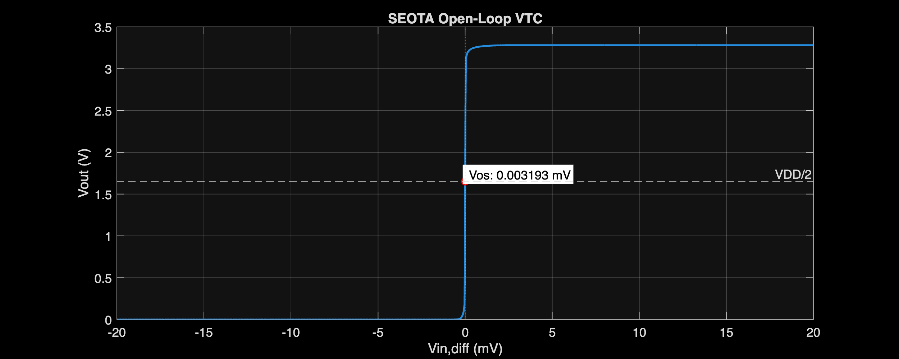

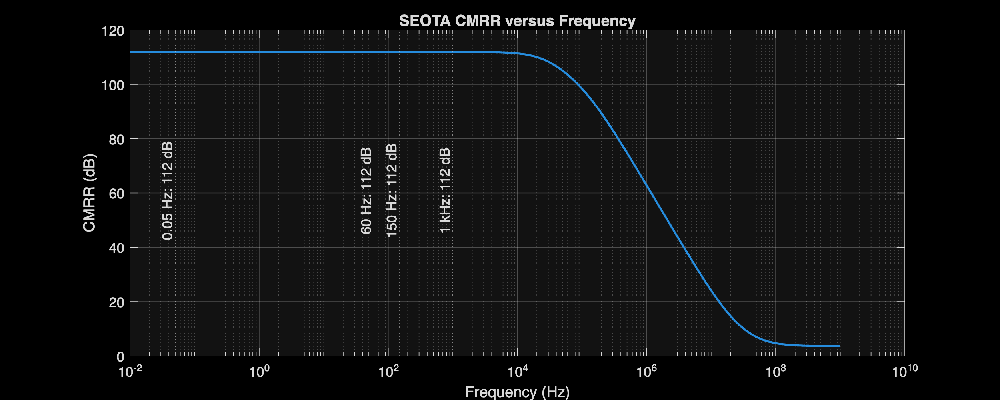

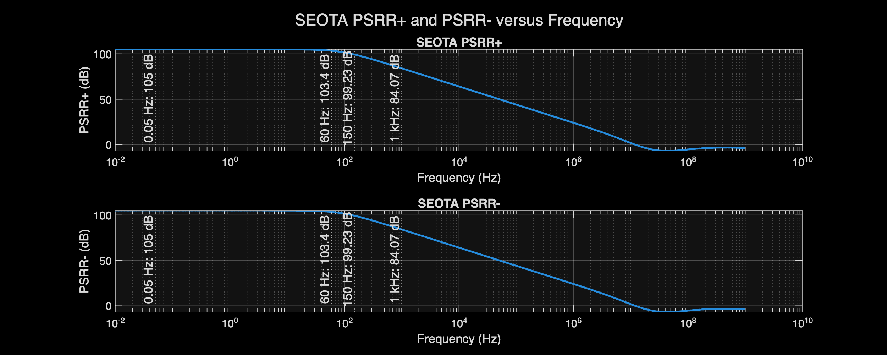


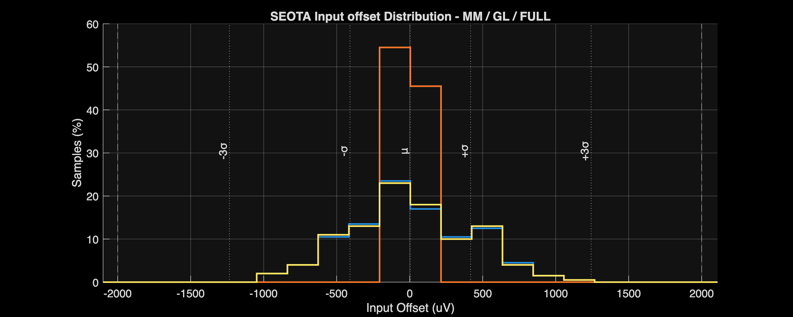

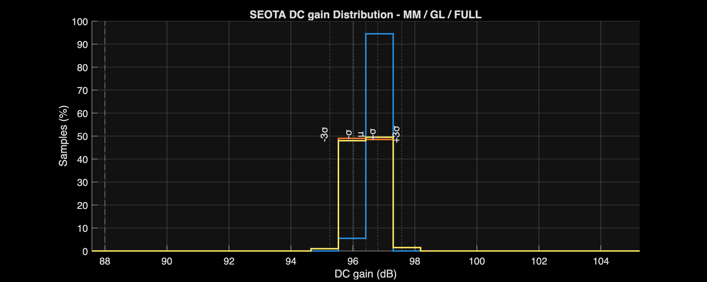

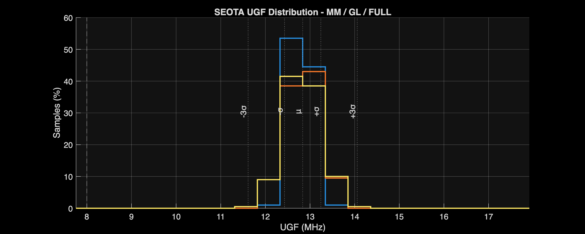

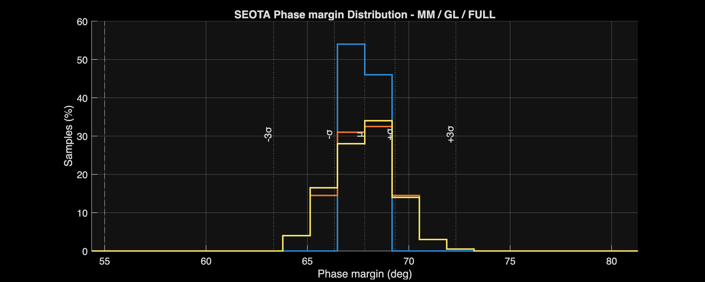

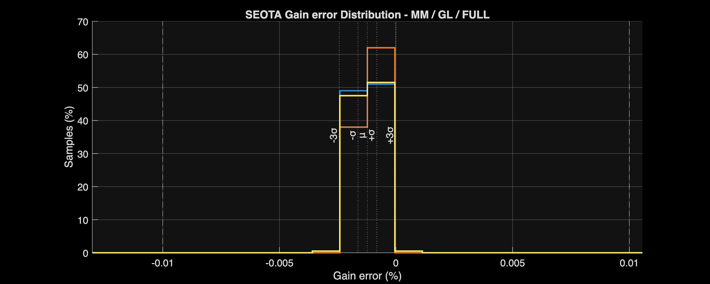

</details>

### 5.3 Fully differential OTA

| Metric | Specification | Nominal | Full-PVT worst case | Corner |
| :--- | :---: | ---: | ---: | :---: |
| Total current | ≤2.5 mA | 1.604 mA | 2.194 mA | `FFVHTH` |
| Differential gain | ≥85 dB | 88.699 dB | 86.753 dB | `FSVLTH` |
| Differential UGF | ≥8 MHz | 12.447 MHz | 8.435 MHz | `SSVLTH` |
| Differential phase margin | ≥60° | 72.649° | 63.377° | `FFVLTH` |
| Differential input offset | ±3 mV | −0.000 µV | 0.000 µV | `SFVHNOM` |
| Output CM error | ±25 mV | 0.395 mV | 12.643 mV | `SSVHTH` |
| CMRR at 60 / 150 Hz | ≥80 / 80 dB | 285.310 / 285.322 dB | 206.691 / 206.691 dB | `SFNOMTL` |
| PSRR+ at 60 / 150 Hz | ≥80 / 80 dB | 266.685 / 258.182 dB | 193.356 / 193.357 dB | `SFNOMTL` |
| Input noise, 0.05–150 Hz | ≤4 µVrms | 3.086 µVrms | 3.514 µVrms | `SSVHTH` |
| Differential output swing | ≥±1.8 V | ±3.188 V | ±2.803 V | `FSVLTH` |
| Differential slew rate | ≥4 V/µs | 7.232 V/µs | 5.135 V/µs | `SSVLTL` |
| Differential settling | ≤300 ns | 149.7 ns | 234.9 ns | `SSVLTL` |
| Differential-step CM disturbance | ≤60 mV | 30.247 mV | 40.985 mV | `SSVLTH` |
| CMFB settling | ≤1000 ns | 329.7 ns | 404.1 ns | `SSVLTL` |

The 200-run FULL Monte Carlo set passes every formal limit. Observed differential input offset spans −2.096 to +2.354 mV against the ±3 mV specification. Differential gain remains above 87.784 dB, UGF above 11.307 MHz, phase margin above 68.996°, and output common-mode error remains between −9.947 and +13.681 mV.

Nominal internal checks place the standalone differential core at 90.090 dB gain, 12.489 MHz UGF, and 72.529° phase margin. The CMFB amplifier has 45.128 dB gain, 966.924 MHz UGF, 71.906° phase margin, and 4.8–5.2 ns closed-loop settling in its dedicated testbench.

<details>
<summary>Complete FD OTA FULL Monte Carlo results</summary>

| Parameter | Unit | Spec | Minimum | Mean | Maximum | Yield |
| :--- | :---: | :---: | ---: | ---: | ---: | ---: |
| FDC bias current | µA | 40±10 | 38.723 | 40.080 | 41.716 | 100% |
| CMFB bias current | µA | 40±10 | 38.712 | 40.088 | 41.605 | 100% |
| Total current | mA | ≤2.5 | 1.519 | 1.606 | 1.745 | 100% |
| Total power | mW | ≤9 | 5.013 | 5.299 | 5.758 | 100% |
| Differential DC gain | dB | ≥85 | 87.784 | 88.667 | 89.622 | 100% |
| Differential UGF | MHz | ≥8 | 11.307 | 12.469 | 13.686 | 100% |
| Differential phase margin | deg | ≥60 | 68.996 | 72.665 | 77.849 | 100% |
| Input differential offset | µV | ±3000 | −2096.150 | 30.711 | 2354.430 | 100% |
| Gain error | % | ±0.01 | −0.0041 | −0.0037 | −0.0033 | 100% |
| Output CM error | mV | ±25 | −9.947 | 0.073 | 13.681 | 100% |

</details>

<details>
<details>
<summary>FD OTA comparison: NOM, FF, SS, FS, SF, VL, VH, TL, TH</summary>

| Parameter | Unit | Spec | NOM | FF | SS | FS | SF | VL | VH | TL | TH |
| :--- | :---: | :---: | ---: | ---: | ---: | ---: | ---: | ---: | ---: | ---: | ---: |
| **SET CONDITIONS** | — | — | — | — | — | — | — | — | — | — | — |
| AVDD | V | — | 3.300 | 3.300 | 3.300 | 3.300 | 3.300 | 3.000 | 3.600 | 3.300 | 3.300 |
| Vin,cm | V | — | 1.650 | 1.650 | 1.650 | 1.650 | 1.650 | 1.500 | 1.800 | 1.650 | 1.650 |
| VREF | V | — | 1.650 | 1.650 | 1.650 | 1.650 | 1.650 | 1.500 | 1.800 | 1.650 | 1.650 |
| Closed-loop target gain | V/V | — | 1.000 | 1.000 | 1.000 | 1.000 | 1.000 | 1.000 | 1.000 | 1.000 | 1.000 |
| **OPERATING POINT** | — | — | — | — | — | — | — | — | — | — | — |
| FDC bias current | uA | 40±10 | 40.092 | 45.286 | 35.875 | 40.727 | 39.434 | 39.479 | 40.525 | 35.435 | 43.278 |
| CMFB bias current | uA | 40±10 | 40.092 | 45.286 | 35.875 | 40.727 | 39.434 | 39.479 | 40.525 | 35.435 | 43.278 |
| Total current | mA | ≤2.5 | 1.604 | 1.857 | 1.400 | 1.652 | 1.556 | 1.568 | 1.633 | 1.302 | 1.861 |
| Total power | mW | ≤9 | 5.293 | 6.129 | 4.620 | 5.451 | 5.133 | 4.703 | 5.878 | 4.296 | 6.142 |
| **OPEN-LOOP SIMULATION** | — | — | — | — | — | — | — | — | — | — | — |
| Differential DC gain | dB | ≥85 | 88.699 | 88.550 | 88.731 | 88.379 | 88.952 | 88.122 | 89.195 | 89.168 | 87.741 |
| Differential UGF | MHz | ≥8 | 12.447 | 14.528 | 10.764 | 12.619 | 12.257 | 12.170 | 12.662 | 13.933 | 10.253 |
| Differential phase margin | deg | ≥60 | 72.649 | 66.886 | 77.375 | 71.851 | 73.436 | 72.365 | 72.892 | 75.290 | 69.080 |
| Input differential offset | uV | ±3000 | -0.000 | -0.000 | 0.000 | 0.000 | 0.000 | -0.000 | 0.000 | -0.000 | -0.000 |
| CMRR @ 60 Hz | dB | ≥80 | 285.310 | 311.336 | 296.211 | 334.082 | 294.280 | 314.786 | 298.385 | 285.922 | 286.303 |
| CMRR @ 150 Hz | dB | ≥80 | 285.322 | 358.824 | 295.776 | 331.726 | 294.428 | 338.284 | 298.865 | 286.211 | 286.341 |
| PSRR+ @ 60 Hz | dB | ≥80 | 266.685 | 272.894 | 259.938 | 276.403 | 271.821 | 276.696 | 273.872 | 272.874 | 259.735 |
| PSRR+ @ 150 Hz | dB | ≥80 | 258.182 | 273.176 | 266.133 | 260.513 | 260.086 | 260.002 | 260.203 | 262.669 | 305.063 |
| PSRR- @ 60 Hz | dB | ≥80 | 282.569 | 291.306 | 279.423 | 278.740 | 292.440 | 294.133 | 297.502 | 309.147 | 274.160 |
| PSRR- @ 150 Hz | dB | ≥80 | 277.076 | 300.965 | 282.441 | 280.892 | 283.131 | 286.933 | 288.764 | 282.124 | 273.993 |
| Input-referred noise 0.05-150 Hz | uVrms | ≤4 | 3.086 | 2.950 | 3.222 | 3.035 | 3.135 | 3.080 | 3.091 | 2.945 | 3.356 |
| **CLOSED-LOOP SIMULATION** | — | — | — | — | — | — | — | — | — | — | — |
| Closed-loop differential gain | dB | — | -3.190e-04 | -3.247e-04 | -3.165e-04 | -3.310e-04 | -3.102e-04 | -3.411e-04 | -3.010e-04 | -3.023e-04 | -3.551e-04 |
| Gain error | % | ±0.01 | -0.004 | -0.004 | -0.004 | -0.004 | -0.004 | -0.004 | -0.003 | -0.003 | -0.004 |
| Output common mode, DC | V | — | 1.650 | 1.648 | 1.653 | 1.652 | 1.649 | 1.500 | 1.800 | 1.643 | 1.661 |
| Output CM error | mV | ±25 | 0.395 | -1.839 | 2.748 | 1.747 | -1.017 | 0.365 | 0.415 | -6.733 | 10.536 |
| Input CM low | mV | ≤1000 | 870.000 | 770.000 | 975.000 | 790.000 | 955.000 | 870.000 | 875.000 | 870.000 | 865.000 |
| Input CM high | V | ≥2.3 | 3.300 | 3.300 | 3.300 | 3.185 | 3.300 | 3.000 | 3.600 | 3.300 | 3.300 |
| Input CM high headroom | mV | — | 0.000 | 0.000 | 0.000 | 115.000 | 0.000 | 0.000 | 0.000 | 0.000 | 0.000 |
| Differential output swing low | V | ≤-1.8 | -3.188 | -3.183 | -3.188 | -3.173 | -3.198 | -2.888 | -3.483 | -3.233 | -3.118 |
| Differential output swing high | V | ≥1.8 | 3.188 | 3.183 | 3.188 | 3.173 | 3.198 | 2.888 | 3.483 | 3.233 | 3.118 |
| Differential SR rise | V/us | ≥4 | 7.232 | 9.031 | 5.903 | 7.360 | 7.103 | 7.101 | 7.334 | 6.443 | 7.706 |
| Differential SR fall | V/us | ≥4 | 7.232 | 9.031 | 5.903 | 7.360 | 7.103 | 7.101 | 7.334 | 6.443 | 7.706 |
| Differential settling time | ns | ≤300 | 149.698 | 149.144 | 200.295 | 165.133 | 154.280 | 154.705 | 149.702 | 174.303 | 180.993 |
| Differential-step CM disturbance | mV | ≤60 | 30.247 | 27.596 | 33.256 | 30.706 | 29.694 | 30.066 | 30.352 | 24.927 | 39.263 |
| CMFB SR rise | V/us | ≥2 | 3.589 | 4.487 | 2.913 | 3.660 | 3.505 | 3.477 | 3.650 | 3.208 | 3.800 |
| CMFB SR fall | V/us | ≥2 | 3.526 | 4.541 | 2.785 | 3.541 | 3.509 | 3.468 | 3.569 | 3.474 | 3.379 |
| CMFB settling time | ns | ≤1000 | 329.729 | 275.711 | 373.846 | 325.534 | 333.998 | 334.052 | 325.742 | 340.681 | 333.963 |

</details>

<details>
<summary>All generated FD OTA plots</summary>

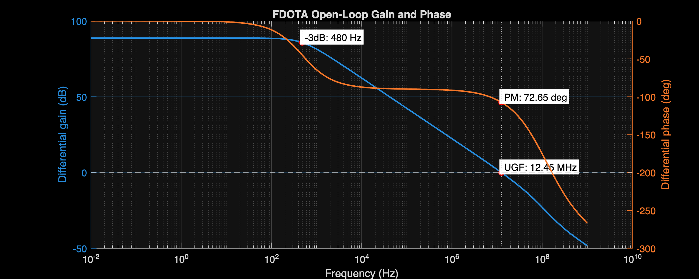

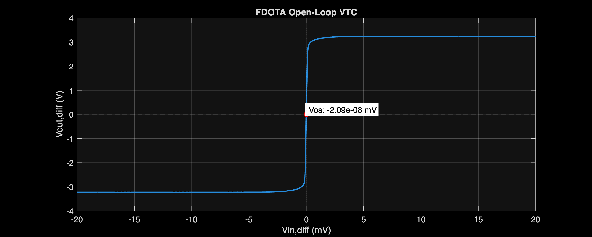


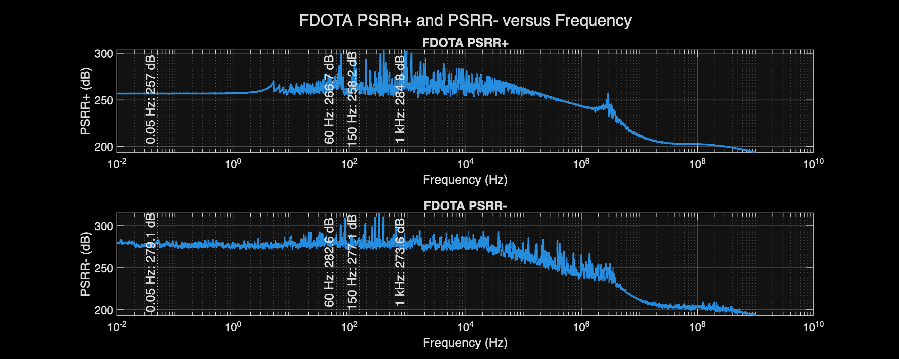

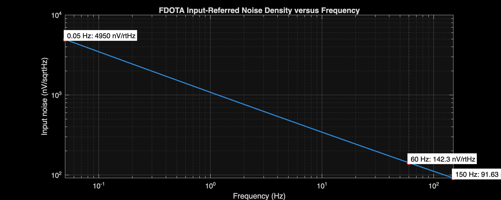

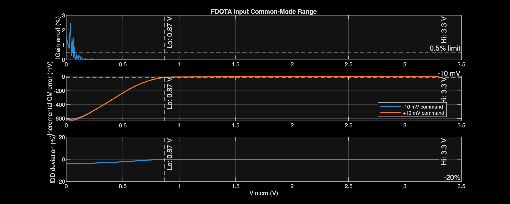

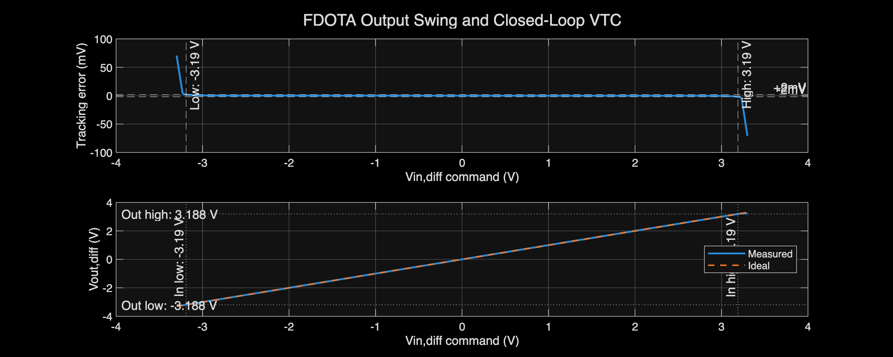

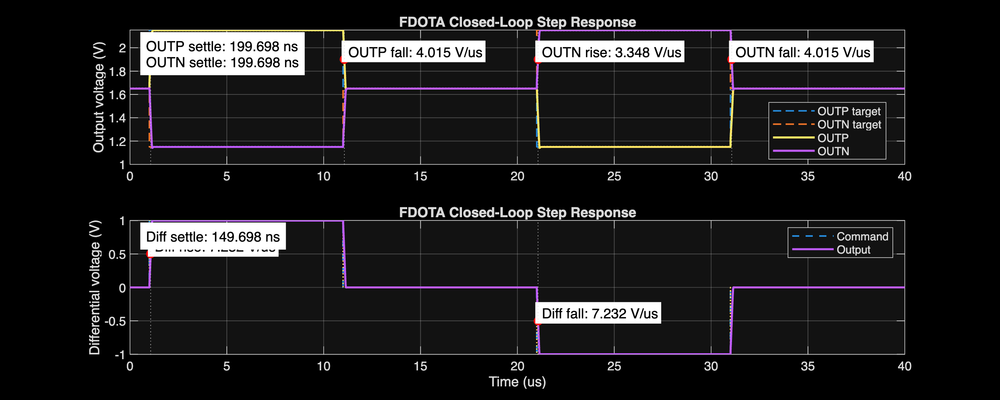


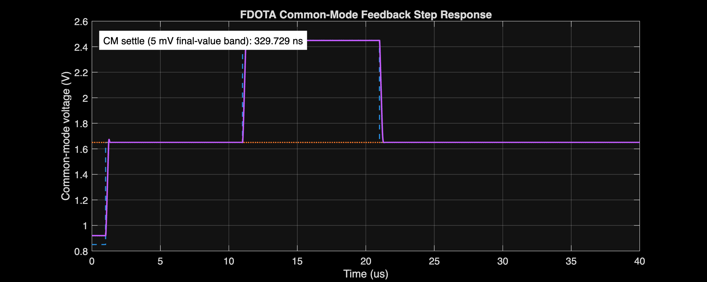


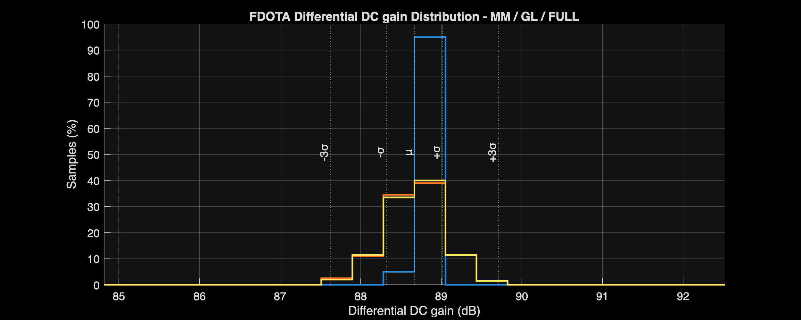

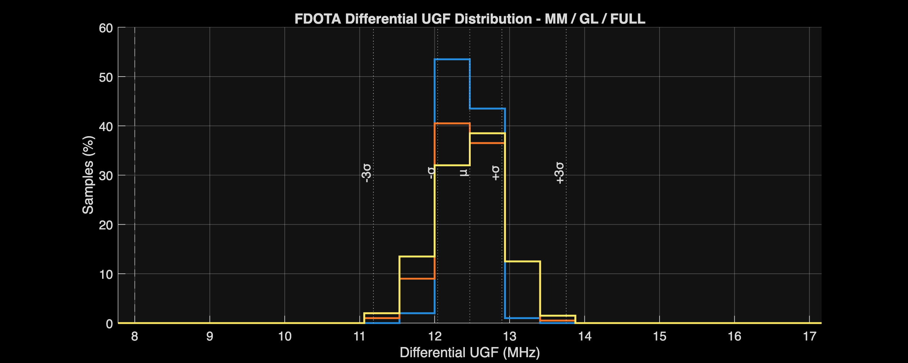

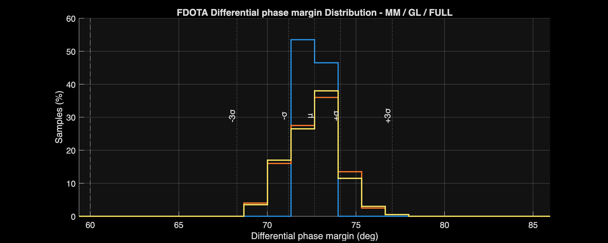

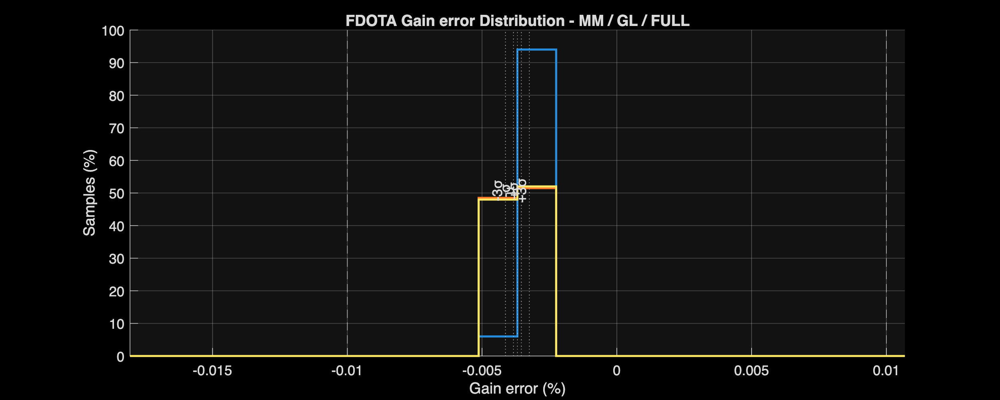

</details>

### 5.4 Instrumentation amplifier and right-leg drive

The balanced INA+RLD report contains formal limits for operating point, offset, gain accuracy, bandwidth, rejection, noise, loop stability, common-mode suppression, rail headroom, and interference-induced gain change. Gain values in V/V and dB remain descriptive. RLD swing ratio and peak current are retained only as debug quantities and are not formal signoff rows.

| Metric | Specification | Nominal | Full-PVT worst case | Corner |
| :--- | :---: | ---: | ---: | :---: |
| Total current / power | ≤6.2 mA / ≤22 mW | 3.860 mA / 12.738 mW | 5.300 mA / 19.079 mW | `FFVHTH` |
| Output CM error | ±40 mV | 0.395 mV | 12.649 mV | `SSVHTH` |
| Input-referred offset | ±2 mV | 0.000 µV | 0.002 µV | `SSVLTH` |
| S1 gain error | ±0.5% | 0.009% | −0.163% | `FFVLTL` |
| S2 gain error | ±0.25% | 0.002% | −0.052% | `FFVLTL` |
| INA gain error | ±0.5% | 0.011% | −0.215% | `FFVLTL` |
| Gain flatness, 0.05–150 Hz | ≤0.1 dB | $1.432\times10^{-6}$ dB | $3.079\times10^{-6}$ dB | `SSVLTH` |
| INA bandwidth | ≥150 kHz | 259.286 kHz | 176.996 kHz | `SSVLTH` |
| INA CMRR, 60 / 150 Hz | ≥80 / 80 dB | 225.384 / 225.265 dB | 204.344 / 203.835 dB | `SSNOMTH` |
| INA PSRR+, 60 / 150 Hz | ≥80 / 80 dB | 200.677 / 200.748 dB | 185.924 / 182.098 dB | `NOMVHTL` / `SSNOMNOM` |
| INA PSRR−, 60 / 150 Hz | ≥80 / 80 dB | 216.490 / 216.000 dB | 201.470 / 201.309 dB | `SSVLTH` |
| Input noise, 0.05–150 Hz | ≤4 µVrms | 2.667 µVrms | 3.117 µVrms | `SSVLTH` |
| RLD UGF | 0.5–1.6 kHz | 0.946 kHz | 1.502 kHz | `FFVHTH` |
| RLD phase margin | ≥60° | 100.672° | 100.092° | `FFVLTH` |
| CM suppression, 60 / 150 Hz | ≥50 / 45 dB | 55.072 / 53.257 dB | 54.644 / 51.676 dB | `SSVLTL` |
| RLD rail headroom | ≥0.1 V | 1.647 V | 1.497 V | `FFVLTH` |
| CM-interference gain change | ±0.1% | $-3.724\times10^{-5}$% | $6.725\times10^{-4}$% | `SSVHTL` |

The 200-run FULL Monte Carlo set passes every formal limit. Observed input-referred offset spans −1.448 to +1.849 mV, INA gain error spans −0.378% to +0.324%, and the minimum sampled CMRR is 95.303 dB. RLD UGF spans 0.820–1.086 kHz, phase margin remains above 100.504°, and common-mode suppression remains above 54.959 dB at 60 Hz and 52.789 dB at 150 Hz.

<details>
<summary>Complete INA+RLD FULL Monte Carlo results</summary>

| Parameter | Unit | Spec | Minimum | Mean | Maximum | Yield |
| :--- | :---: | :---: | ---: | ---: | ---: | ---: |
| Total current | mA | ≤6.2 | 3.701 | 3.870 | 4.109 | 100% |
| Total power | mW | ≤22 | 12.212 | 12.769 | 13.558 | 100% |
| Output CM error | mV | ±40 | −9.988 | 0.095 | 13.891 | 100% |
| Input-referred offset | µV | ±2000 | −1447.910 | −2.212 | 1848.980 | 100% |
| S1 gain | V/V | Report | 59.829 | 60.003 | 60.146 | — |
| S1 gain error | % | ±0.5 | −0.285 | 0.005 | 0.244 | 100% |
| S2 gain | V/V | Report | 3.996 | 4.000 | 4.003 | — |
| S2 gain error | % | ±0.25 | −0.094 | 0.001 | 0.080 | 100% |
| INA gain | V/V | Report | 239.092 | 240.014 | 240.777 | — |
| INA gain error | % | ±0.5 | −0.378 | 0.006 | 0.324 | 100% |
| INA CMRR @ 60 Hz | dB | ≥80 | 95.303 | 110.832 | 163.076 | 100% |
| INA CMRR @ 150 Hz | dB | ≥80 | 95.302 | 110.717 | 162.638 | 100% |
| RLD loop UGF | kHz | 0.5–1.6 | 0.820 | 0.948 | 1.086 | 100% |
| RLD phase margin | deg | ≥60 | 100.504 | 100.669 | 100.817 | 100% |
| Input CM suppression @ 60 Hz | dB | ≥50 | 54.959 | 55.075 | 55.164 | 100% |
| Input CM suppression @ 150 Hz | dB | ≥45 | 52.789 | 53.259 | 53.646 | 100% |

</details>

<details>
<details>
<summary>INA+RLD comparison: NOM, FF, SS, FS, SF, VL, VH, TL, TH</summary>

| Parameter | Unit | Spec | NOM | FF | SS | FS | SF | VL | VH | TL | TH |
| :--- | :---: | :---: | ---: | ---: | ---: | ---: | ---: | ---: | ---: | ---: | ---: |
| **SET CONDITIONS** | — | — | — | — | — | — | — | — | — | — | — |
| AVDD | V | — | 3.300 | 3.300 | 3.300 | 3.300 | 3.300 | 3.000 | 3.600 | 3.300 | 3.300 |
| Temperature | C | — | 27.000 | 27.000 | 27.000 | 27.000 | 27.000 | 27.000 | 27.000 | -40.000 | 125.000 |
| S1 target gain | V/V | — | 60.000 | 60.000 | 60.000 | 60.000 | 60.000 | 60.000 | 60.000 | 60.000 | 60.000 |
| S2 target gain | V/V | — | 4.000 | 4.000 | 4.000 | 4.000 | 4.000 | 4.000 | 4.000 | 4.000 | 4.000 |
| INA target gain | V/V | — | 240.000 | 240.000 | 240.000 | 240.000 | 240.000 | 240.000 | 240.000 | 240.000 | 240.000 |
| **OPERATING POINT** | — | — | — | — | — | — | — | — | — | — | — |
| Total current | mA | ≤6.2 | 3.860 | 4.474 | 3.366 | 3.977 | 3.742 | 3.771 | 3.930 | 3.123 | 4.491 |
| Total power | mW | ≤22 | 12.738 | 14.765 | 11.108 | 13.124 | 12.348 | 11.314 | 14.149 | 10.307 | 14.819 |
| Output CM error | mV | ±40 | 0.395 | -1.839 | 2.750 | 1.748 | -1.018 | 0.365 | 0.415 | -6.736 | 10.542 |
| Input-referred offset | uV | ±2000 | 0.000 | -0.000 | -0.000 | 0.001 | -0.001 | 0.001 | -0.001 | 0.001 | 0.001 |
| **INA** | — | — | — | — | — | — | — | — | — | — | — |
| S1 gain | V/V | — | 60.006 | 59.940 | 60.047 | 60.005 | 60.005 | 59.997 | 60.012 | 59.982 | 60.017 |
| S1 gain dB | dB | — | 35.564 | 35.554 | 35.570 | 35.564 | 35.564 | 35.563 | 35.565 | 35.560 | 35.566 |
| S1 gain error | % | ±0.5 | 0.009 | -0.100 | 0.079 | 0.008 | 0.009 | -0.004 | 0.020 | -0.030 | 0.029 |
| S1 -3 dB bandwidth | kHz | ≥150 | 261.757 | 330.834 | 211.064 | 268.045 | 255.398 | 257.167 | 265.190 | 273.784 | 227.570 |
| S2 gain | V/V | — | 4.000 | 3.999 | 4.001 | 4.000 | 4.000 | 4.000 | 4.000 | 3.999 | 4.001 |
| S2 gain dB | dB | — | 12.041 | 12.039 | 12.043 | 12.041 | 12.041 | 12.041 | 12.041 | 12.040 | 12.043 |
| S2 gain error | % | ±0.25 | 0.002 | -0.030 | 0.023 | 0.001 | 0.002 | 1.915e-04 | 0.003 | -0.015 | 0.019 |
| S2 -3 dB bandwidth | MHz | ≥1.5 | 2.647 | 3.409 | 2.100 | 2.717 | 2.578 | 2.597 | 2.683 | 2.752 | 2.321 |
| INA gain | V/V | — | 240.027 | 239.689 | 240.243 | 240.021 | 240.026 | 239.990 | 240.055 | 239.892 | 240.113 |
| INA gain dB | dB | — | 47.605 | 47.593 | 47.613 | 47.605 | 47.605 | 47.604 | 47.606 | 47.600 | 47.608 |
| INA gain error | % | ±0.5 | 0.011 | -0.130 | 0.101 | 0.009 | 0.011 | -0.004 | 0.023 | -0.045 | 0.047 |
| Gain flatness 0.05-150 Hz | dB | ≤0.1 | 1.432e-06 | 8.999e-07 | 2.208e-06 | 1.368e-06 | 1.505e-06 | 1.483e-06 | 1.395e-06 | 1.312e-06 | 1.894e-06 |
| INA -3 dB bandwidth | kHz | ≥150 | 259.286 | 327.841 | 209.004 | 265.524 | 252.978 | 254.746 | 262.678 | 271.141 | 225.472 |
| INA CMRR @ 60 Hz | dB | ≥80 | 225.384 | 218.695 | 239.259 | 210.445 | 234.189 | 219.116 | 216.820 | 220.541 | 224.778 |
| INA CMRR @ 150 Hz | dB | ≥80 | 225.265 | 218.650 | 238.714 | 210.430 | 233.703 | 219.124 | 216.476 | 220.533 | 224.856 |
| INA PSRR+ @ 60 Hz | dB | ≥80 | 200.677 | 196.205 | 194.996 | 190.667 | 195.734 | 194.571 | 198.889 | 198.572 | 197.597 |
| INA PSRR+ @ 150 Hz | dB | ≥80 | 200.748 | 196.207 | 182.098 | 210.536 | 198.848 | 194.607 | 198.945 | 198.522 | 197.661 |
| INA PSRR- @ 60 Hz | dB | ≥80 | 216.490 | 219.881 | 220.373 | 244.774 | 228.583 | 221.746 | 239.552 | 212.358 | 210.978 |
| INA PSRR- @ 150 Hz | dB | ≥80 | 216.000 | 219.821 | 221.122 | 255.255 | 228.819 | 221.743 | 243.891 | 212.540 | 210.978 |
| Input-referred noise 0.05-150 Hz | uVrms | ≤4 | 2.667 | 2.536 | 2.803 | 2.633 | 2.703 | 2.668 | 2.668 | 2.524 | 2.954 |
| **RLD** | — | — | — | — | — | — | — | — | — | — | — |
| RLD loop UGF | kHz | 1.05±0.55 | 0.946 | 1.313 | 0.717 | 0.946 | 0.946 | 0.946 | 0.946 | 0.839 | 1.082 |
| RLD phase margin | deg | ≥60 | 100.672 | 100.310 | 100.899 | 100.689 | 100.655 | 100.644 | 100.697 | 100.779 | 100.540 |
| Input CM suppression @ 60 Hz | dB | ≥50 | 55.072 | 55.254 | 54.807 | 55.074 | 55.070 | 55.068 | 55.075 | 54.973 | 55.160 |
| Input CM suppression @ 150 Hz | dB | ≥45 | 53.257 | 54.098 | 52.233 | 53.269 | 53.245 | 53.237 | 53.275 | 52.853 | 53.651 |
| RLD output rail headroom | V | ≥0.1 | 1.647 | 1.647 | 1.647 | 1.647 | 1.647 | 1.497 | 1.797 | 1.647 | 1.647 |
| CM Interference Gain Change | % | ±0.1 | -3.724e-05 | -5.156e-04 | -3.258e-04 | -2.836e-04 | -2.270e-04 | -5.445e-04 | -3.291e-04 | -1.896e-04 | -4.596e-04 |

</details>

<details>
<summary>All generated INA+RLD plots</summary>

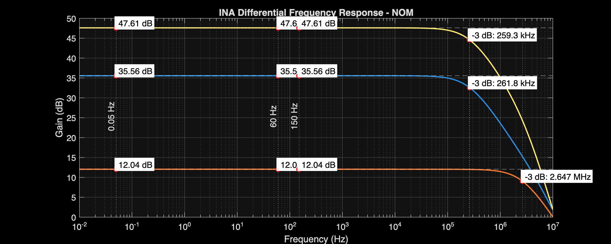

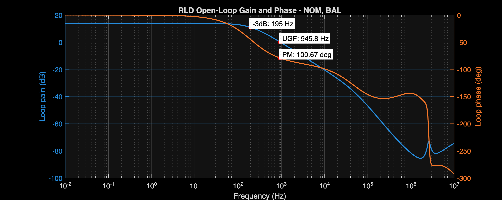

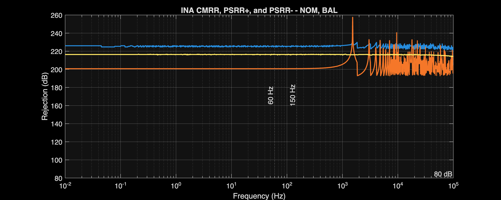

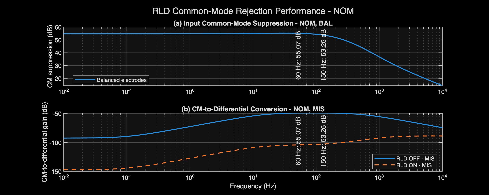

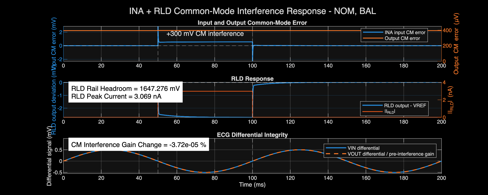

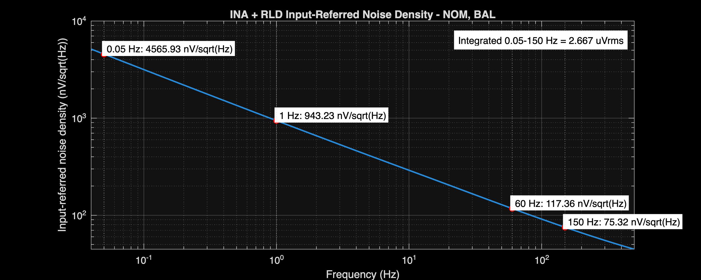

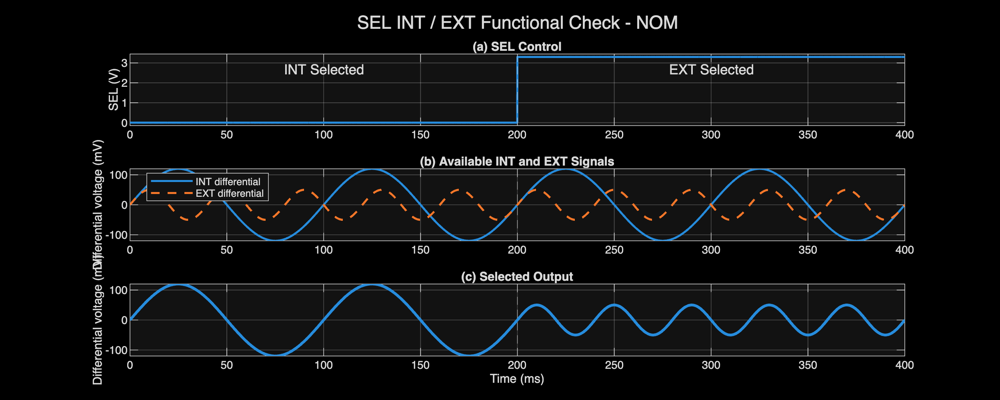

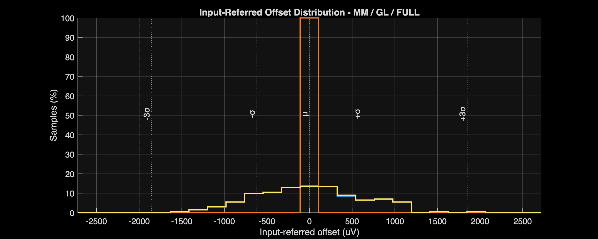

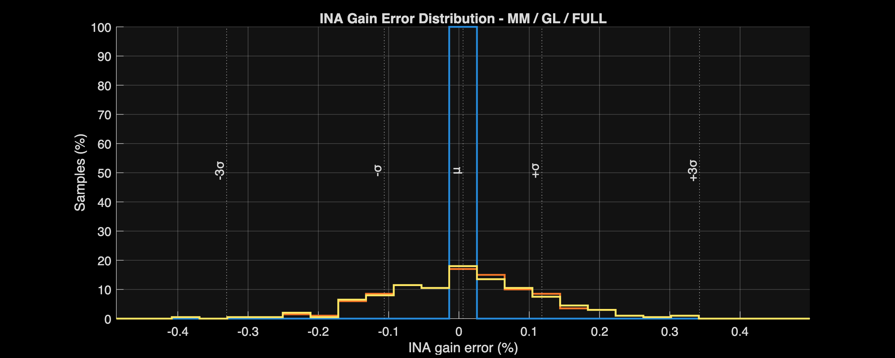

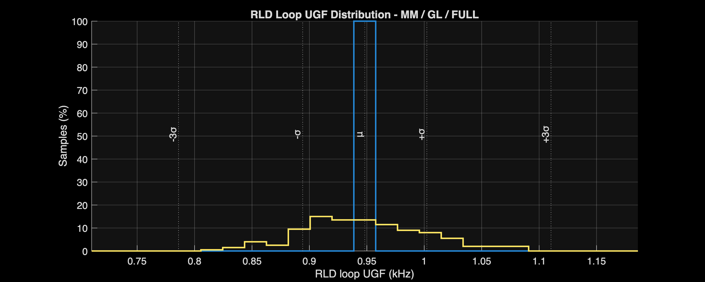

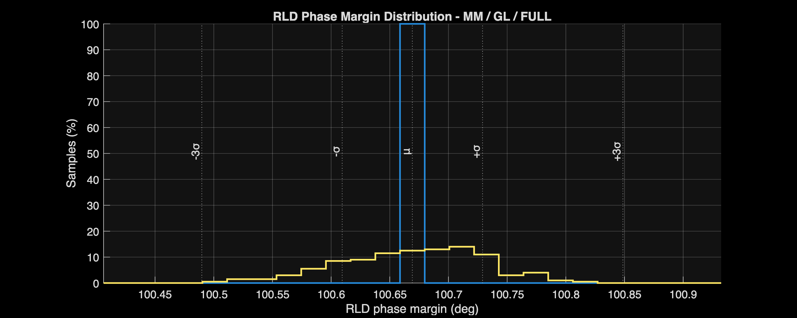

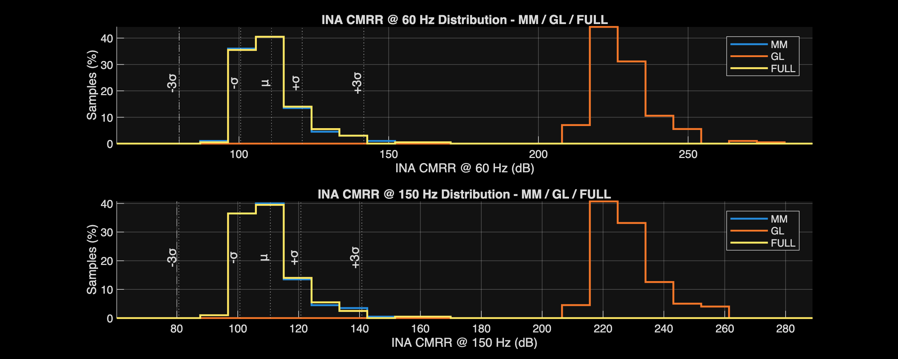

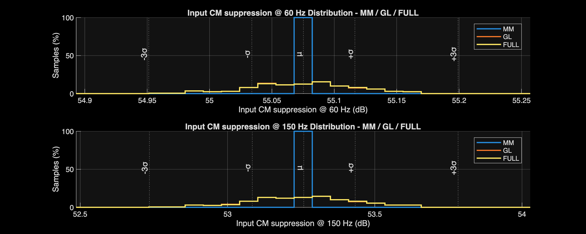

</details>

### 5.5 Low-pass filter

The LPF uses the −1 dB frequency as its formal signal-band criterion. Loss at 150 Hz and the −3 dB frequency are reported for characterization without redundant pass/fail limits.

| Metric | Specification | Nominal | Full-PVT worst case | Corner |
| :--- | :---: | ---: | ---: | :---: |
| Total current / power | ≤2.5 mA / ≤9 mW | 1.604 mA / 5.293 mW | 2.194 mA / 7.900 mW | `FFVHTH` |
| Output CM error | ±25 mV | 0.395 mV | 12.659 mV | `SSVHTH` |
| Input offset | ±6 mV | 0.000 mV | −0.000 mV | `SFVLTH` |
| Passband gain error | ±0.5% | −0.027% | −0.050% | `SSVLTL` |
| Loss at 150 Hz | Report only | 0.361 dB | 0.762 dB | `SSVHTL` |
| −1 dB frequency | ≥150 Hz | 258.691 Hz | 174.135 Hz | `SSVHTL` |
| −3 dB frequency | Report only | 506.912 Hz | 340.986 Hz | `SSVHTL` |
| CMRR, 60 / 150 Hz | ≥80 / 80 dB | 245.253 / 245.225 dB | 218.616 / 218.582 dB | `SSVHNOM` / `SSVLNOM` |
| PSRR+, 60 / 150 Hz | ≥80 / 80 dB | 191.538 / 257.637 dB | 190.541 / 189.146 dB | `SSVHNOM` / `SSVLTH` |
| PSRR−, 60 / 150 Hz | ≥80 / 80 dB | 234.605 / 236.558 dB | 204.439 / 204.885 dB | `SSVLNOM` |
| Input noise, 0.05–150 Hz | ≤10 µVrms | 6.176 µVrms | 7.036 µVrms | `SSVHTH` |

The 200-run FULL Monte Carlo set passes every formal limit. Observed LPF input offset spans −4.612 to +5.068 mV against the ±6 mV limit. Passband gain error stays between −0.0335% and −0.0219%, the −1 dB frequency remains above 224.388 Hz, and sampled CMRR remains above 91.208 dB at both 60 Hz and 150 Hz.

<details>
<summary>Complete LPF FULL Monte Carlo results</summary>

| Parameter | Unit | Spec | Minimum | Mean | Maximum | Yield |
| :--- | :---: | :---: | ---: | ---: | ---: | ---: |
| FDC bias current | µA | 40±10 | 38.520 | 40.106 | 41.822 | 100% |
| CMFB bias current | µA | 40±10 | 38.532 | 40.100 | 41.771 | 100% |
| Total current | mA | ≤2.5 | 1.522 | 1.608 | 1.694 | 100% |
| Total power | mW | ≤9 | 5.024 | 5.305 | 5.590 | 100% |
| Output CM error | mV | ±25 | −11.398 | 0.332 | 15.409 | 100% |
| LPF input offset | mV | ±6 | −4.612 | −0.090 | 5.068 | 100% |
| Passband gain | V/V | Report | 0.999665 | 0.999731 | 0.999781 | — |
| Passband gain error | % | ±0.5 | −0.0335 | −0.0269 | −0.0219 | 100% |
| LPF −1 dB frequency | Hz | ≥150 | 224.388 | 259.345 | 297.071 | 100% |
| LPF −3 dB frequency | Hz | Report | 439.608 | 508.186 | 582.188 | — |
| CMRR @ 60 Hz | dB | ≥80 | 91.218 | 107.861 | 151.259 | 100% |
| CMRR @ 150 Hz | dB | ≥80 | 91.208 | 107.775 | 147.169 | 100% |

</details>

<details>
<details>
<summary>LPF comparison: NOM, FF, SS, FS, SF, VL, VH, TL, TH</summary>

| Parameter | Unit | Spec | NOM | FF | SS | FS | SF | VL | VH | TL | TH |
| :--- | :---: | :---: | ---: | ---: | ---: | ---: | ---: | ---: | ---: | ---: | ---: |
| **SET CONDITIONS** | — | — | — | — | — | — | — | — | — | — | — |
| AVDD | V | — | 3.300 | 3.300 | 3.300 | 3.300 | 3.300 | 3.000 | 3.600 | 3.300 | 3.300 |
| Temperature | C | — | 27.000 | 27.000 | 27.000 | 27.000 | 27.000 | 27.000 | 27.000 | -40.000 | 125.000 |
| LPF target gain | V/V | — | 1.000 | 1.000 | 1.000 | 1.000 | 1.000 | 1.000 | 1.000 | 1.000 | 1.000 |
| **OPERATING POINT** | — | — | — | — | — | — | — | — | — | — | — |
| FDC bias current | uA | 40±10 | 40.092 | 45.286 | 35.875 | 40.727 | 39.434 | 39.479 | 40.525 | 35.435 | 43.278 |
| CMFB bias current | uA | 40±10 | 40.092 | 45.286 | 35.875 | 40.727 | 39.434 | 39.479 | 40.525 | 35.435 | 43.278 |
| Total current | mA | ≤2.5 | 1.604 | 1.857 | 1.400 | 1.652 | 1.556 | 1.568 | 1.633 | 1.302 | 1.861 |
| Total power | mW | ≤9 | 5.293 | 6.129 | 4.620 | 5.451 | 5.133 | 4.703 | 5.878 | 4.296 | 6.143 |
| Output CM error | mV | ±25 | 0.395 | -1.841 | 2.752 | 1.749 | -1.019 | 0.365 | 0.415 | -6.740 | 10.550 |
| LPF input offset | mV | ±6 | 0.000 | 0.000 | 0.000 | -0.000 | -0.000 | 0.000 | -0.000 | 0.000 | 0.000 |
| **LPF** | — | — | — | — | — | — | — | — | — | — | — |
| Passband gain | V/V | — | 1.000 | 1.000 | 1.000 | 1.000 | 1.000 | 1.000 | 1.000 | 1.000 | 1.000 |
| Passband gain error | % | ±0.5 | -0.027 | -0.018 | -0.041 | -0.027 | -0.027 | -0.027 | -0.026 | -0.032 | -0.023 |
| Loss @ 150 Hz | dB | — | 0.361 | 0.191 | 0.611 | 0.361 | 0.361 | 0.361 | 0.361 | 0.454 | 0.279 |
| LPF -1 dB frequency | Hz | ≥150 | 258.691 | 359.135 | 196.115 | 258.691 | 258.690 | 258.691 | 258.690 | 229.654 | 295.879 |
| LPF -3 dB frequency | Hz | — | 506.912 | 703.898 | 384.135 | 506.914 | 506.911 | 506.913 | 506.912 | 449.936 | 579.847 |
| CMRR @ 60 Hz | dB | ≥80 | 245.253 | 224.162 | 220.057 | 247.019 | 243.716 | 246.290 | 244.236 | 222.335 | 245.124 |
| CMRR @ 150 Hz | dB | ≥80 | 245.225 | 224.157 | 220.675 | 246.979 | 243.685 | 246.266 | 244.200 | 224.269 | 245.163 |
| PSRR+ @ 60 Hz | dB | ≥80 | 191.538 | 192.668 | 190.631 | 191.774 | 191.298 | 191.457 | 191.625 | 233.076 | 252.607 |
| PSRR+ @ 150 Hz | dB | ≥80 | 257.637 | 192.627 | 190.492 | 257.089 | 254.286 | 240.823 | 254.961 | 191.733 | 190.298 |
| PSRR- @ 60 Hz | dB | ≥80 | 234.605 | 215.375 | 212.133 | 234.660 | 233.753 | 228.572 | 236.436 | 213.278 | 238.788 |
| PSRR- @ 150 Hz | dB | ≥80 | 236.558 | 215.346 | 210.355 | 237.874 | 236.146 | 233.752 | 237.079 | 214.256 | 236.197 |
| Input-referred noise 0.05-150 Hz | uVrms | ≤10 | 6.176 | 5.903 | 6.452 | 6.077 | 6.274 | 6.164 | 6.187 | 5.895 | 6.715 |

</details>

<details>
<summary>All generated LPF plots</summary>

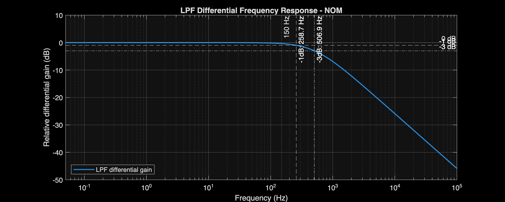

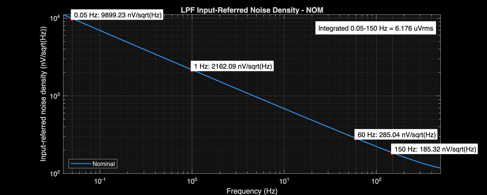

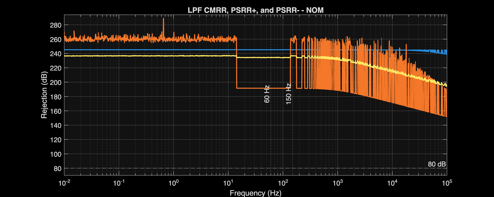

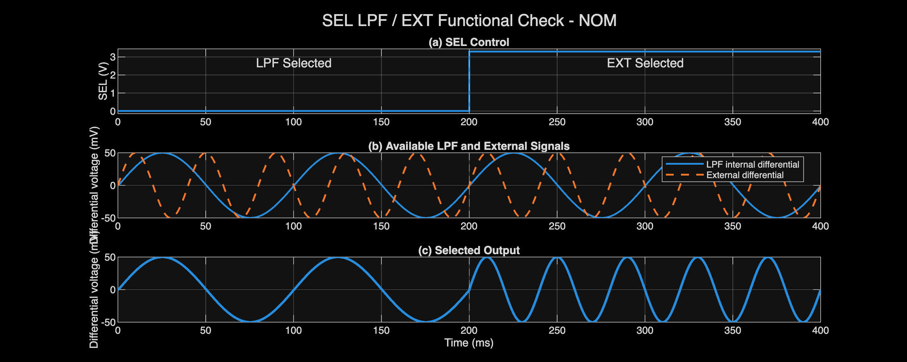

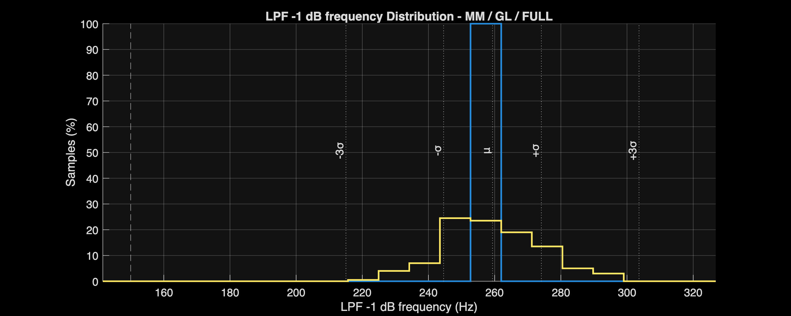

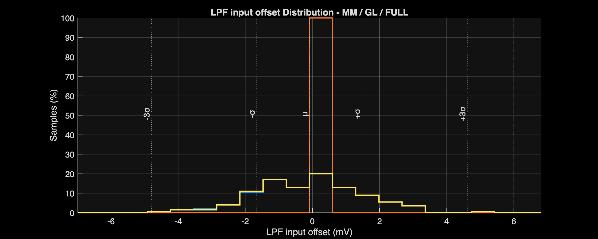

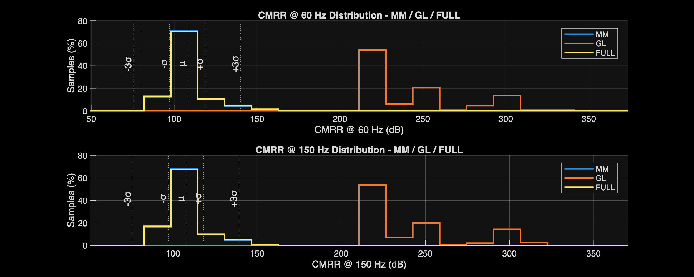

</details>

### 5.6 Programmable gain amplifier

PGA verification covers G2, G4, G8, and G16. Absolute gain is descriptive; gain error carries the ±5% hard limit. The nominal frequency-response and noise figures combine all four gain codes, while rejection uses three subplots for CMRR, PSRR+, and PSRR−.

| Metric | Specification | Full-PVT worst case | Gain / corner |
| :--- | :---: | ---: | :---: |
| Total current / power | ≤2.5 mA / ≤9 mW | 2.195 mA / 7.901 mW | `FFVHTH` |
| Output CM error | ±20 mV | 12.654 mV | `SSVHTH` |
| Input offset | ±5 mV | <1 nV deterministic | All gain codes |
| Gain error | ±5% | 2.502% | G2 / `SSVLTH` |
| −3 dB bandwidth | ≥0.15 MHz | 0.595 MHz | G16 / `SSVLTH` |
| CMRR at 150 Hz | ≥80 dB | 184.550 dB | G8 / `NOMVHNOM` |
| PSRR− at 150 Hz | ≥80 dB | 181.026 dB | G8 / `NOMVHNOM` |
| Input noise, 0.05–150 Hz | ≤10 µVrms | 5.250 µVrms | G2 / `SSVHTH` |

Nominal gain-code results are:

| Gain code | Gain at 10 Hz | Gain error | −3 dB bandwidth | Input noise, 0.05–150 Hz |
| :---: | ---: | ---: | ---: | ---: |
| G2 | 2.015 V/V | +0.751% | 5.053 MHz | 4.617 µVrms |
| G4 | 3.991 V/V | −0.236% | 3.025 MHz | 3.859 µVrms |
| G8 | 7.958 V/V | −0.522% | 2.070 MHz | 3.473 µVrms |
| G16 | 15.860 V/V | −0.878% | 0.907 MHz | 3.280 µVrms |

The 200-run FULL Monte Carlo set passes every formal limit. The closest rejection margin occurs at G2, where sampled CMRR remains above 85.634 dB. G2 input offset spans −3.450 to +3.790 mV, while the other gain codes have smaller extrema. Across gain codes, sampled bandwidth minima are 4.588 MHz (G2), 2.754 MHz (G4), 1.854 MHz (G8), and 0.826 MHz (G16), all comfortably above 0.15 MHz.

<details>
<summary>Complete PGA FULL Monte Carlo results</summary>

| Parameter | Unit | Spec | Minimum | Mean | Maximum | Yield |
| :--- | :---: | :---: | ---: | ---: | ---: | ---: |
| FDC bias current | µA | 40±10 | 38.520 | 40.106 | 41.822 | 100% |
| CMFB bias current | µA | 40±10 | 38.532 | 40.100 | 41.771 | 100% |
| Total current | mA | ≤2.5 | 1.522 | 1.608 | 1.694 | 100% |
| Total power | mW | ≤9 | 5.023 | 5.305 | 5.590 | 100% |
| Output CM error | mV | ±20 | −11.394 | 0.332 | 15.402 | 100% |
| G2 input offset | mV | ±5 | −3.450 | −0.068 | 3.790 | 100% |
| G2 gain @ 10 Hz | V/V | Report | 2.010 | 2.015 | 2.024 | — |
| G2 gain error | % | ±5 | 0.489 | 0.755 | 1.223 | 100% |
| G2 gain @ 150 Hz | V/V | Report | 2.010 | 2.015 | 2.024 | — |
| G2 −3 dB bandwidth | MHz | ≥0.15 | 4.588 | 5.056 | 5.660 | 100% |
| G2 CMRR @ 60 Hz | dB | ≥80 | 85.634 | 101.150 | 140.705 | 100% |
| G2 CMRR @ 150 Hz | dB | ≥80 | 85.634 | 101.150 | 140.705 | 100% |
| G4 input offset | mV | ±5 | −2.884 | −0.056 | 3.169 | 100% |
| G4 gain @ 10 Hz | V/V | Report | 3.986 | 3.991 | 3.995 | — |
| G4 gain error | % | ±5 | −0.339 | −0.235 | −0.134 | 100% |
| G4 gain @ 150 Hz | V/V | Report | 3.986 | 3.991 | 3.995 | — |
| G4 −3 dB bandwidth | MHz | ≥0.15 | 2.754 | 3.027 | 3.364 | 100% |
| G4 CMRR @ 60 Hz | dB | ≥80 | 92.418 | 105.515 | 134.085 | 100% |
| G4 CMRR @ 150 Hz | dB | ≥80 | 92.418 | 105.515 | 134.085 | 100% |
| G8 input offset | mV | ±5 | −2.596 | −0.051 | 2.852 | 100% |
| G8 gain @ 10 Hz | V/V | Report | 7.947 | 7.958 | 7.967 | — |
| G8 gain error | % | ±5 | −0.657 | −0.523 | −0.409 | 100% |
| G8 gain @ 150 Hz | V/V | Report | 7.947 | 7.958 | 7.967 | — |
| G8 −3 dB bandwidth | MHz | ≥0.15 | 1.854 | 2.072 | 2.324 | 100% |
| G8 CMRR @ 60 Hz | dB | ≥80 | 91.302 | 107.708 | 145.889 | 100% |
| G8 CMRR @ 150 Hz | dB | ≥80 | 91.302 | 107.708 | 145.889 | 100% |
| G16 input offset | mV | ±5 | −2.452 | −0.048 | 2.694 | 100% |
| G16 gain @ 10 Hz | V/V | Report | 15.845 | 15.859 | 15.872 | — |
| G16 gain error | % | ±5 | −0.972 | −0.879 | −0.800 | 100% |
| G16 gain @ 150 Hz | V/V | Report | 15.845 | 15.859 | 15.872 | — |
| G16 −3 dB bandwidth | MHz | ≥0.15 | 0.826 | 0.908 | 1.003 | 100% |
| G16 CMRR @ 60 Hz | dB | ≥80 | 91.226 | 107.909 | 154.493 | 100% |
| G16 CMRR @ 150 Hz | dB | ≥80 | 91.226 | 107.909 | 154.483 | 100% |

</details>

<details>
<details>
<summary>PGA comparison: NOM, FF, SS, FS, SF, VL, VH, TL, TH</summary>

| Parameter | Unit | Spec | NOM | FF | SS | FS | SF | VL | VH | TL | TH |
| :--- | :---: | :---: | ---: | ---: | ---: | ---: | ---: | ---: | ---: | ---: | ---: |
| **SET CONDITIONS** | — | — | — | — | — | — | — | — | — | — | — |
| AVDD | V | — | 3.300 | 3.300 | 3.300 | 3.300 | 3.300 | 3.000 | 3.600 | 3.300 | 3.300 |
| Temperature | C | — | 27.000 | 27.000 | 27.000 | 27.000 | 27.000 | 27.000 | 27.000 | -40.000 | 125.000 |
| Shared OP gain code | code | — | 2.000 | 2.000 | 2.000 | 2.000 | 2.000 | 2.000 | 2.000 | 2.000 | 2.000 |
| **OPERATING POINT** | — | — | — | — | — | — | — | — | — | — | — |
| FDC bias current | uA | 40±10 | 40.092 | 45.286 | 35.875 | 40.727 | 39.434 | 39.479 | 40.525 | 35.435 | 43.278 |
| CMFB bias current | uA | 40±10 | 40.092 | 45.286 | 35.875 | 40.727 | 39.434 | 39.479 | 40.525 | 35.435 | 43.278 |
| Total current | mA | ≤2.5 | 1.604 | 1.857 | 1.400 | 1.652 | 1.556 | 1.568 | 1.633 | 1.302 | 1.862 |
| Total power | mW | ≤9 | 5.293 | 6.129 | 4.621 | 5.451 | 5.133 | 4.703 | 5.878 | 4.296 | 6.144 |
| Output CM error | mV | ±20 | 0.395 | -1.840 | 2.750 | 1.748 | -1.018 | 0.365 | 0.415 | -6.738 | 10.545 |
| **G2** | — | — | — | — | — | — | — | — | — | — | — |
| G2 target gain | V/V | — | 2.000 | 2.000 | 2.000 | 2.000 | 2.000 | 2.000 | 2.000 | 2.000 | 2.000 |
| G2 input offset | mV | ±5 | 2.329e-08 | 8.015e-08 | 4.844e-08 | -6.433e-08 | 2.144e-08 | 2.133e-08 | -3.856e-08 | -1.035e-07 | -5.205e-07 |
| G2 gain @ 10 Hz | V/V | — | 2.015 | 2.012 | 2.022 | 2.013 | 2.017 | 2.023 | 2.010 | 2.008 | 2.026 |
| G2 gain @ 150 Hz | V/V | — | 2.015 | 2.012 | 2.022 | 2.013 | 2.017 | 2.023 | 2.010 | 2.008 | 2.026 |
| G2 gain error | % | ±5 | 0.751 | 0.604 | 1.115 | 0.660 | 0.832 | 1.152 | 0.515 | 0.375 | 1.317 |
| G2 -3 dB bandwidth | MHz | ≥0.15 | 5.053 | 6.637 | 3.941 | 5.203 | 4.904 | 4.958 | 5.116 | 5.276 | 4.367 |
| G2 CMRR @ 60 Hz | dB | ≥80 | 256.698 | 250.023 | 245.010 | 250.810 | 259.482 | 253.215 | 259.071 | 245.176 | 231.207 |
| G2 CMRR @ 150 Hz | dB | ≥80 | 256.479 | 250.049 | 245.074 | 250.896 | 259.210 | 252.989 | 259.288 | 245.160 | 231.199 |
| G2 PSRR+ @ 60 Hz | dB | ≥80 | 246.395 | 233.145 | 230.213 | 226.573 | 232.478 | 216.133 | 230.555 | 228.383 | 235.708 |
| G2 PSRR+ @ 150 Hz | dB | ≥80 | 246.262 | 233.122 | 230.226 | 226.569 | 232.525 | 216.137 | 230.546 | 228.413 | 235.697 |
| G2 PSRR- @ 60 Hz | dB | ≥80 | 234.094 | 240.760 | 227.492 | 223.465 | 228.057 | 219.275 | 230.377 | 234.734 | 234.005 |
| G2 PSRR- @ 150 Hz | dB | ≥80 | 232.714 | 241.502 | 226.906 | 223.061 | 228.875 | 218.935 | 229.597 | 235.232 | 234.710 |
| G2 input-referred noise 0.05-150 Hz | uVrms | ≤10 | 4.617 | 4.417 | 4.815 | 4.545 | 4.689 | 4.602 | 4.629 | 4.412 | 5.012 |
| **G4** | — | — | — | — | — | — | — | — | — | — | — |
| G4 target gain | V/V | — | 4.000 | 4.000 | 4.000 | 4.000 | 4.000 | 4.000 | 4.000 | 4.000 | 4.000 |
| G4 input offset | mV | ±5 | -6.921e-08 | -1.865e-07 | -4.575e-07 | -3.246e-08 | 1.916e-09 | 9.768e-09 | -6.398e-08 | 4.504e-08 | -6.418e-08 |
| G4 gain @ 10 Hz | V/V | — | 3.991 | 3.988 | 3.995 | 3.990 | 3.991 | 3.995 | 3.988 | 3.986 | 3.997 |
| G4 gain @ 150 Hz | V/V | — | 3.991 | 3.988 | 3.995 | 3.990 | 3.991 | 3.995 | 3.988 | 3.986 | 3.997 |
| G4 gain error | % | ±5 | -0.236 | -0.288 | -0.134 | -0.259 | -0.215 | -0.136 | -0.294 | -0.339 | -0.085 |
| G4 -3 dB bandwidth | MHz | ≥0.15 | 3.025 | 3.920 | 2.385 | 3.112 | 2.938 | 2.973 | 3.061 | 3.178 | 2.596 |
| G4 CMRR @ 60 Hz | dB | ≥80 | 226.805 | 221.833 | 225.787 | 226.660 | 226.573 | 226.484 | 226.693 | 221.370 | 222.254 |
| G4 CMRR @ 150 Hz | dB | ≥80 | 220.287 | 220.389 | 234.813 | 220.186 | 220.212 | 220.182 | 220.186 | 218.996 | 220.377 |
| G4 PSRR+ @ 60 Hz | dB | ≥80 | 236.682 | 248.435 | 234.280 | 235.694 | 234.083 | 232.469 | 246.321 | 241.288 | 242.240 |
| G4 PSRR+ @ 150 Hz | dB | ≥80 | 236.710 | 248.511 | 234.296 | 235.717 | 234.059 | 232.462 | 246.444 | 241.173 | 242.205 |
| G4 PSRR- @ 60 Hz | dB | ≥80 | 217.577 | 213.931 | 214.805 | 217.371 | 216.518 | 216.107 | 217.568 | 213.703 | 213.188 |
| G4 PSRR- @ 150 Hz | dB | ≥80 | 211.726 | 212.488 | 220.065 | 211.590 | 211.203 | 210.994 | 211.674 | 211.274 | 211.531 |
| G4 input-referred noise 0.05-150 Hz | uVrms | ≤10 | 3.859 | 3.690 | 4.028 | 3.797 | 3.920 | 3.851 | 3.866 | 3.684 | 4.195 |
| **G8** | — | — | — | — | — | — | — | — | — | — | — |
| G8 target gain | V/V | — | 8.000 | 8.000 | 8.000 | 8.000 | 8.000 | 8.000 | 8.000 | 8.000 | 8.000 |
| G8 input offset | mV | ±5 | 9.462e-07 | 2.456e-07 | 1.373e-07 | -1.905e-07 | 4.265e-07 | 8.312e-07 | 7.111e-07 | 2.143e-07 | 2.164e-07 |
| G8 gain @ 10 Hz | V/V | — | 7.958 | 7.953 | 7.967 | 7.956 | 7.960 | 7.966 | 7.954 | 7.950 | 7.970 |
| G8 gain @ 150 Hz | V/V | — | 7.958 | 7.953 | 7.967 | 7.956 | 7.960 | 7.966 | 7.954 | 7.950 | 7.970 |
| G8 gain error | % | ±5 | -0.522 | -0.585 | -0.416 | -0.547 | -0.501 | -0.425 | -0.580 | -0.628 | -0.370 |
| G8 -3 dB bandwidth | MHz | ≥0.15 | 2.070 | 2.668 | 1.629 | 2.137 | 2.003 | 2.026 | 2.101 | 2.253 | 1.682 |
| G8 CMRR @ 60 Hz | dB | ≥80 | 211.955 | 207.973 | 193.428 | 202.563 | 191.621 | 207.828 | 184.741 | 197.365 | 199.520 |
| G8 CMRR @ 150 Hz | dB | ≥80 | 218.025 | 207.221 | 193.767 | 201.187 | 191.213 | 205.489 | 184.550 | 197.801 | 199.904 |
| G8 PSRR+ @ 60 Hz | dB | ≥80 | 231.664 | 241.701 | 238.711 | 237.793 | 243.735 | 232.343 | 239.790 | 241.993 | 234.689 |
| G8 PSRR+ @ 150 Hz | dB | ≥80 | 231.658 | 241.733 | 238.691 | 237.815 | 243.716 | 232.326 | 239.764 | 241.958 | 234.681 |
| G8 PSRR- @ 60 Hz | dB | ≥80 | 207.945 | 204.315 | 189.887 | 199.006 | 188.105 | 204.547 | 181.216 | 193.844 | 196.077 |
| G8 PSRR- @ 150 Hz | dB | ≥80 | 213.545 | 203.576 | 190.226 | 197.634 | 187.698 | 202.152 | 181.026 | 194.280 | 196.463 |
| G8 input-referred noise 0.05-150 Hz | uVrms | ≤10 | 3.473 | 3.321 | 3.626 | 3.418 | 3.529 | 3.466 | 3.480 | 3.315 | 3.777 |
| **G16** | — | — | — | — | — | — | — | — | — | — | — |
| G16 target gain | V/V | — | 16.000 | 16.000 | 16.000 | 16.000 | 16.000 | 16.000 | 16.000 | 16.000 | 16.000 |
| G16 input offset | mV | ±5 | 3.383e-07 | -3.840e-08 | -6.553e-08 | 3.272e-07 | 3.459e-07 | 3.446e-07 | -1.212e-07 | -5.861e-09 | -6.413e-08 |
| G16 gain @ 10 Hz | V/V | — | 15.860 | 15.854 | 15.863 | 15.859 | 15.860 | 15.859 | 15.860 | 15.857 | 15.862 |
| G16 gain @ 150 Hz | V/V | — | 15.860 | 15.854 | 15.863 | 15.859 | 15.860 | 15.859 | 15.860 | 15.857 | 15.862 |
| G16 gain error | % | ±5 | -0.878 | -0.910 | -0.857 | -0.880 | -0.876 | -0.882 | -0.874 | -0.892 | -0.866 |
| G16 -3 dB bandwidth | MHz | ≥0.15 | 0.907 | 1.153 | 0.725 | 0.933 | 0.880 | 0.891 | 0.918 | 0.969 | 0.765 |
| G16 CMRR @ 60 Hz | dB | ≥80 | 188.992 | 215.201 | 215.186 | 188.992 | 188.993 | 194.854 | 188.991 | 207.016 | 206.727 |
| G16 CMRR @ 150 Hz | dB | ≥80 | 188.555 | 212.944 | 224.785 | 188.551 | 188.559 | 194.026 | 188.549 | 205.345 | 205.577 |
| G16 PSRR+ @ 60 Hz | dB | ≥80 | 269.035 | 282.154 | 278.364 | 269.534 | 272.115 | 275.565 | 261.675 | 280.825 | 283.703 |
| G16 PSRR+ @ 150 Hz | dB | ≥80 | 267.726 | 284.635 | 278.579 | 268.605 | 271.356 | 273.408 | 261.655 | 284.969 | 283.341 |
| G16 PSRR- @ 60 Hz | dB | ≥80 | 186.022 | 210.506 | 229.112 | 186.021 | 186.022 | 191.939 | 186.021 | 204.883 | 202.889 |
| G16 PSRR- @ 150 Hz | dB | ≥80 | 185.643 | 208.856 | 219.476 | 185.639 | 185.646 | 191.214 | 185.637 | 203.294 | 201.982 |
| G16 input-referred noise 0.05-150 Hz | uVrms | ≤10 | 3.280 | 3.136 | 3.425 | 3.228 | 3.332 | 3.274 | 3.286 | 3.131 | 3.567 |

</details>

<details>
<summary>All generated PGA plots</summary>

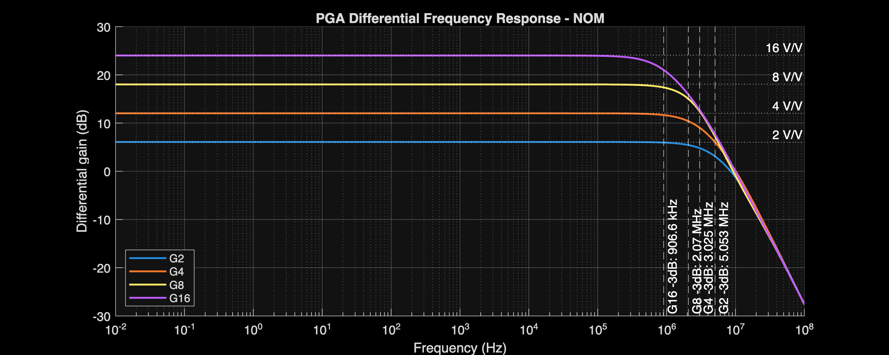

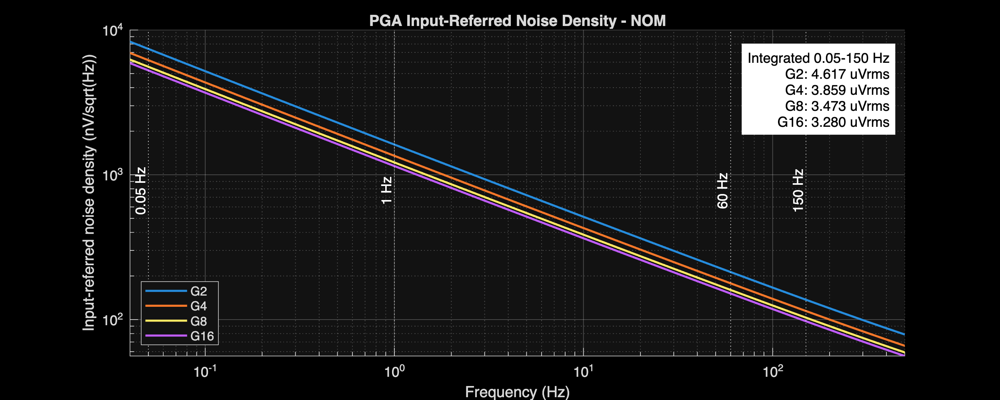

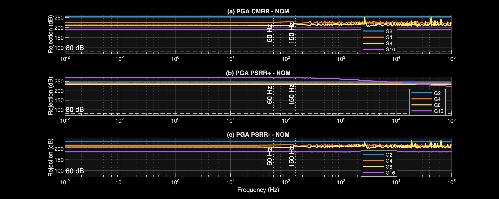

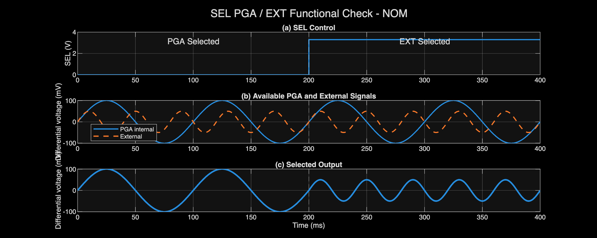

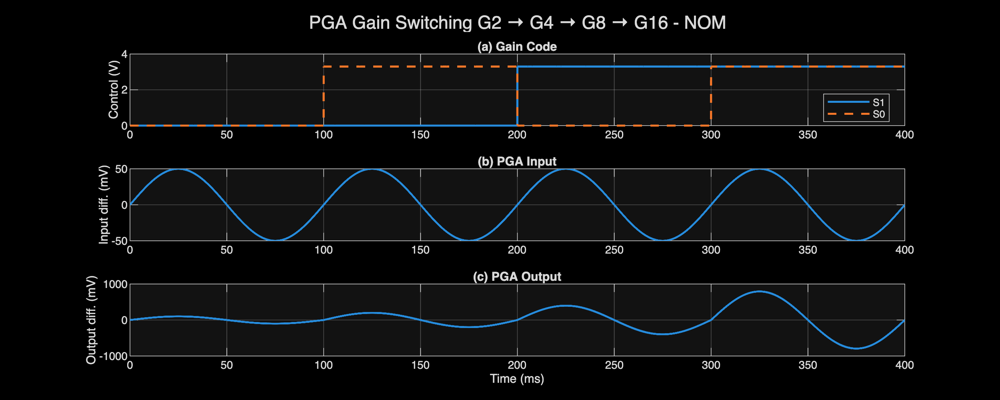

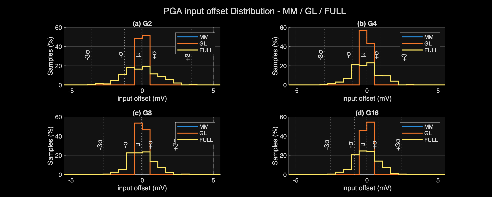

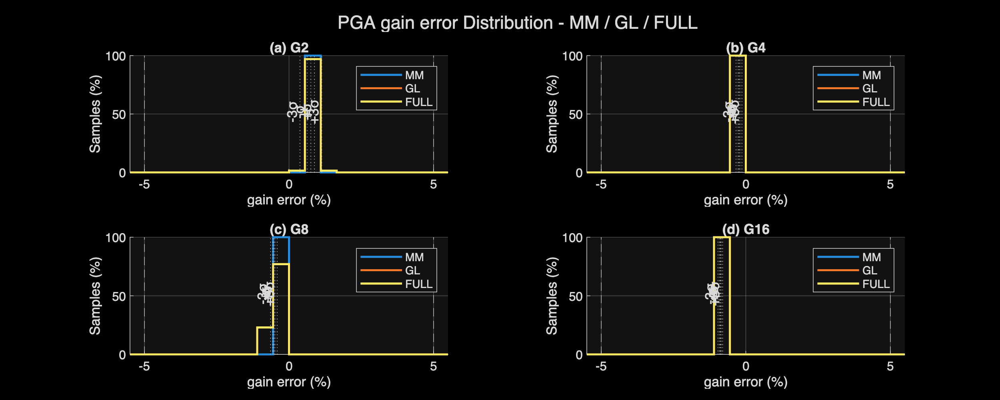

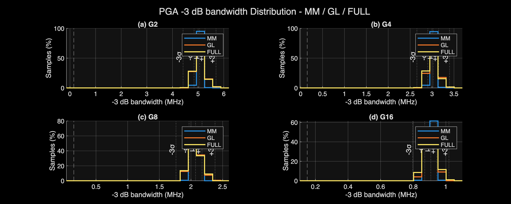

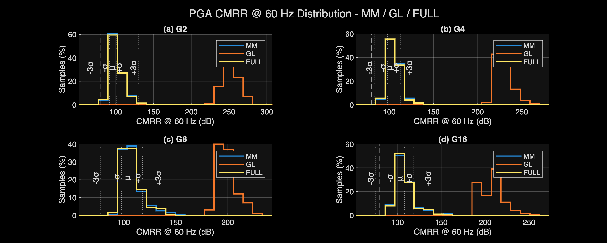

</details>

### 5.7 Output buffer

The BUFFER directory contains nominal PVT raw exports for operating point, offset, differential response, CMRR, PSRR, noise, and selector transient, together with an MM summary export. A block-level MATLAB analyzer, formal worst-case table, and MM/GL/FULL signoff reports have not yet been completed. Buffer performance is therefore intentionally excluded from the verified-result and yield tables rather than inferred from unprocessed raw files.

### 5.8 Integrated AFE

The complete AFE schematic and an `AFE_Analyze.m` scaffold are present. Formal full-chain results are not yet reported. The remaining integration campaign must verify cascaded gain, passband response, integrated input-referred noise, output swing, selector behavior, and ADC-load settling across PVT before the AFE can be marked complete.

## 6. Complete 45-corner deterministic results

The following tables expose every simulated PVT corner instead of showing only nominal and worst-case entries. They use a compact set of the most important signoff quantities; the preceding block tables retain the complete parameter list and specification limits. Every corner passed all formal specifications, including metrics not repeated in these compact tables.

For exhaustive long-form data, see the [INA+RLD](Measurement_Results/IC_Simulation/INA_RLD/Reports/INA_RLD_full_pvt_report.csv), [LPF](Measurement_Results/IC_Simulation/LPF/Reports/LPF_full_pvt_report.csv), and [PGA](Measurement_Results/IC_Simulation/PGA/Reports/PGA_full_pvt_report.csv) full-PVT CSV reports.

<details>
<summary>SE OTA: all 45 PVT corners</summary>

| Corner | Current (mA) | Gain (dB) | UGF (MHz) | PM (°) | Offset (µV) | Noise (µVrms) | Status |
| :--- | ---: | ---: | ---: | ---: | ---: | ---: | :---: |
| `NOMNOMNOM` | 0.825 | 96.522 | 12.835 | 67.767 | 3.193 | 1.873 | Pass |
| `NOMVLNOM` | 0.806 | 95.934 | 12.566 | 67.337 | 3.235 | 1.874 | Pass |
| `NOMVHNOM` | 0.839 | 97.023 | 13.041 | 68.117 | 3.169 | 1.874 | Pass |
| `NOMNOMTL` | 0.680 | 96.599 | 14.448 | 72.157 | -1.045 | 1.774 | Pass |
| `NOMNOMTH` | 0.948 | 95.678 | 10.616 | 62.054 | 6.918 | 2.074 | Pass |
| `NOMVLTL` | 0.664 | 96.080 | 14.105 | 71.686 | -1.168 | 1.772 | Pass |
| `NOMVLTH` | 0.930 | 94.944 | 10.424 | 61.718 | 7.126 | 2.077 | Pass |
| `NOMVHTL` | 0.694 | 97.034 | 14.720 | 72.545 | -0.914 | 1.776 | Pass |
| `NOMVHTH` | 0.962 | 96.294 | 10.761 | 62.330 | 6.735 | 2.072 | Pass |
| `FFNOMNOM` | 0.942 | 96.345 | 15.068 | 61.737 | 7.450 | 1.780 | Pass |
| `FFVLNOM` | 0.923 | 95.698 | 14.807 | 61.377 | 7.602 | 1.780 | Pass |
| `FFVHNOM` | 0.958 | 96.874 | 15.279 | 62.044 | 7.344 | 1.781 | Pass |
| `FFNOMTL` | 0.775 | 96.746 | 16.631 | 65.770 | 3.471 | 1.689 | Pass |
| `FFNOMTH` | 1.090 | 95.026 | 12.727 | 56.643 | 11.054 | 1.967 | Pass |
| `FFVLTL` | 0.758 | 96.227 | 16.314 | 65.370 | 3.456 | 1.687 | Pass |
| `FFVLTH` | 1.071 | 94.151 | 12.527 | 56.368 | 11.377 | 1.969 | Pass |
| `FFVHTL` | 0.790 | 97.180 | 16.895 | 66.113 | 3.517 | 1.691 | Pass |
| `FFVHTH` | 1.106 | 95.725 | 12.885 | 56.883 | 10.793 | 1.966 | Pass |
| `SSNOMNOM` | 0.730 | 96.324 | 11.066 | 72.737 | -1.468 | 1.969 | Pass |
| `SSVLNOM` | 0.710 | 95.741 | 10.755 | 72.191 | -1.551 | 1.971 | Pass |
| `SSVHNOM` | 0.743 | 96.822 | 11.277 | 73.144 | -1.407 | 1.969 | Pass |
| `SSNOMTL` | 0.603 | 96.114 | 12.698 | 77.260 | -5.903 | 1.861 | Pass |
| `SSNOMTH` | 0.834 | 95.818 | 8.970 | 66.582 | 2.333 | 2.185 | Pass |
| `SSVLTL` | 0.586 | 95.572 | 12.289 | 76.687 | -6.134 | 1.859 | Pass |
| `SSVLTH` | 0.814 | 95.150 | 8.762 | 66.160 | 2.404 | 2.189 | Pass |
| `SSVHTL` | 0.616 | 96.543 | 12.994 | 77.712 | -5.684 | 1.863 | Pass |
| `SSVHTH` | 0.847 | 96.397 | 9.110 | 66.901 | 2.232 | 2.182 | Pass |
| `FSNOMNOM` | 0.841 | 96.190 | 13.115 | 67.661 | 6.456 | 1.849 | Pass |
| `FSVLNOM` | 0.821 | 95.552 | 12.816 | 67.205 | 6.464 | 1.850 | Pass |
| `FSVHNOM` | 0.855 | 96.757 | 13.330 | 68.019 | 6.424 | 1.849 | Pass |
| `FSNOMTL` | 0.696 | 96.379 | 14.808 | 72.036 | 0.735 | 1.753 | Pass |
| `FSNOMTH` | 0.963 | 94.878 | 10.804 | 61.900 | 11.876 | 2.047 | Pass |
| `FSVLTL` | 0.679 | 95.837 | 14.441 | 71.553 | 0.538 | 1.751 | Pass |
| `FSVLTH` | 0.941 | 93.988 | 10.577 | 61.536 | 12.092 | 2.050 | Pass |
| `FSVHTL` | 0.709 | 96.863 | 15.093 | 72.428 | 0.926 | 1.755 | Pass |
| `FSVHTH` | 0.977 | 95.646 | 10.958 | 62.185 | 11.612 | 2.045 | Pass |
| `SFNOMNOM` | 0.808 | 96.634 | 12.548 | 67.832 | -0.088 | 1.898 | Pass |
| `SFVLNOM` | 0.789 | 96.100 | 12.281 | 67.404 | -0.006 | 1.899 | Pass |
| `SFVHNOM` | 0.822 | 97.026 | 12.750 | 68.180 | -0.153 | 1.899 | Pass |
| `SFNOMTL` | 0.664 | 96.715 | 14.085 | 72.234 | -2.796 | 1.796 | Pass |
| `SFNOMTH` | 0.932 | 95.905 | 10.415 | 62.169 | 1.806 | 2.103 | Pass |
| `SFVLTL` | 0.647 | 96.237 | 13.741 | 71.758 | -2.825 | 1.794 | Pass |
| `SFVLTH` | 0.914 | 95.285 | 10.230 | 61.842 | 1.999 | 2.105 | Pass |
| `SFVHTL` | 0.677 | 97.052 | 14.350 | 72.621 | -2.766 | 1.799 | Pass |
| `SFVHTH` | 0.946 | 96.369 | 10.556 | 62.440 | 1.645 | 2.101 | Pass |

</details>

<details>
<summary>FD OTA: all 45 PVT corners</summary>

| Corner | Current (mA) | Gain (dB) | UGF (MHz) | PM (°) | CM error (mV) | Noise (µVrms) | Status |
| :--- | ---: | ---: | ---: | ---: | ---: | ---: | :---: |
| `NOMNOMNOM` | 1.604 | 88.699 | 12.447 | 72.649 | 0.395 | 3.086 | Pass |
| `NOMVLNOM` | 1.568 | 88.122 | 12.170 | 72.365 | 0.365 | 3.080 | Pass |
| `NOMVHNOM` | 1.633 | 89.195 | 12.662 | 72.892 | 0.415 | 3.091 | Pass |
| `NOMNOMTL` | 1.302 | 89.168 | 13.933 | 75.290 | -6.733 | 2.945 | Pass |
| `NOMNOMTH` | 1.861 | 87.741 | 10.253 | 69.080 | 10.536 | 3.356 | Pass |
| `NOMVLTL` | 1.269 | 88.659 | 13.588 | 74.999 | -6.769 | 2.935 | Pass |
| `NOMVLTH` | 1.825 | 87.088 | 10.059 | 68.858 | 10.504 | 3.354 | Pass |
| `NOMVHTL` | 1.329 | 89.601 | 14.211 | 75.543 | -6.702 | 2.954 | Pass |
| `NOMVHTH` | 1.890 | 88.308 | 10.402 | 69.273 | 10.555 | 3.358 | Pass |
| `FFNOMNOM` | 1.857 | 88.550 | 14.528 | 66.886 | -1.839 | 2.950 | Pass |
| `FFVLNOM` | 1.819 | 87.973 | 14.261 | 66.636 | -1.875 | 2.945 | Pass |
| `FFVHNOM` | 1.889 | 89.041 | 14.747 | 67.108 | -1.813 | 2.956 | Pass |
| `FFNOMTL` | 1.509 | 89.047 | 15.922 | 69.709 | -9.068 | 2.824 | Pass |
| `FFNOMTH` | 2.163 | 87.531 | 12.277 | 63.557 | 8.577 | 3.200 | Pass |
| `FFVLTL` | 1.474 | 88.537 | 15.600 | 69.419 | -9.112 | 2.815 | Pass |
| `FFVLTH` | 2.124 | 86.877 | 12.079 | 63.377 | 8.536 | 3.198 | Pass |
| `FFVHTL` | 1.539 | 89.474 | 16.195 | 69.968 | -9.030 | 2.832 | Pass |
| `FFVHTH` | 2.194 | 88.094 | 12.437 | 63.721 | 8.601 | 3.203 | Pass |
| `SSNOMNOM` | 1.400 | 88.731 | 10.764 | 77.375 | 2.748 | 3.222 | Pass |
| `SSVLNOM` | 1.362 | 88.152 | 10.448 | 77.055 | 2.724 | 3.215 | Pass |
| `SSVHNOM` | 1.427 | 89.234 | 10.983 | 77.633 | 2.762 | 3.228 | Pass |
| `SSNOMTL` | 1.136 | 89.203 | 12.319 | 79.673 | -4.287 | 3.066 | Pass |
| `SSNOMTH` | 1.619 | 87.784 | 8.645 | 73.673 | 12.633 | 3.512 | Pass |
| `SSVLTL` | 1.103 | 88.692 | 11.920 | 79.407 | -4.313 | 3.055 | Pass |
| `SSVLTH` | 1.581 | 87.126 | 8.435 | 73.396 | 12.610 | 3.511 | Pass |
| `SSVHTL` | 1.161 | 89.643 | 12.610 | 79.898 | -4.265 | 3.076 | Pass |
| `SSVHTH` | 1.645 | 88.358 | 8.788 | 73.895 | 12.643 | 3.514 | Pass |
| `FSNOMNOM` | 1.652 | 88.379 | 12.619 | 71.851 | 1.747 | 3.035 | Pass |
| `FSVLNOM` | 1.611 | 87.775 | 12.319 | 71.548 | 1.692 | 3.031 | Pass |
| `FSVHNOM` | 1.682 | 88.917 | 12.840 | 72.104 | 1.781 | 3.041 | Pass |
| `FSNOMTL` | 1.341 | 88.829 | 14.122 | 74.463 | -5.139 | 2.901 | Pass |
| `FSNOMTH` | 1.914 | 87.441 | 10.390 | 68.299 | 11.505 | 3.299 | Pass |
| `FSVLTL` | 1.306 | 88.295 | 13.765 | 74.159 | -5.189 | 2.892 | Pass |
| `FSVLTH` | 1.870 | 86.753 | 10.166 | 68.053 | 11.426 | 3.299 | Pass |
| `FSVHTL` | 1.369 | 89.304 | 14.405 | 74.723 | -5.100 | 2.909 | Pass |
| `FSVHTH` | 1.944 | 88.050 | 10.544 | 68.501 | 11.544 | 3.302 | Pass |
| `SFNOMNOM` | 1.556 | 88.952 | 12.257 | 73.436 | -1.017 | 3.135 | Pass |
| `SFVLNOM` | 1.520 | 88.413 | 11.978 | 73.161 | -1.018 | 3.128 | Pass |
| `SFVHNOM` | 1.583 | 89.369 | 12.471 | 73.672 | -1.017 | 3.141 | Pass |
| `SFNOMTL` | 1.263 | 89.453 | 13.722 | 76.111 | -8.393 | 2.989 | Pass |
| `SFNOMTH` | 1.808 | 87.953 | 10.106 | 69.853 | 9.515 | 3.411 | Pass |
| `SFVLTL` | 1.230 | 88.981 | 13.369 | 75.826 | -8.411 | 2.978 | Pass |
| `SFVLTH` | 1.773 | 87.337 | 9.916 | 69.642 | 9.530 | 3.409 | Pass |
| `SFVHTL` | 1.289 | 89.804 | 14.000 | 76.358 | -8.373 | 2.999 | Pass |
| `SFVHTH` | 1.835 | 88.443 | 10.254 | 70.037 | 9.502 | 3.414 | Pass |

</details>

<details>
<summary>INA+RLD: all 45 PVT corners</summary>

| Corner | Current (mA) | Gain error (%) | BW (kHz) | Noise (µVrms) | RLD UGF (kHz) | PM (°) | Supp. 60 (dB) | Supp. 150 (dB) | Status |
| :--- | ---: | ---: | ---: | ---: | ---: | ---: | ---: | ---: | :---: |
| `NOMNOMNOM` | 3.860 | 0.011 | 259.286 | 2.667 | 0.946 | 100.672 | 55.072 | 53.257 | Pass |
| `NOMVLNOM` | 3.771 | -0.004 | 254.746 | 2.668 | 0.946 | 100.644 | 55.068 | 53.237 | Pass |
| `NOMVHNOM` | 3.930 | 0.023 | 262.678 | 2.668 | 0.946 | 100.697 | 55.075 | 53.275 | Pass |
| `NOMNOMTL` | 3.123 | -0.045 | 271.141 | 2.524 | 0.839 | 100.779 | 54.973 | 52.853 | Pass |
| `NOMNOMTH` | 4.491 | 0.047 | 225.472 | 2.954 | 1.082 | 100.540 | 55.160 | 53.651 | Pass |
| `NOMVLTL` | 3.044 | -0.058 | 266.533 | 2.521 | 0.839 | 100.753 | 54.970 | 52.832 | Pass |
| `NOMVLTH` | 4.402 | 0.029 | 221.640 | 2.958 | 1.082 | 100.509 | 55.157 | 53.633 | Pass |
| `NOMVHTL` | 3.189 | -0.035 | 274.684 | 2.527 | 0.839 | 100.803 | 54.976 | 52.872 | Pass |
| `NOMVHTH` | 4.559 | 0.062 | 228.340 | 2.952 | 1.082 | 100.568 | 55.163 | 53.668 | Pass |
| `FFNOMNOM` | 4.474 | -0.130 | 327.841 | 2.536 | 1.313 | 100.310 | 55.254 | 54.098 | Pass |
| `FFVLNOM` | 4.381 | -0.145 | 322.783 | 2.536 | 1.313 | 100.273 | 55.251 | 54.079 | Pass |
| `FFVHNOM` | 4.553 | -0.118 | 331.864 | 2.537 | 1.313 | 100.345 | 55.257 | 54.114 | Pass |
| `FFNOMTL` | 3.624 | -0.202 | 342.319 | 2.405 | 1.166 | 100.455 | 55.200 | 53.833 | Pass |
| `FFNOMTH` | 5.222 | -0.080 | 286.575 | 2.804 | 1.502 | 100.133 | 55.302 | 54.348 | Pass |
| `FFVLTL` | 3.540 | -0.215 | 337.116 | 2.402 | 1.166 | 100.420 | 55.196 | 53.813 | Pass |
| `FFVLTH` | 5.128 | -0.099 | 282.254 | 2.807 | 1.502 | 100.092 | 55.299 | 54.330 | Pass |
| `FFVHTL` | 3.698 | -0.191 | 346.567 | 2.408 | 1.166 | 100.486 | 55.203 | 53.850 | Pass |
| `FFVHTH` | 5.300 | -0.065 | 289.995 | 2.802 | 1.502 | 100.170 | 55.305 | 54.363 | Pass |
| `SSNOMNOM` | 3.366 | 0.101 | 209.004 | 2.803 | 0.717 | 100.899 | 54.807 | 52.233 | Pass |
| `SSVLNOM` | 3.273 | 0.086 | 204.410 | 2.804 | 0.717 | 100.877 | 54.803 | 52.211 | Pass |
| `SSVHNOM` | 3.431 | 0.113 | 212.017 | 2.803 | 0.717 | 100.919 | 54.810 | 52.252 | Pass |
| `SSNOMTL` | 2.722 | 0.056 | 218.975 | 2.646 | 0.636 | 100.983 | 54.648 | 51.699 | Pass |
| `SSNOMTH` | 3.903 | 0.125 | 180.833 | 3.110 | 0.820 | 100.796 | 54.952 | 52.770 | Pass |
| `SSVLTL` | 2.642 | 0.043 | 214.418 | 2.644 | 0.636 | 100.963 | 54.644 | 51.676 | Pass |
| `SSVLTH` | 3.810 | 0.106 | 176.996 | 3.117 | 0.820 | 100.772 | 54.948 | 52.750 | Pass |
| `SSVHTL` | 2.783 | 0.067 | 222.089 | 2.650 | 0.636 | 101.002 | 54.652 | 51.719 | Pass |
| `SSVHTH` | 3.966 | 0.140 | 183.369 | 3.107 | 0.820 | 100.818 | 54.955 | 52.788 | Pass |
| `FSNOMNOM` | 3.977 | 0.009 | 265.524 | 2.633 | 0.946 | 100.689 | 55.074 | 53.269 | Pass |
| `FSVLNOM` | 3.878 | -0.008 | 260.510 | 2.634 | 0.946 | 100.661 | 55.070 | 53.250 | Pass |
| `FSVHNOM` | 4.051 | 0.022 | 269.039 | 2.633 | 0.946 | 100.714 | 55.077 | 53.286 | Pass |
| `FSNOMTL` | 3.218 | -0.049 | 277.561 | 2.494 | 0.839 | 100.794 | 54.975 | 52.865 | Pass |
| `FSNOMTH` | 4.620 | 0.046 | 230.758 | 2.916 | 1.082 | 100.558 | 55.162 | 53.662 | Pass |
| `FSVLTL` | 3.134 | -0.063 | 272.717 | 2.492 | 0.839 | 100.769 | 54.972 | 52.845 | Pass |
| `FSVLTH` | 4.513 | 0.026 | 226.239 | 2.921 | 1.082 | 100.529 | 55.159 | 53.644 | Pass |
| `FSVHTL` | 3.287 | -0.036 | 281.210 | 2.497 | 0.839 | 100.817 | 54.978 | 52.883 | Pass |
| `FSVHTH` | 4.693 | 0.063 | 233.744 | 2.913 | 1.082 | 100.586 | 55.165 | 53.678 | Pass |
| `SFNOMNOM` | 3.742 | 0.011 | 252.978 | 2.703 | 0.946 | 100.655 | 55.070 | 53.245 | Pass |
| `SFVLNOM` | 3.655 | -0.003 | 248.429 | 2.703 | 0.946 | 100.626 | 55.066 | 53.225 | Pass |
| `SFVHNOM` | 3.809 | 0.020 | 256.334 | 2.703 | 0.946 | 100.681 | 55.073 | 53.264 | Pass |
| `SFNOMTL` | 3.028 | -0.044 | 264.634 | 2.555 | 0.839 | 100.764 | 54.971 | 52.841 | Pass |
| `SFNOMTH` | 4.359 | 0.044 | 220.153 | 2.995 | 1.082 | 100.520 | 55.158 | 53.640 | Pass |
| `SFVLTL` | 2.949 | -0.056 | 259.932 | 2.552 | 0.839 | 100.737 | 54.967 | 52.819 | Pass |
| `SFVLTH` | 4.275 | 0.027 | 216.428 | 2.999 | 1.082 | 100.489 | 55.155 | 53.620 | Pass |
| `SFVHTL` | 3.091 | -0.036 | 268.148 | 2.559 | 0.839 | 100.788 | 54.974 | 52.860 | Pass |
| `SFVHTH` | 4.425 | 0.055 | 222.982 | 2.992 | 1.082 | 100.549 | 55.161 | 53.657 | Pass |

</details>

<details>
<summary>LPF: all 45 PVT corners</summary>

| Corner | Current (mA) | Offset (mV) | Gain error (%) | Loss 150 (dB) | −1 dB (Hz) | −3 dB (Hz) | Noise (µVrms) | Status |
| :--- | ---: | ---: | ---: | ---: | ---: | ---: | ---: | :---: |
| `NOMNOMNOM` | 1.604 | 0.000 | -0.027 | 0.361 | 258.691 | 506.912 | 6.176 | Pass |
| `NOMVLNOM` | 1.568 | 0.000 | -0.027 | 0.361 | 258.691 | 506.913 | 6.164 | Pass |
| `NOMVHNOM` | 1.633 | -0.000 | -0.026 | 0.361 | 258.690 | 506.912 | 6.187 | Pass |
| `NOMNOMTL` | 1.302 | 0.000 | -0.032 | 0.454 | 229.654 | 449.936 | 5.895 | Pass |
| `NOMNOMTH` | 1.861 | 0.000 | -0.023 | 0.279 | 295.879 | 579.847 | 6.715 | Pass |
| `NOMVLTL` | 1.269 | 0.000 | -0.032 | 0.454 | 229.654 | 449.937 | 5.875 | Pass |
| `NOMVLTH` | 1.825 | 0.000 | -0.024 | 0.279 | 295.880 | 579.848 | 6.711 | Pass |
| `NOMVHTL` | 1.329 | 0.000 | -0.031 | 0.454 | 229.653 | 449.936 | 5.913 | Pass |
| `NOMVHTH` | 1.890 | 0.000 | -0.023 | 0.279 | 295.879 | 579.847 | 6.719 | Pass |
| `FFNOMNOM` | 1.857 | 0.000 | -0.018 | 0.191 | 359.135 | 703.898 | 5.903 | Pass |
| `FFVLNOM` | 1.819 | 0.000 | -0.018 | 0.191 | 359.136 | 703.899 | 5.892 | Pass |
| `FFVHNOM` | 1.889 | 0.000 | -0.017 | 0.191 | 359.135 | 703.898 | 5.913 | Pass |
| `FFNOMTL` | 1.509 | -0.000 | -0.020 | 0.241 | 318.777 | 624.764 | 5.650 | Pass |
| `FFNOMTH` | 2.163 | 0.000 | -0.016 | 0.147 | 410.798 | 805.228 | 6.403 | Pass |
| `FFVLTL` | 1.474 | -0.000 | -0.020 | 0.241 | 318.777 | 624.764 | 5.632 | Pass |
| `FFVLTH` | 2.124 | -0.000 | -0.017 | 0.147 | 410.798 | 805.229 | 6.399 | Pass |
| `FFVHTL` | 1.539 | -0.000 | -0.020 | 0.241 | 318.776 | 624.763 | 5.666 | Pass |
| `FFVHTH` | 2.194 | 0.000 | -0.016 | 0.147 | 410.797 | 805.227 | 6.408 | Pass |
| `SSNOMNOM` | 1.400 | 0.000 | -0.041 | 0.611 | 196.115 | 384.135 | 6.452 | Pass |
| `SSVLNOM` | 1.362 | 0.000 | -0.042 | 0.611 | 196.115 | 384.135 | 6.439 | Pass |
| `SSVHNOM` | 1.427 | 0.000 | -0.041 | 0.611 | 196.115 | 384.134 | 6.464 | Pass |
| `SSNOMTL` | 1.136 | 0.000 | -0.050 | 0.762 | 174.135 | 340.986 | 6.142 | Pass |
| `SSNOMTH` | 1.619 | -0.000 | -0.034 | 0.475 | 224.272 | 439.376 | 7.032 | Pass |
| `SSVLTL` | 1.103 | 0.000 | -0.050 | 0.762 | 174.135 | 340.987 | 6.120 | Pass |
| `SSVLTH` | 1.581 | -0.000 | -0.035 | 0.475 | 224.273 | 439.377 | 7.029 | Pass |
| `SSVHTL` | 1.161 | 0.000 | -0.049 | 0.762 | 174.135 | 340.986 | 6.162 | Pass |
| `SSVHTH` | 1.645 | -0.000 | -0.033 | 0.475 | 224.272 | 439.376 | 7.036 | Pass |
| `FSNOMNOM` | 1.652 | -0.000 | -0.027 | 0.361 | 258.691 | 506.914 | 6.077 | Pass |
| `FSVLNOM` | 1.611 | -0.000 | -0.028 | 0.361 | 258.692 | 506.914 | 6.067 | Pass |
| `FSVHNOM` | 1.682 | -0.000 | -0.027 | 0.361 | 258.691 | 506.913 | 6.087 | Pass |
| `FSNOMTL` | 1.341 | 0.000 | -0.032 | 0.454 | 229.654 | 449.937 | 5.808 | Pass |
| `FSNOMTH` | 1.914 | 0.000 | -0.023 | 0.279 | 295.880 | 579.849 | 6.605 | Pass |
| `FSVLTL` | 1.306 | 0.000 | -0.032 | 0.454 | 229.654 | 449.938 | 5.790 | Pass |
| `FSVLTH` | 1.870 | 0.000 | -0.024 | 0.279 | 295.880 | 579.850 | 6.602 | Pass |
| `FSVHTL` | 1.369 | 0.000 | -0.031 | 0.454 | 229.654 | 449.937 | 5.824 | Pass |
| `FSVHTH` | 1.944 | -0.000 | -0.023 | 0.279 | 295.880 | 579.848 | 6.608 | Pass |
| `SFNOMNOM` | 1.556 | -0.000 | -0.027 | 0.361 | 258.690 | 506.911 | 6.274 | Pass |
| `SFVLNOM` | 1.520 | -0.000 | -0.027 | 0.361 | 258.690 | 506.912 | 6.261 | Pass |
| `SFVHNOM` | 1.583 | 0.000 | -0.026 | 0.361 | 258.690 | 506.911 | 6.287 | Pass |
| `SFNOMTL` | 1.263 | 0.000 | -0.031 | 0.454 | 229.653 | 449.935 | 5.983 | Pass |
| `SFNOMTH` | 1.808 | -0.000 | -0.023 | 0.279 | 295.878 | 579.846 | 6.827 | Pass |
| `SFVLTL` | 1.230 | 0.000 | -0.032 | 0.454 | 229.653 | 449.936 | 5.961 | Pass |
| `SFVLTH` | 1.773 | -0.000 | -0.023 | 0.279 | 295.879 | 579.847 | 6.822 | Pass |
| `SFVHTL` | 1.289 | 0.000 | -0.031 | 0.454 | 229.653 | 449.935 | 6.002 | Pass |
| `SFVHTH` | 1.835 | -0.000 | -0.022 | 0.279 | 295.878 | 579.846 | 6.831 | Pass |

</details>

<details>
<summary>PGA: all 45 PVT corners</summary>

| Corner | Current (mA) | CM error (mV) | Max abs. gain error (%) | Min BW (MHz) | Min CMRR 60 (dB) | Max noise (µVrms) | Status |
| :--- | ---: | ---: | ---: | ---: | ---: | ---: | :---: |
| `NOMNOMNOM` | 1.604 | 0.395 | 0.878 | 0.907 | 188.992 | 4.617 | Pass |
| `NOMVLNOM` | 1.568 | 0.365 | 1.152 | 0.891 | 194.854 | 4.602 | Pass |
| `NOMVHNOM` | 1.633 | 0.415 | 0.874 | 0.918 | 184.741 | 4.629 | Pass |
| `NOMNOMTL` | 1.302 | -6.738 | 0.892 | 0.969 | 197.365 | 4.412 | Pass |
| `NOMNOMTH` | 1.862 | 10.545 | 1.317 | 0.765 | 199.520 | 5.012 | Pass |
| `NOMVLTL` | 1.269 | -6.774 | 0.896 | 0.953 | 205.888 | 4.392 | Pass |
| `NOMVLTH` | 1.825 | 10.513 | 1.773 | 0.751 | 201.550 | 5.002 | Pass |
| `NOMVHTL` | 1.329 | -6.707 | 0.889 | 0.981 | 205.046 | 4.428 | Pass |
| `NOMVHTH` | 1.890 | 10.563 | 1.022 | 0.774 | 201.325 | 5.020 | Pass |
| `FFNOMNOM` | 1.857 | -1.840 | 0.910 | 1.153 | 207.973 | 4.417 | Pass |
| `FFVLNOM` | 1.819 | -1.877 | 0.914 | 1.136 | 209.892 | 4.405 | Pass |
| `FFVHNOM` | 1.889 | -1.814 | 0.906 | 1.167 | 216.064 | 4.427 | Pass |
| `FFNOMTL` | 1.509 | -9.074 | 0.928 | 1.230 | 196.994 | 4.232 | Pass |
| `FFNOMTH` | 2.163 | 8.583 | 1.169 | 0.978 | 196.898 | 4.782 | Pass |
| `FFVLTL` | 1.474 | -9.119 | 0.932 | 1.212 | 196.991 | 4.216 | Pass |
| `FFVLTH` | 2.125 | 8.543 | 1.479 | 0.964 | 205.398 | 4.774 | Pass |
| `FFVHTL` | 1.539 | -9.035 | 0.925 | 1.245 | 231.532 | 4.246 | Pass |
| `FFVHTH` | 2.195 | 8.607 | 0.951 | 0.990 | 202.390 | 4.789 | Pass |
| `SSNOMNOM` | 1.400 | 2.750 | 1.115 | 0.725 | 193.428 | 4.815 | Pass |
| `SSVLNOM` | 1.362 | 2.727 | 1.945 | 0.708 | 204.271 | 4.793 | Pass |
| `SSVHNOM` | 1.427 | 2.764 | 0.854 | 0.735 | 195.031 | 4.830 | Pass |
| `SSNOMTL` | 1.136 | -4.291 | 0.869 | 0.776 | 193.893 | 4.588 | Pass |
| `SSNOMTH` | 1.620 | 12.644 | 1.695 | 0.609 | 202.718 | 5.240 | Pass |
| `SSVLTL` | 1.103 | -4.317 | 1.494 | 0.760 | 201.516 | 4.560 | Pass |
| `SSVLTH` | 1.581 | 12.623 | 2.502 | 0.595 | 202.761 | 5.224 | Pass |
| `SSVHTL` | 1.161 | -4.268 | 0.866 | 0.787 | 198.684 | 4.609 | Pass |
| `SSVHTH` | 1.646 | 12.654 | 1.236 | 0.617 | 201.287 | 5.250 | Pass |
| `FSNOMNOM` | 1.652 | 1.748 | 0.880 | 0.933 | 188.992 | 4.545 | Pass |
| `FSVLNOM` | 1.611 | 1.694 | 0.989 | 0.915 | 194.853 | 4.532 | Pass |
| `FSVHNOM` | 1.682 | 1.782 | 0.876 | 0.945 | 188.991 | 4.555 | Pass |
| `FSNOMTL` | 1.341 | -5.143 | 0.895 | 0.998 | 193.103 | 4.347 | Pass |
| `FSNOMTH` | 1.915 | 11.514 | 1.220 | 0.786 | 206.731 | 4.931 | Pass |
| `FSVLTL` | 1.306 | -5.192 | 0.899 | 0.981 | 207.012 | 4.330 | Pass |
| `FSVLTH` | 1.871 | 11.436 | 1.621 | 0.770 | 200.998 | 4.922 | Pass |
| `FSVHTL` | 1.369 | -5.104 | 0.891 | 1.010 | 207.034 | 4.362 | Pass |
| `FSVHTH` | 1.944 | 11.553 | 0.954 | 0.796 | 202.490 | 4.938 | Pass |
| `SFNOMNOM` | 1.556 | -1.018 | 0.876 | 0.880 | 188.993 | 4.689 | Pass |
| `SFVLNOM` | 1.520 | -1.019 | 1.296 | 0.864 | 194.855 | 4.672 | Pass |
| `SFVHNOM` | 1.583 | -1.018 | 0.873 | 0.891 | 188.993 | 4.703 | Pass |
| `SFNOMTL` | 1.263 | -8.399 | 0.891 | 0.940 | 202.057 | 4.476 | Pass |
| `SFNOMTH` | 1.808 | 9.524 | 1.392 | 0.743 | 194.217 | 5.094 | Pass |
| `SFVLTL` | 1.230 | -8.417 | 0.894 | 0.923 | 204.391 | 4.453 | Pass |
| `SFVLTH` | 1.774 | 9.540 | 1.889 | 0.731 | 194.896 | 5.082 | Pass |
| `SFVHTL` | 1.289 | -8.379 | 0.888 | 0.952 | 195.119 | 4.494 | Pass |
| `SFVHTH` | 1.835 | 9.510 | 1.075 | 0.753 | 197.996 | 5.102 | Pass |

</details>

## 7. Monte Carlo summary

| Block | MM | GL | FULL | Runs per mode | Failed runs |
| :--- | ---: | ---: | ---: | ---: | ---: |
| SE OTA | 100% | 100% | 100% | 200 | 0 |
| FD OTA | 100% | 100% | 100% | 200 | 0 |
| INA + RLD | 100% | 100% | 100% | 200 | 0 |
| LPF | 100% | 100% | 100% | 200 | 0 |
| PGA | 100% | 100% | 100% | 200 | 0 |

Every generated Monte Carlo figure is included in its corresponding block section above.

## 8. Generated artifacts

| Block | Analyzer | Deterministic reports | Monte Carlo reports |
| :--- | :--- | :--- | :--- |
| BIAS / SEL | [`BIAS_Analyze.m`](Measurement_Results/IC_Simulation/BIAS/BIAS_Analyze.m) | [`BIAS_table_report.csv`](Measurement_Results/IC_Simulation/BIAS/BIAS_table_report.csv), [`BIAS_global_worst_case.csv`](Measurement_Results/IC_Simulation/BIAS/BIAS_global_worst_case.csv) | — |
| SE OTA | [`SEOTA_Analyze.m`](Measurement_Results/IC_Simulation/SE_OTA/SEOTA_Analyze.m) | [`SEOTA_table_report.csv`](Measurement_Results/IC_Simulation/SE_OTA/Reports/SEOTA_table_report.csv), [`SEOTA_worst_case_report.csv`](Measurement_Results/IC_Simulation/SE_OTA/Reports/SEOTA_worst_case_report.csv) | [`SEOTA_MC_Run_Summary.csv`](Measurement_Results/IC_Simulation/SE_OTA/Reports/SEOTA_MC_Run_Summary.csv) |
| FD OTA | [`FDOTA_Analyze.m`](Measurement_Results/IC_Simulation/FD_OTA/FDOTA_Analyze.m) | [`FDOTA_table_report.csv`](Measurement_Results/IC_Simulation/FD_OTA/Results/FDOTA_table_report.csv), [`FDOTA_worst_case_report.csv`](Measurement_Results/IC_Simulation/FD_OTA/Results/FDOTA_worst_case_report.csv) | [`FDOTA_MC_Run_Summary.csv`](Measurement_Results/IC_Simulation/FD_OTA/Results/FDOTA_MC_Run_Summary.csv) |
| INA + RLD | [`INA_RLD_Analyze.m`](Measurement_Results/IC_Simulation/INA_RLD/INA_RLD_Analyze.m) | [`INA_RLD_table_report.csv`](Measurement_Results/IC_Simulation/INA_RLD/Reports/INA_RLD_table_report.csv), [`INA_RLD_full_pvt_report.csv`](Measurement_Results/IC_Simulation/INA_RLD/Reports/INA_RLD_full_pvt_report.csv), [`INA_RLD_worst_case_report.csv`](Measurement_Results/IC_Simulation/INA_RLD/Reports/INA_RLD_worst_case_report.csv) | [`MC_Run_Summary.csv`](Measurement_Results/IC_Simulation/INA_RLD/Reports/MC_Run_Summary.csv) |
| LPF | [`LPF_Analyze.m`](Measurement_Results/IC_Simulation/LPF/LPF_Analyze.m) | [`LPF_table_report.csv`](Measurement_Results/IC_Simulation/LPF/Reports/LPF_table_report.csv), [`LPF_full_pvt_report.csv`](Measurement_Results/IC_Simulation/LPF/Reports/LPF_full_pvt_report.csv), [`LPF_worst_case_report.csv`](Measurement_Results/IC_Simulation/LPF/Reports/LPF_worst_case_report.csv) | [`MC_Run_Summary.csv`](Measurement_Results/IC_Simulation/LPF/Reports/MC_Run_Summary.csv) |
| PGA | [`PGA_Analyze.m`](Measurement_Results/IC_Simulation/PGA/PGA_Analyze.m) | [`PGA_table_report.csv`](Measurement_Results/IC_Simulation/PGA/Reports/PGA_table_report.csv), [`PGA_full_pvt_report.csv`](Measurement_Results/IC_Simulation/PGA/Reports/PGA_full_pvt_report.csv), [`PGA_worst_case_report.csv`](Measurement_Results/IC_Simulation/PGA/Reports/PGA_worst_case_report.csv) | [`MC_Run_Summary.csv`](Measurement_Results/IC_Simulation/PGA/Reports/MC_Run_Summary.csv) |

## 9. Reproducing the analysis

Run from the repository root after the ngspice source files have been generated:

```bash
matlab -batch "addpath(fullfile(pwd,'Measurement_Results','IC_Simulation','BIAS')); BIAS_Analyze"
matlab -batch "addpath(fullfile(pwd,'Measurement_Results','IC_Simulation','SE_OTA')); SEOTA_Analyze"
matlab -batch "addpath(fullfile(pwd,'Measurement_Results','IC_Simulation','FD_OTA')); FDOTA_Analyze"
matlab -batch "addpath(fullfile(pwd,'Measurement_Results','IC_Simulation','INA_RLD')); INA_RLD_Analyze"
matlab -batch "addpath(fullfile(pwd,'Measurement_Results','IC_Simulation','LPF')); LPF_Analyze"
matlab -batch "addpath(fullfile(pwd,'Measurement_Results','IC_Simulation','PGA')); PGA_Analyze"
```

The analyzers follow a numeric-first workflow:

```text
ngspice TXT → double-precision calculations → PVT/MC selection → unit scaling → CSV and plots
```

## 10. Limitations and next steps

| Priority | Work item | Completion criterion |
| :---: | :--- | :--- |
| 1 | BUFFER reporting | Complete PVT/MC analyzer, formal table, worst-case report, and plots |
| 2 | Full AFE verification | Verify cascaded INA → LPF → PGA → BUFFER gain, bandwidth, noise, and transient behavior |
| 3 | Physical implementation | Complete matching-aware layout, DRC, and LVS |
| 4 | Extracted verification | Repeat PVT and selected FULL Monte Carlo simulations with extracted parasitics |
| 5 | Mixed-signal integration | Integrate the SAR ADC, digital control, and pad ring |
| 6 | Silicon validation | Build the evaluation PCB and measure gain, noise, rejection, power, and electrode-interface behavior |

The offset-sensitive input devices, resistor-ratio networks, and RLD loop components are the highest-priority layout matching and parasitic-control targets.
