# ECG Acquisition IC Project Report

**Project Stage**: Pre-layout schematic design, full-PVT block verification, and frontend integration  
**Process Technology**: GlobalFoundries 180 nm MCU (`gf180mcu`, 3.3 V 1P6M)  
**Target Application**: Low-power, high-CMRR biomedical electrophysiology acquisition (ECG / Biopotential Recording)  

---

## 1. Executive Summary

This report documents the design, transistor-level sizing, simulation methodology, and multi-corner verification of a low-noise, high-common-mode-rejection analog frontend (AFE) integrated circuit for electrocardiogram (ECG) acquisition. Developed for the IEEE SSCS Chipathon 2026 flow, the design provides an end-to-end signal conditioning chain tailored to sub-millivolt biopotential recording in the presence of large differential electrode offset voltages ($\pm 300\text{ mV}$) and strong powerline common-mode interference ($50/60\text{ Hz}$).

### Key Verification Deliverables

1. **Master Bias & Reference (`BIAS` / `SEL`)**: Characterized across 5 process corners, continuous supply voltage sweeps ($3.0\text{--}3.6\text{ V}$), temperature sweeps ($-40^\circ\text{C}\text{ to }+125^\circ\text{C}$), 35 startup transient runs (**0 failures**), and analog multiplexer transmission accuracy ($< 26\text{ nV}$ error).
2. **Single-Ended OTA (`SE_OTA`)**: Full 45-point PVT characterization ($5\text{ processes} \times 9\text{ V-T corners}$) covering open-loop stability, rejection, noise integration ($0.05\text{--}150\text{ Hz}$), closed-loop tracking, high-side headroom, and transient step settling.
3. **Fully Differential OTA (`FD_OTA`)**: Full 45-point PVT characterization of the core amplifier with dynamic continuous-time common-mode feedback (`CMFB`), closed-loop differential tracking, input common-mode range, and step response.
4. **$g_m/I_D$ Sizing Automation**: Semi-empirical transistor sizing based on continuous lookups of transconductance efficiency ($g_m/I_D$), current density ($I_D/W$), transit frequency ($f_T$), and self-gain ($g_m/g_{ds}$).
5. **Data Integrity Pipeline**: All post-processing analyzers implement a strict numeric-first double-precision pipeline (`ngspice TXT -> double -> PVT worst-case selection -> SI scaling -> string format`), eliminating intermediate truncation and prefix errors.

> [!NOTE]
> All reported performance metrics are pre-layout schematic simulations. Monte Carlo mismatch analysis, physical layout parasitics (PEX), mixed-signal SAR ADC integration, and laboratory silicon validation are detailed in [Section 9](#9-limitations-and-future-work).

---

## 2. System Architecture & Building Blocks

### 2.1 Integrated AFE Top-Level Schematic

The integrated top-level AFE schematic combines the biopotential instrumentation amplifier, active low-pass filter, programmable gain amplifier, ADC output driver, right-leg drive feedback, and master biasing network:


### 2.2 Circuit Subsystems & Sizing Specifications

| Stage | Subsystem | Circuit Topology & Key Components | Stage Gain & Bandwidth |
| :--- | :--- | :--- | :---: |
| **Stage 1** | **Instrumentation Amp (`INA`)** | 3-opamp topology ($2\times$ `SE_OTA` input buffers, $1\times$ `FD_OTA` difference stage, $R_1 = 118\text{ k}\Omega$, $R_{\text{gain}} = 4\text{ k}\Omega$, $R_{2\text{--}5} = 10\text{--}40\text{ k}\Omega$) | $60\text{ V/V}$ ($35.6\text{ dB}$)<br>$\text{BW} > 10\text{ kHz}$ |
| **Stage 2** | **Active Low-Pass Filter (`LPF`)** | Fully differential active 2nd-order RC filter ($1\times$ `FD_OTA`, $R = 3.7\text{ M}\Omega$, $C = 100\text{ pF}$ MIM) | $4\text{ V/V}$ ($12.0\text{ dB}$)<br>$f_c \approx 150\text{ Hz}$ |
| **Stage 3** | **Programmable Gain Amp (`PGA`)** | Fully differential switched-resistor ladder ($1\times$ `FD_OTA`, $6\times$ `TG`, $R = 20\text{--}120\text{ k}\Omega$) | $1\times, 2\times, 4\times, 8\times, 16\times$<br>($0\text{ to }24.1\text{ dB}$) |
| **Stage 4** | **Output Driver (`BUFFER`)** | Closed-loop differential unity follower ($1\times$ `FD_OTA`, $4\times 20\text{ k}\Omega$) driving sampling cap | $1\text{ V/V}$ ($0\text{ dB}$)<br>$C_L = 10\text{ pF}$ |
| **Support** | **Right-Leg Drive (`RLD`)** | Active integrator sensing input CM ($1\times$ `SE_OTA`, $R_{\text{in}} = 4\text{ M}\Omega$, $R_f = 20\text{ M}\Omega$, $C_f = 80\text{ pF}$) | High active CM suppression ($> 100\text{ dB}$) |
| **Reference** | **Master Bias (`BIAS`/`MIRROR`)** | $\beta$-Multiplier reference ($40\text{ }\mu\text{A}$ target) with startup device and 11-channel cascode mirror tree | $\Delta I_{\text{bias}} < 0.15\%$ mirror tracking |
| **Total Chain** | **Full AFE Performance** | Cascaded multi-stage biopotential recording path with analog channel selection (`SEL`) | **$240\text{ to }3840\text{ V/V}$**<br>($47.6\text{ to }71.7\text{ dB}$)<br>**$0.05\text{--}150\text{ Hz}$** |

---

## 3. Transistor-Level Sizing & $g_m/I_D$ Methodology

All operational transconductance amplifiers and reference circuits are sized using the $g_m/I_D$ methodology on the GlobalFoundries 180 nm MCU process.

### 3.1 Single-Ended OTA (`SE_OTA`) Sizing

Implemented in [`SE_OTA_Sizing.m`](file:///d:/Documents/GitHub/ECG_Acquisition_IC/Design_Files/IC%20Design/Schematic/SE_OTA/SE_OTA_Sizing.m):

* **Topology**: 2-stage Miller-compensated folded-cascode single-ended OTA.
* **Input Pair ($M_1, M_2$)**: PMOS differential pair operated in moderate/weak inversion ($g_m/I_D = 16.0\text{ V}^{-1}$, $L = 2.0\text{ }\mu\text{m}$) for high transconductance efficiency and minimal thermal/flicker noise.
* **First-Stage Loads ($M_3, M_4$)**: NMOS current-source loads operated in strong inversion ($g_m/I_D = 16.0\text{ V}^{-1}$, $L = 2.0\text{ }\mu\text{m}$) to minimize input-referred noise contribution.
* **Tail Current Source ($M_5$)**: PMOS current source ($g_m/I_D = 6.0\text{ V}^{-1}$, $L = 2.0\text{ }\mu\text{m}$) for high output impedance and high CMRR.
* **Second-Stage Driver ($M_6$)**: NMOS common-source amplifier ($g_m/I_D = 6.0\text{ V}^{-1}$, $L = 0.5\text{ }\mu\text{m}$) with PMOS active load ($M_7$).
* **Compensation Network**: Miller compensation capacitor $C_c = 2.0\text{ pF}$ driving a nominal load $C_L = 10.0\text{ pF}$, establishing a pole-splitting ratio $k_{p2} = 3.5$ for phase margin $> 70^\circ$.

### 3.2 Fully Differential Core (`FDC`) & CMFB Sizing

Implemented in [`FDC_Sizing.m`](file:///d:/Documents/GitHub/ECG_Acquisition_IC/Design_Files/IC%20Design/Schematic/FD_OTA/FDC/FDC_Sizing.m) and [`CMFB_Sizing.m`](file:///d:/Documents/GitHub/ECG_Acquisition_IC/Design_Files/IC%20Design/Schematic/FD_OTA/CMFB/CMFB_Sizing.m):

* **Differential Core Input Pair ($M_1, M_2$)**: NMOS differential pair sized with $g_m/I_D = 20.0\text{ V}^{-1}$, $L = 2.0\text{ }\mu\text{m}$ for high transconductance at low bias currents.
* **CMFB Controlled Loads ($M_3, M_4$)**: PMOS current sources ($g_m/I_D = 20.0\text{ V}^{-1}$, $L = 2.0\text{ }\mu\text{m}$) dynamically modulated by the $V_{\text{CMFB}}$ error voltage.
* **Differential Second Stage ($M_6\text{--}M_9$)**: PMOS common-source amplifiers with NMOS active current sources ($L = 1.0\text{ }\mu\text{m}$, $g_m/I_D = 4.0\text{ V}^{-1}$) providing large output swing.
* **Continuous-Time CMFB Amplifier**: Active common-mode sense resistors with an NMOS differential error amplifier ($L = 0.5\text{ }\mu\text{m}$, $g_m/I_D = 4.0\text{ V}^{-1}$) yielding an ultra-fast loop unity-gain bandwidth ($> 800\text{ MHz}$) and phase margin $> 86^\circ$.

### 3.3 Technology Characterization Curves

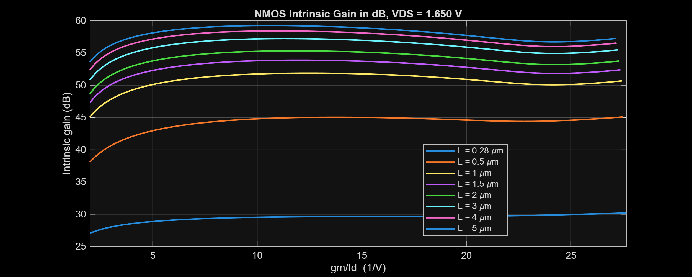
*Figure 3.1: GF180 3.3 V NMOS Intrinsic Self-Gain ($g_m/g_{ds}$) versus $g_m/I_D$ across channel lengths.*

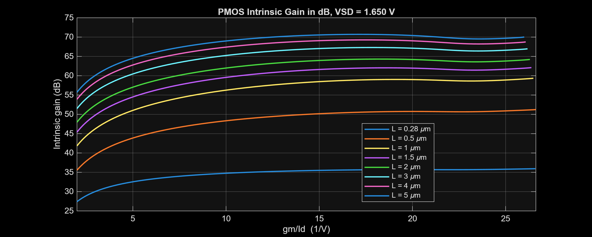
*Figure 3.2: GF180 3.3 V PMOS Intrinsic Self-Gain ($g_m/g_{ds}$) versus $g_m/I_D$ across channel lengths.*

---

## 4. Nominal Operating Conditions

| Parameter | Nominal Setting | Notes / Test Setup |
| :--- | :---: | :--- |
| **Process Corner** | `NOM` (Typical-Typical) | PDK library `sm141064.ngspice` |
| **Supply Voltage ($V_{DD}$)** | $3.30\text{ V}$ | Voltage range: $3.0\text{ V}$ (`VL`) to $3.6\text{ V}$ (`VH`) |
| **Analog Ground ($V_{SS}$)** | $0.00\text{ V}$ | Single-supply ground reference |
| **Input Common-Mode ($V_{in,cm}$)** | $1.65\text{ V}$ | Mid-supply reference ($V_{DD}/2$) |
| **Reference Voltage ($V_{\text{REF}}$)** | $1.65\text{ V}$ | CMFB target output common-mode |
| **Nominal Bias Current ($I_{\text{BIAS}}$)** | $40.00\text{ }\mu\text{A}$ | Master bias generator target |
| **Load Capacitance ($C_L$)** | $10.0\text{ pF}$ | Single-ended or differential output load |
| **Noise Integration Bandwidth** | $0.05\text{ Hz to }150\text{ Hz}$ | Diagnostic ECG clinical bandwidth standard |
| **Temperature ($T$)** | $27^\circ\text{C}$ | Temperature range: $-40^\circ\text{C}$ (`TL`) to $+125^\circ\text{C}$ (`TH`) |

---

## 5. Verification Methodology

### 5.1 45-Point PVT Verification Matrix

The complete PVT verification matrix comprises **5 process corners** $\times$ **9 environmental conditions** = **45 corners**:

- **Processes (5)**: `NOM` (Typical), `FF` (Fast-Fast), `SS` (Slow-Slow), `FS` (Fast-Slow), `SF` (Slow-Fast).
- **Environmental Cases (9)**:
  - `nom`: $3.3\text{ V}, 27^\circ\text{C}$ (Nominal)
  - `vl` / `vh`: $3.0\text{ V} / 3.6\text{ V}, 27^\circ\text{C}$ (Supply bounds)
  - `tl` / `th`: $3.3\text{ V}, -40^\circ\text{C} / +125^\circ\text{C}$ (Temperature bounds)
  - `vltl` / `vlth`: $3.0\text{ V}, -40^\circ\text{C} / +125^\circ\text{C}$ (Cross-environmental corners)
  - `vhtl` / `vhth`: $3.6\text{ V}, -40^\circ\text{C} / +125^\circ\text{C}$ (Cross-environmental corners)

Corner labels combine process and environmental codes (e.g., `FFVHTH` = Fast-Fast, $3.6\text{ V}, +125^\circ\text{C}$; `SSVLTH` = Slow-Slow, $3.0\text{ V}, +125^\circ\text{C}$).

---

## 6. Simulation Results & Characterization Plots

### 6.1 Master Bias & Reference Subsystem (`BIAS` / `SEL`)

| Performance Parameter | Nominal Result | PVT Extrema / Range | Worst-Case Corner |
| :--- | :---: | :---: | :---: |
| **Reference Bias Current ($I_{\text{BIAS}}$)** | $39.997\text{ }\mu\text{A}$ | $31.054\text{ to }49.441\text{ }\mu\text{A}$ | `SSVLTL` / `FFVHTH` |
| **Bias Current Relative Error** | $+0.007\%$ | $-22.36\%\text{ to }+23.60\%$ | `FFVHTH` |
| **Reference Error ($V_{\text{REF}} - V_{DD}/2$)** | $0.057\text{ mV}$ | $-6.154\text{ }\mu\text{V to }+6.154\text{ }\mu\text{V}$ | `SSVHNOM` |
| **Current Mirror Tracking Error** | $0.001\%$ | $\le 0.149\%$ | `FSVLNOM` |
| **Startup Settling Time** | $158.4\text{ }\mu\text{s}$ | $\le 1180.28\text{ }\mu\text{s}$ | `SSVLTL` |
| **Startup Failure Count** | **0 of 35** | **0 of 35** across all runs | All PVT Points |
| **Analog Selector Transmission Error** | $0.025\text{ }\mu\text{V}$ | $\le 25.466\text{ nV}$ | `SSTH` |


*Figure 6.1: Nominal startup transient showing reliable settling of reference current to $40\text{ }\mu\text{A}$ within $160\text{ }\mu\text{s}$.*


*Figure 6.2: Two-dimensional DC surface of master bias current across supply voltage ($3.0\text{--}3.6\text{ V}$) and temperature ($-40^\circ\text{C}\text{ to }+125^\circ\text{C}$).*

---

### 6.2 Single-Ended OTA (`SE_OTA`) Performance

| Parameter | Unit | Nominal Value | Full-PVT Worst Value | Worst Corner |
| :--- | :--- | :---: | :---: | :---: |
| **Total Current / Power** | $\text{mA} / \text{mW}$ | 0.913 / 3.012 | 1.212 / 4.363 | `FFVHTH` |
| **DC Open-Loop Gain** | $\text{dB}$ | 93.855 | **89.697** | `FSVLTH` |
| **Unity-Gain Frequency ($C_L = 10\text{ pF}$)** | $\text{MHz}$ | 12.144 | **8.417** | `SSVLTH` |
| **Phase Margin** | $\text{deg}$ | 71.975 | **59.932** | `FFVLTH` |
| **Input Offset Voltage** | $\mu\text{V}$ | 14.532 | 21.419 | `FSVLTH` |
| **CMRR @ 60 Hz** | $\text{dB}$ | 110.809 | **108.150** | `SSVLTH` |
| **PSRR+ @ 60 Hz** | $\text{dB}$ | 103.738 | **101.557** | `SSNOMTH` |
| **Input Noise ($0.05\text{--}150\text{ Hz}$)** | $\mu\text{Vrms}$ | 1.876 | **2.188** | `SSVLTH` |
| **Input Low / High Headroom** | $\text{mV}$ | 318.0 / 78.0 | 545.0 / 213.0 | `SSVHTL` / `FSVLTH` |
| **Slew Rate (Rise / Fall)** | $\text{V}/\mu\text{s}$ | 9.968 / 7.763 | 7.034 / 5.522 | `SSVLTL` |
| **Settling Time ($2\text{ mV}$ band)** | $\text{ns}$ | 164.9 | 214.4 | `SSVLTL` |

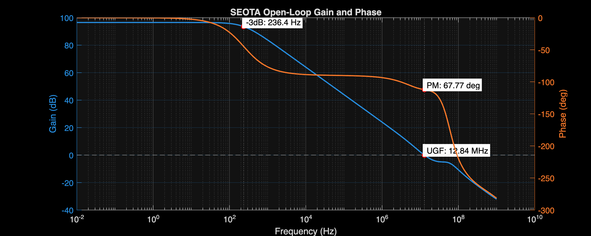
*Figure 6.3: SE OTA nominal open-loop gain and phase ($A_{v,0} = 93.86\text{ dB}$, $\text{UGF} = 12.14\text{ MHz}$, $\text{PM} = 71.98^\circ$).*

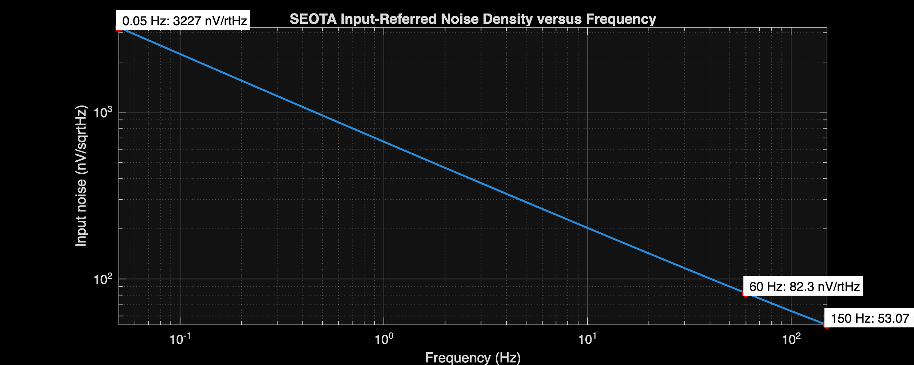
*Figure 6.4: SE OTA input-referred noise spectral density ($1.876\text{ }\mu\text{Vrms}$ integrated from $0.05\text{ Hz}$ to $150\text{ Hz}$).*

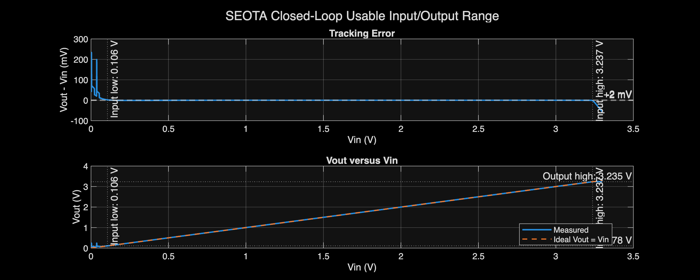
*Figure 6.5: SE OTA closed-loop unity-follower tracking error showing rail-to-rail usable input range ($0.318\text{ V to }3.222\text{ V}$).*

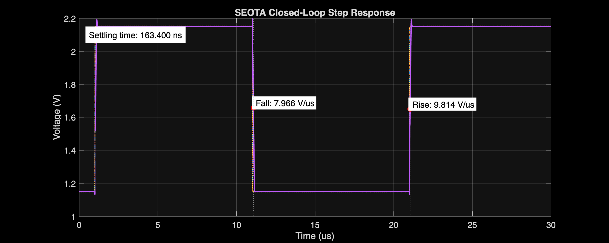
*Figure 6.6: SE OTA closed-loop large-signal step transient ($V_{\text{step}} = 1.0\text{ V}$, settling time $164.9\text{ ns}$).*

---

### 6.3 Fully Differential OTA (`FD_OTA`) Performance

| Parameter | Unit | Nominal Value | Full-PVT Worst Value | Worst Corner |
| :--- | :--- | :---: | :---: | :---: |
| **Total Current / Power** | $\text{mA} / \text{mW}$ | 1.753 / 5.784 | 2.320 / 8.352 | `FFVHTH` |
| **Differential DC Gain** | $\text{dB}$ | 86.391 | **83.594** | `FSVLTH` |
| **Differential UGF ($C_L = 10\text{ pF}$)** | $\text{MHz}$ | 12.256 | **8.306** | `SSVLTH` |
| **Differential Phase Margin** | $\text{deg}$ | 73.795 | **64.167** | `FFVLTH` |
| **Input-Referred Noise ($0.05\text{--}150\text{ Hz}$)** | $\mu\text{Vrms}$ | 3.111 | **3.545** | `SSVHTH` |
| **Output CM Voltage Error** | $\text{mV}$ | -0.057 | 32.999 | `SSNOMTH` |
| **Symmetrical Output Swing** | $\text{V}$ | $\pm 3.158$ | $\mathbf{\pm 2.730}$ | `FSVLTH` |
| **Differential Slew Rate (Rise / Fall)** | $\text{V}/\mu\text{s}$ | 7.238 / 7.140 | 5.138 / 5.073 | `SSVLTL` |
| **Differential Settling Time ($2\text{ mV}$)** | $\text{ns}$ | 153.6 | 236.6 | `SSVLTL` |
| **CMFB Phase Margin / Settling** | $\text{deg} / \text{ns}$ | 86.428 / 313.6 | 84.1 / 507.1 | `FFVLTH` / `SSVLTH` |

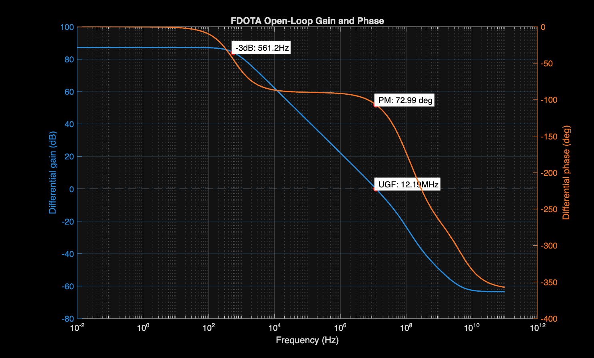
*Figure 6.7: FD OTA differential open-loop gain and phase ($A_{v,0} = 86.39\text{ dB}$, $\text{UGF} = 12.26\text{ MHz}$, $\text{PM} = 73.80^\circ$).*

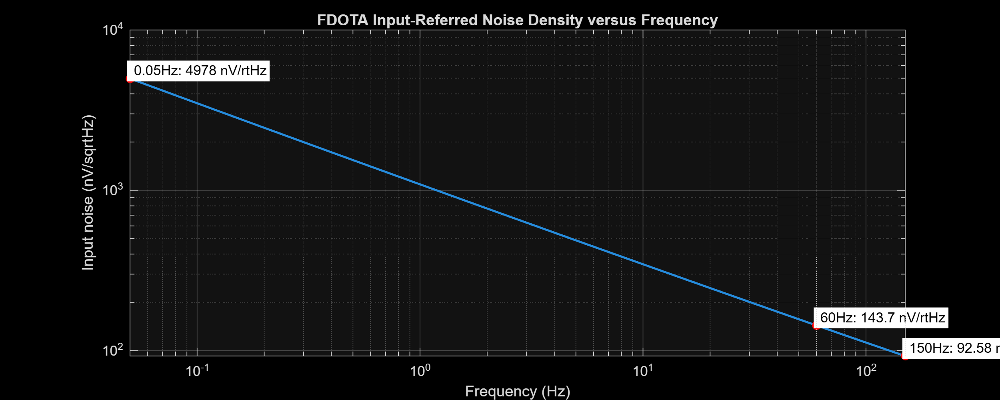
*Figure 6.8: FD OTA input-referred noise spectral density ($3.111\text{ }\mu\text{Vrms}$ integrated in $0.05\text{--}150\text{ Hz}$).*

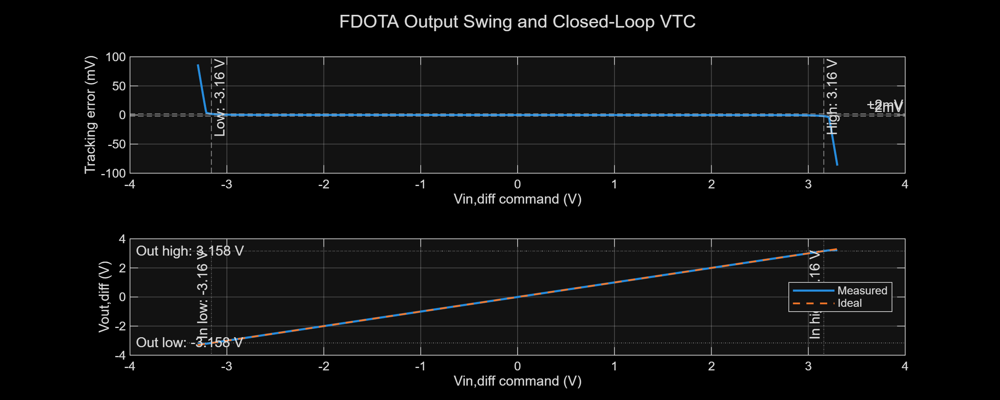
*Figure 6.9: FD OTA closed-loop differential transfer curve and dynamic output swing limits ($\pm 3.158\text{ V}$).*

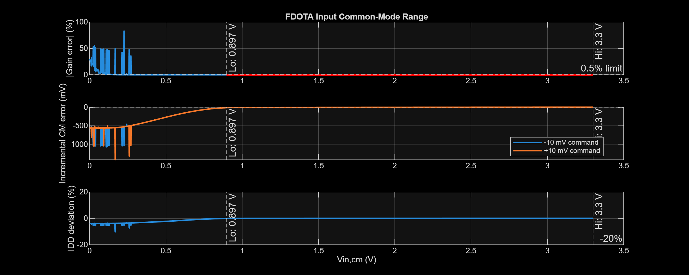
*Figure 6.10: FD OTA input common-mode range (ICMR) verification across common-mode input sweeps.*

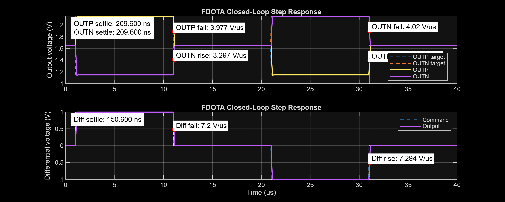
*Figure 6.11: FD OTA closed-loop differential step transient and settling performance.*

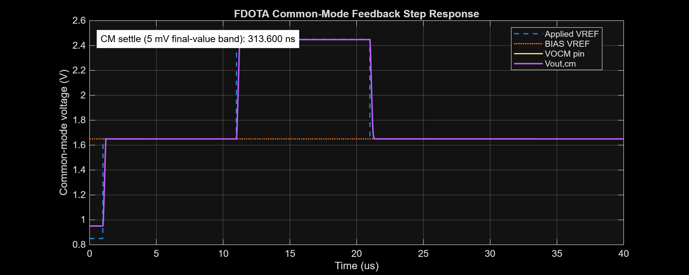
*Figure 6.12: CMFB transient regulation settling output common-mode voltage back to $V_{\text{REF}} = 1.65\text{ V}$.*

---

### 6.4 Standalone Core (`FDC`) & CMFB Subsystems

| Sub-Block | Characterization Metric | Nominal Result | Design Specification |
| :--- | :--- | :---: | :---: |
| **`FDC` (Core)** | Differential DC Gain | 88.362 dB | $> 80\text{ dB}$ |
| | Unity-Gain Frequency ($C_L = 10\text{ pF}$) | 12.236 MHz | $> 10\text{ MHz}$ |
| | Phase Margin | 72.894° | $> 60^\circ$ |
| | Plant Differential Gain | 18,831 V/V | High-gain core |
| | Input Noise ($1\text{--}150\text{ Hz}$) | 2.461 µVrms | $< 3.0\text{ }\mu\text{Vrms}$ |
| **`CMFB`** | Open-Loop Common-Mode Gain | 43.912 dB | $> 40\text{ dB}$ |
| | Common-Mode Loop UGF ($C_L = 2\text{ pF}$) | 800.932 MHz | Fast CM stabilization |
| | Common-Mode Phase Margin | 86.428° | High loop damping |
| | Valid Reference Voltage Range | $1.120\text{ to }2.760\text{ V}$ | Symmetric tracking around $1.65\text{ V}$ |
| | Transient Settling Time ($V_{\text{REF}}$ step) | 5.2 ns | Instantaneous CM recovery |

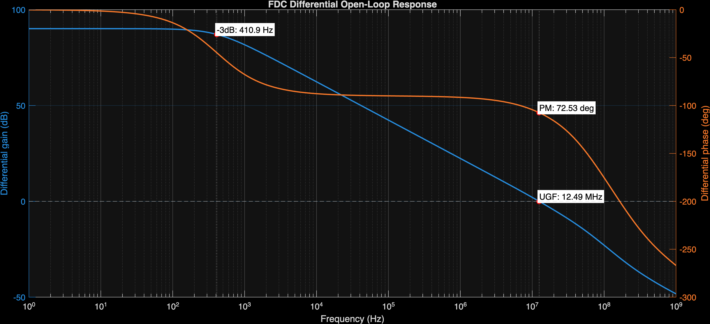
*Figure 6.13: FDC differential core open-loop AC frequency response.*

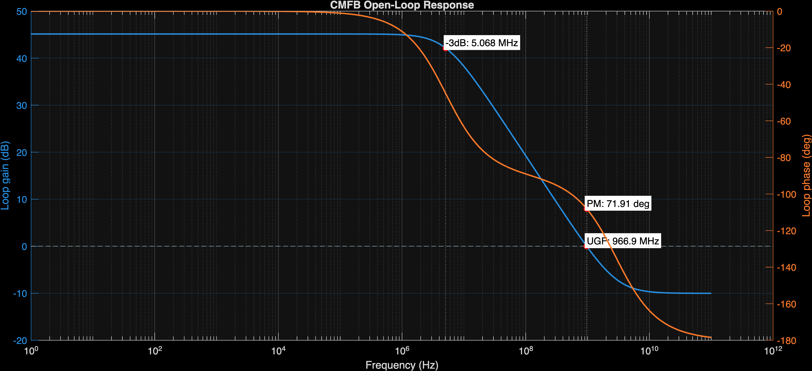
*Figure 6.14: CMFB loop open-loop frequency response ($A_{\text{cm}} = 43.91\text{ dB}$, $\text{UGF} = 800.9\text{ MHz}$, $\text{PM} = 86.43^\circ$).*

---

## 7. Generated Reports & Reviewable Artifacts

### 7.1 CSV Summary Datasets

- **BIAS Subsystem**:
  - [`BIAS_table_report.csv`](file:///d:/Documents/GitHub/ECG_Acquisition_IC/Measurement_Results/IC_Simulation/BIAS/BIAS_table_report.csv): 9-corner comparison summary
  - [`BIAS_global_worst_case.csv`](file:///d:/Documents/GitHub/ECG_Acquisition_IC/Measurement_Results/IC_Simulation/BIAS/BIAS_global_worst_case.csv): Global PVT extrema search
  - [`BIAS_startup_report.csv`](file:///d:/Documents/GitHub/ECG_Acquisition_IC/Measurement_Results/IC_Simulation/BIAS/BIAS_startup_report.csv): 35 startup transient runs
  - [`BIAS_sel_report.csv`](file:///d:/Documents/GitHub/ECG_Acquisition_IC/Measurement_Results/IC_Simulation/BIAS/BIAS_sel_report.csv): Transmission gate code error
  - [`BIAS_dc2d_report.csv`](file:///d:/Documents/GitHub/ECG_Acquisition_IC/Measurement_Results/IC_Simulation/BIAS/BIAS_dc2d_report.csv): 2D DC voltage/temperature surface grid
  - [`BIAS_reference_report.csv`](file:///d:/Documents/GitHub/ECG_Acquisition_IC/Measurement_Results/IC_Simulation/BIAS/BIAS_reference_report.csv): Reference voltage stability report
- **Single-Ended OTA (`SE_OTA`)**:
  - [`SEOTA_table_report.csv`](file:///d:/Documents/GitHub/ECG_Acquisition_IC/Measurement_Results/IC_Simulation/SE_OTA/SEOTA_table_report.csv): 9-column comparison summary
  - [`SEOTA_worst_case_report.csv`](file:///d:/Documents/GitHub/ECG_Acquisition_IC/Measurement_Results/IC_Simulation/SE_OTA/SEOTA_worst_case_report.csv): 45-point full-PVT worst-case dataset
  - [`NOM.SEOTA_summary.csv`](file:///d:/Documents/GitHub/ECG_Acquisition_IC/Measurement_Results/IC_Simulation/SE_OTA/NOM.SEOTA_summary.csv): Compatibility summary export
- **Fully Differential OTA (`FD_OTA`)**:
  - [`FDOTA_table_report.csv`](file:///d:/Documents/GitHub/ECG_Acquisition_IC/Measurement_Results/IC_Simulation/FD_OTA/FDOTA/FDOTA_table_report.csv): 9-column comparison summary
  - [`FDOTA_worst_case_report.csv`](file:///d:/Documents/GitHub/ECG_Acquisition_IC/Measurement_Results/IC_Simulation/FD_OTA/FDOTA/FDOTA_worst_case_report.csv): 45-point full-PVT worst-case dataset
  - [`NOM.FDOTA_summary.csv`](file:///d:/Documents/GitHub/ECG_Acquisition_IC/Measurement_Results/IC_Simulation/FD_OTA/FDOTA/NOM.FDOTA_summary.csv): Compatibility summary export
  - [`NOM.FDC_summary.csv`](file:///d:/Documents/GitHub/ECG_Acquisition_IC/Measurement_Results/IC_Simulation/FD_OTA/FDC/NOM.FDC_summary.csv): Differential core standalone summary
  - [`NOM.CMFB_summary.csv`](file:///d:/Documents/GitHub/ECG_Acquisition_IC/Measurement_Results/IC_Simulation/FD_OTA/CMFB/NOM.CMFB_summary.csv): CMFB standalone summary

---

## 8. Verification Reproducibility

Execute all simulations and post-processing analyzers from the repository root:

```bash
# 1. BIAS & Selector Subsystem
matlab -batch "addpath(fullfile(pwd,'Measurement_Results','IC_Simulation','BIAS')); BIAS_Analyze"

# 2. Single-Ended OTA Full 45-PVT Analysis
matlab -batch "run(fullfile(pwd,'Measurement_Results','IC_Simulation','SE_OTA','SEOTA_Analyze.m'))"

# 3. Fully Differential OTA, Core, and CMFB Full Analysis
matlab -batch "run(fullfile(pwd,'Measurement_Results','IC_Simulation','FD_OTA','CMFB','CMFB_Analyze.m'))"
matlab -batch "run(fullfile(pwd,'Measurement_Results','IC_Simulation','FD_OTA','FDC','FDC_Analyze.m'))"
matlab -batch "run(fullfile(pwd,'Measurement_Results','IC_Simulation','FD_OTA','FDOTA','FDOTA_Analyze.m'))"
```

All analysis routines have been validated in MATLAB R2026a under Windows and Linux environments.

---

## 9. Limitations and Future Work

| Phase | Milestone | Objective / Completion Criteria |
| :---: | :--- | :--- |
| **Phase 1** | **Top-Level AFE Verification** | Execute full-chain transient and frequency-domain verification across the cascaded `INA -> LPF -> PGA -> BUFFER` path. |
| **Phase 2** | **Mismatch & Monte Carlo** | Run statistical mismatch simulations to establish true yield, realistic CMRR/PSRR floors, and statistical input offset bounds. |
| **Phase 3** | **Physical Layout & Extraction** | Complete DRC/LVS-clean layout on GF180 1P6M, extract parasitic $RC$ networks, and perform post-layout extracted re-simulation. |
| **Phase 4** | **Mixed-Signal ADC Integration** | Integrate the 10-bit SAR ADC converter macro with the analog frontend core. |
| **Phase 5** | **Silicon Tapeout & Laboratory Test** | Prepare pad ring, chip assembly, evaluation PCB testbench, and bio-signal measurement validation. |
