# FD OTA Detailed Verification Report

[← System-level project report](../../Project_Report.md)

| Item | Value |
| :--- | :--- |
| Verification level | Pre-layout schematic |
| Deterministic coverage | 45 PVT corners |
| Statistical coverage | 200-run MM, GL, and FULL |
| Status | Pass |

## Architecture and design intent

The FD OTA separates the differential signal path from output common-mode regulation:

- **FDC:** a symmetric, fully differential, two-stage signal amplifier. M1/M2 form the NMOS input pair, M3/M4 form the PMOS first-stage loads controlled by `VCMFB`, M5 is the input-stage tail device, and M10 is the NMOS bias reference. M6/M8 and M7/M9 form the two output branches. Each side has its own series $R_z$–$C_c$ compensation path.
- **CMFB:** an NMOS differential error amplifier. M1/M2 compare the sensed output common mode against `REF`; M3/M4 provide the PMOS active load, M5 supplies the tail current, and M10 is the bias-reference device. The CMFB output drives the FDC PMOS-load gates.
- **Output common-mode sensor:** equal R1/R2 resistors average `OUTP` and `OUTN` to generate `VOCM`; C1/C2 provide symmetric high-frequency loading and filtering. The CMFB loop forces this sensed value toward `REF` without disturbing the differential signal ideally.

Schematic sources: [FDOTA.sch](<../../Design_Files/IC Design/Schematic/ANALOG_BLOCKS/FDOTA/FDOTA/FDOTA.sch>), [FDC.sch](<../../Design_Files/IC Design/Schematic/ANALOG_BLOCKS/FDOTA/FDC/FDC.sch>), and [CMFB.sch](<../../Design_Files/IC Design/Schematic/ANALOG_BLOCKS/FDOTA/CMFB/CMFB.sch>).

### Implemented FDC dimensions

`W_eff` is $W\times m$ because every listed MOS device uses `nf=1`.

| Function | Devices | Type | $L$ (µm) | $W$ (µm) | $m$ | $W_{eff}$ per device (µm) | Sizing objective |
| :--- | :---: | :---: | ---: | ---: | ---: | ---: | :--- |
| Input differential pair | M1, M2 | NMOS | 2.0 | 100 | 2 | 200 | High $g_m/I_D$, low input-referred noise, and differential gain |
| CMFB-controlled first-stage load | M3, M4 | PMOS | 2.0 | 50 | 4 | 200 | High output resistance with common-mode control authority |
| Tail source | M5 | NMOS | 2.0 | 10 | 1 | Establish the input-stage current |
| Bias reference | M10 | NMOS | 2.0 | 20 | 1 | Generate the current-mirror reference |
| Output pull-ups | M6, M7 | PMOS | 0.5 | 50 | 10 | Differential output current and positive slew capability |
| Output pull-downs | M8, M9 | NMOS | 0.5 | 100 | 1 | Differential output current and negative slew capability |

Each FDC MIM capacitor has $W=L=35.36\,\mu\text{m}$ in the 2 fF/µm² model, giving approximately $C_c=2.50$ pF per side. Each poly resistor uses the 2 kΩ/square model with $L/W=7/4$, giving a first-order value of approximately $R_z=3.5$ kΩ before model end and contact corrections.

### Implemented CMFB and sensor dimensions

| Function | Devices | Type | $L$ (µm) | $W$ (µm) | $m$ | $W_{eff}$ per device (µm) | Sizing objective |
| :--- | :---: | :---: | ---: | ---: | ---: | ---: | :--- |
| CMFB input pair | M1, M2 | NMOS | 1.0 | 15 | 1 | 15 | Fast common-mode error sensing with useful transconductance efficiency |
| CMFB active load | M3, M4 | PMOS | 1.0 | 41.1 | 5 | 205.5 | High load resistance and sufficient drive for `VCMFB` |
| CMFB tail source | M5 | NMOS | 2.0 | 20 | 1 | Establish CMFB input-pair current |
| CMFB bias reference | M10 | NMOS | 2.0 | 20 | 1 | One-to-one nominal tail-current reference |

R1/R2 use the 2 kΩ/square poly model with $L/W=100/2$, so each is approximately 100 kΩ. C1/C2 use 5 µm by 5 µm MIM elements in the 2 fF/µm² model, so each is approximately 50 fF. Equal values are essential: mismatch in the averaging network converts differential output signal into a false common-mode error.

## $g_m/I_D$ sizing methodology

The design uses the lookup-table form of the $g_m/I_D$ method. Silveira, Flandre, and Jespers established $g_m/I_D$ as a unified design variable across weak, moderate, and strong inversion. Jespers and Murmann later formalized the simulator-generated lookup-table workflow used here: characterize the process once, select operating points from figures of merit, calculate widths, and then close the design with complete circuit simulation.

The central equations are

$$
g_m=\left(\frac{g_m}{I_D}\right)I_D,
\qquad
J_D=\frac{I_D}{W_{eff}},
\qquad
W_{eff}=\frac{I_D}{J_D},
$$

where $J_D=I_D/W$ is taken from the device table at the selected length, drain bias, and $g_m/I_D$. The same operating point provides

$$
A_{v,int}=\frac{g_m}{g_{ds}},
$$

as a device-level gain indicator, while $f_T$ and $(g_m/I_D)f_T$ indicate speed. High $g_m/I_D$ improves transconductance per unit current and reduces required overdrive, but decreases current density and increases width. Long channel length improves $g_m/g_{ds}$ and matching, but reduces $f_T$ and adds capacitance. A fully differential OTA also requires the differential and CMFB loops to be designed together: increasing main-path gain or output-stage size changes the CMFB plant, and aggressive CMFB bandwidth can interact with the differential loop and output sensor.

The practical sizing sequence is therefore:

1. Convert differential UGF, noise, load, settling, output-swing, and slew requirements into input-stage $g_m$, branch-current, and compensation targets.
2. Choose $L$ and $g_m/I_D$ for the FDC input pair and active loads to obtain adequate $g_m/g_{ds}$ without giving up all speed.
3. Compute $I_D=g_m/(g_m/I_D)$ and $W_{eff}=I_D/J_D$, then implement matched pairs with identical multiplicity and orientation.
4. Size the short-channel output devices from load current and slew rate, and size the symmetric $R_z$–$C_c$ networks from pole/zero placement.
5. Size the CMFB input pair and load from common-mode loop gain, control-node capacitance, and settling; keep the sensor elements symmetric.
6. Verify the two loops independently and together, followed by PVT and mismatch/global Monte Carlo analysis.

### Local 180 nm characterization data

The project characterization sweeps 10-µm-wide `nfet_03v3` and `pfet_03v3` devices over $L=0.28$–5 µm. The terminal tables interpolate $g_m/I_D=4$–20 V⁻¹ at $V_{DS}=1.65$ V for NMOS and $V_{SD}=1.65$ V for PMOS. Direct simulator operating-point values of $g_m$, $g_{ds}$, capacitance, and $f_T$ are converted into $g_m/I_D$, $I_D/W$, $g_m/g_{ds}$, and $(g_m/I_D)f_T$ on the physical monotonic branch.

The table's $V_{OV}$ and threshold-voltage columns are diagnostic only: the postprocessor estimates $V_{OV}\approx2/(g_m/I_D)$ and derives threshold voltage from that estimate. Width selection in this report relies on simulator-derived current density and small-signal quantities, not on treating the square-law $V_{OV}$ estimate as an exact compact-model result.

Representative values at $g_m/I_D=10$ V⁻¹ quantify the length tradeoff used by the FDC and CMFB:

| $L$ (µm) | NMOS $I_D/W$ (µA/µm) | NMOS $g_m/g_{ds}$ (dB) | NMOS $(g_m/I_D)f_T$ (GHz/V) | PMOS $I_D/W$ (µA/µm) | PMOS $g_m/g_{ds}$ (dB) | PMOS $(g_m/I_D)f_T$ (GHz/V) |
| ---: | ---: | ---: | ---: | ---: | ---: | ---: |
| 0.5 | 4.381 | 44.80 | 54.34 | 1.265 | 48.34 | 12.62 |
| 1.0 | 2.257 | 51.75 | 13.75 | 0.5309 | 56.26 | 2.668 |
| 2.0 | 1.055 | 55.27 | 3.067 | 0.2390 | 61.99 | 0.6172 |
| 4.0 | 0.4959 | 58.41 | 0.7020 | 0.1128 | 67.40 | 0.1501 |

The chosen lengths follow this characterized trend. The 2-µm FDC gain devices preserve substantially more intrinsic gain than 0.5-µm devices while retaining more speed than the 4-µm option. The 1-µm CMFB devices favor loop speed, and the 0.5-µm FDC output devices favor current density and load drive.

- [NMOS $g_m/I_D$ current-density plot](../../Measurement_Results/IC_Simulation/SIZING/Gm_Id/NMOS_Gm_Id/Plots/nmos_current_density_vs_gmid.png)
- [NMOS intrinsic-gain plot](../../Measurement_Results/IC_Simulation/SIZING/Gm_Id/NMOS_Gm_Id/Plots/nmos_intrinsic_gain_db_vs_gmid.png)
- [PMOS $g_m/I_D$ current-density plot](../../Measurement_Results/IC_Simulation/SIZING/Gm_Id/PMOS_Gm_Id/Plots/pmos_current_density_vs_gmid.png)
- [PMOS intrinsic-gain plot](../../Measurement_Results/IC_Simulation/SIZING/Gm_Id/PMOS_Gm_Id/Plots/pmos_intrinsic_gain_db_vs_gmid.png)

### Interpretation of the implemented FDC sizing

The nominal FDC bias current is 40.092 µA. M5 and M10 share $L=2$ µm, and the M5 width is one half of the M10 width. A first-order mirror estimate therefore places the FDC tail current near 20 µA and each balanced input branch near 10 µA.

- **M1/M2:** $10\,\mu\text{A}/200\,\mu\text{m}\approx0.050\,\mu\text{A}/\mu\text{m}$. The $L=2$ µm NMOS table gives 0.0748 µA/µm at $g_m/I_D=20$ V⁻¹, so the implemented input pair lies at the high-efficiency end of, or slightly beyond, the printed 4–20 V⁻¹ lookup range under the first-order current estimate. This supports low noise and high input transconductance per unit current.
- **M3/M4:** the same branch current gives approximately 0.050 µA/µm in each 200-µm PMOS load. At $L=2$ µm, the PMOS table gives 0.0567 µA/µm at 16 V⁻¹ and 0.0432 µA/µm at 17 V⁻¹. The load pair is therefore consistent with high-efficiency moderate-to-weak inversion, while the 2-µm channel supplies high output resistance and CMFB control gain.
- **M6–M9:** the output devices use $L=0.5$ µm and large widths. Their lookup curves offer far higher current density and $f_T$ than the 2-µm gain devices, which is appropriate for driving the differential load, achieving the slew target, and keeping the two compensation nodes fast. Symmetric sizing and matched compensation preserve differential balance.

The FDC thus applies high $g_m/I_D$ and longer length where noise and gain dominate, then uses shorter devices where slew rate and output-current density dominate. This allocation is more useful than forcing every device to the same inversion level.

### Interpretation of the CMFB sizing

The nominal CMFB bias current is also 40.092 µA. M5 and M10 have identical $W/L=20/2$, so a first-order estimate gives a 40-µA tail current and approximately 20 µA per balanced input branch.

- **CMFB M1/M2:** $20\,\mu\text{A}/15\,\mu\text{m}\approx1.33\,\mu\text{A}/\mu\text{m}$. For a 1-µm NMOS, the table gives 1.404 µA/µm at 12 V⁻¹ and 1.115 µA/µm at 13 V⁻¹. The input pair is therefore consistent with $g_m/I_D\approx12$–13 V⁻¹ at the characterization drain bias—a moderate-inversion point that balances transconductance efficiency and speed.
- **CMFB M3/M4:** $20\,\mu\text{A}/205.5\,\mu\text{m}\approx0.0973\,\mu\text{A}/\mu\text{m}$. For a 1-µm PMOS, the table gives 0.0966 µA/µm at 17 V⁻¹. The large load devices therefore operate at a higher transconductance-efficiency point and contribute output resistance while driving the FDC common-mode-control gates.

This division of labor explains the dedicated CMFB result: 45.128 dB gain, 966.924 MHz UGF, 71.906° phase margin, and 4.8–5.2 ns closed-loop settling. The main FDC loop is intentionally slower and more heavily compensated; the CMFB error amplifier is comparatively light and fast so that output common mode is corrected without limiting the required signal-band behavior.

These are current-density-based design interpretations, not substitutes for saved transistor operating-point data. The lookup tables use a 1.65-V drain-bias slice, whereas the in-circuit devices see different $V_{DS}$/$V_{SD}$ and body biases. Exact device $g_m/I_D$ values require nominal OP vectors from the final hierarchy. The lookup analysis explains why the selected lengths, widths, and multiplicities are reasonable; PVT and Monte Carlo simulations determine whether the complete design meets specification.

### Sizing-to-verification closure

| Sizing choice | Intended result | Verified evidence |
| :--- | :--- | :--- |
| High-efficiency, 2-µm FDC input pair | High differential $g_m$, low noise, and useful intrinsic gain | 88.699 dB nominal top-level gain and 3.086 µVrms nominal integrated input noise |
| 2-µm PMOS FDC loads | First-stage gain plus CMFB control authority | Full-PVT differential gain remains at least 86.753 dB; output CM error remains within ±12.643 mV |
| 0.5-µm, wide output devices | High current density, output swing, and load drive | ±3.188 V nominal differential swing and 7.232 V/µs nominal differential slew rate |
| Dual 2.5-pF / 3.5-kΩ compensation branches | Stable, symmetric differential loop | 12.447 MHz nominal UGF and 72.649° nominal phase margin; 63.377° full-PVT minimum |
| 1-µm CMFB input/load path | Fast output-common-mode correction | 4.8–5.2 ns dedicated CMFB settling; 329.7 ns nominal top-level CMFB settling under full output loading |
| Large matched devices and symmetric paths | Low mismatch sensitivity | FULL-MC offset spans −2.096 to +2.354 mV and all 200 runs pass |

## Design-method references

- F. Silveira, D. Flandre, and P. G. A. Jespers, “A $g_m/I_D$ Based Methodology for the Design of CMOS Analog Circuits and Its Application to the Synthesis of a Silicon-on-Insulator Micropower OTA,” *IEEE Journal of Solid-State Circuits*, vol. 31, no. 9, 1996. [DOI: 10.1109/4.535416](https://doi.org/10.1109/4.535416)
- P. G. A. Jespers and B. Murmann, “Basic Sizing Using the $g_m/I_D$ Methodology,” in *Systematic Design of Analog CMOS Circuits: Using Pre-Computed Lookup Tables*, Cambridge University Press, 2017. [DOI: 10.1017/9781108125840.003](https://doi.org/10.1017/9781108125840.003)
- P. G. A. Jespers and B. Murmann, “Lookup Table Generation and Usage,” ibid., 2017. [DOI: 10.1017/9781108125840.008](https://doi.org/10.1017/9781108125840.008)
- A. A. Youssef, B. Murmann, and H. Omran, “Analog IC Design Using Precomputed Lookup Tables: Challenges and Solutions,” *IEEE Access*, 2020. [DOI: 10.1109/ACCESS.2020.3010875](https://doi.org/10.1109/ACCESS.2020.3010875)

## Detailed results

| Metric | Specification | Nominal | Full-PVT worst case | Corner |
| :--- | :---: | ---: | ---: | :---: |
| Total current | ≤2.5 mA | 1.604 mA | 2.194 mA | `FFVHTH` |
| Differential gain | ≥85 dB | 88.699 dB | 86.753 dB | `FSVLTH` |
| Differential UGF | ≥8 MHz | 12.447 MHz | 8.435 MHz | `SSVLTH` |
| Differential phase margin | ≥60° | 72.649° | 63.377° | `FFVLTH` |
| Differential input offset | ±3 mV | −0.000 µV | 0.000 µV | `SFVHNOM` |
| Output CM error | ±25 mV | 0.395 mV | 12.643 mV | `SSVHTH` |
| CMRR at 60 / 150 Hz | ≥80 / 80 dB | 285.310 / 285.322 dB | 206.691 / 206.691 dB | `SFNOMTL` |
| PSRR+ at 60 / 150 Hz | ≥80 / 80 dB | 266.685 / 258.182 dB | 193.356 / 193.357 dB | `SFNOMTL` |
| Input noise, 0.05–150 Hz | ≤4 µVrms | 3.086 µVrms | 3.514 µVrms | `SSVHTH` |
| Differential output swing | ≥±1.8 V | ±3.188 V | ±2.803 V | `FSVLTH` |
| Differential slew rate | ≥4 V/µs | 7.232 V/µs | 5.135 V/µs | `SSVLTL` |
| Differential settling | ≤300 ns | 149.7 ns | 234.9 ns | `SSVLTL` |
| Differential-step CM disturbance | ≤60 mV | 30.247 mV | 40.985 mV | `SSVLTH` |
| CMFB settling | ≤1000 ns | 329.7 ns | 404.1 ns | `SSVLTL` |

The 200-run FULL Monte Carlo set passes every formal limit. Observed differential input offset spans −2.096 to +2.354 mV against the ±3 mV specification. Differential gain remains above 87.784 dB, UGF above 11.307 MHz, phase margin above 68.996°, and output common-mode error remains between −9.947 and +13.681 mV.

Nominal internal checks place the standalone differential core at 90.090 dB gain, 12.489 MHz UGF, and 72.529° phase margin. The CMFB amplifier has 45.128 dB gain, 966.924 MHz UGF, 71.906° phase margin, and 4.8–5.2 ns closed-loop settling in its dedicated testbench.

## Monte Carlo results

MM applies local mismatch, GL applies global process variation, and FULL combines both. Each campaign requested 200 runs, produced 200 valid runs with zero failed runs, and achieved 100% joint yield. The tables include every metric exported in the corresponding MC summary CSV.

### MM Monte Carlo — complete statistics

| Parameter | Unit | Spec | Min | μ−3σ | μ−σ | Mean | μ+σ | μ+3σ | Max | Yield |
| :--- | :---: | :---: | ---: | ---: | ---: | ---: | ---: | ---: | ---: | ---: |
| FDC bias current | µA | 40±10 | 38.852 | 38.414 | 39.515 | 40.065 | 40.615 | 41.716 | 41.496 | 100% |
| CMFB bias current | µA | 40±10 | 38.907 | 38.439 | 39.528 | 40.073 | 40.617 | 41.707 | 41.524 | 100% |
| Total current | mA | ≤2.5 | 1.541 | 1.524 | 1.577 | 1.603 | 1.629 | 1.681 | 1.682 | 100% |
| Total power | mW | ≤9 | 5.085 | 5.031 | 5.203 | 5.290 | 5.376 | 5.549 | 5.550 | 100% |
| Differential DC gain | dB | ≥85 | 88.639 | 88.647 | 88.683 | 88.700 | 88.718 | 88.753 | 88.739 | 100% |
| Differential UGF | MHz | ≥8 | 11.905 | 11.782 | 12.223 | 12.443 | 12.664 | 13.105 | 13.294 | 100% |
| Differential phase margin | ° | ≥60 | 72.273 | 72.259 | 72.514 | 72.641 | 72.769 | 73.023 | 73.059 | 100% |
| Input differential offset | µV | ±3000 | −2097.010 | −2276.450 | −738.365 | 30.677 | 799.720 | 2337.805 | 2355.490 | 100% |
| Gain error | % | ±0.01 | −0.003700 | −0.003697 | −0.003681 | −0.003673 | −0.003665 | −0.003648 | −0.003660 | 100% |
| Output CM error | mV | ±25 | −9.632 | −11.905 | −3.912 | 0.0842 | 4.081 | 12.073 | 11.463 | 100% |

### GL Monte Carlo — complete statistics

| Parameter | Unit | Spec | Min | μ−3σ | μ−σ | Mean | μ+σ | μ+3σ | Max | Yield |
| :--- | :---: | :---: | ---: | ---: | ---: | ---: | ---: | ---: | ---: | ---: |
| FDC bias current | µA | 40±10 | 39.253 | 39.101 | 39.771 | 40.107 | 40.442 | 41.112 | 40.929 | 100% |
| CMFB bias current | µA | 40±10 | 39.253 | 39.101 | 39.771 | 40.107 | 40.442 | 41.112 | 40.929 | 100% |
| Total current | mA | ≤2.5 | 1.547 | 1.534 | 1.582 | 1.607 | 1.631 | 1.680 | 1.680 | 100% |
| Total power | mW | ≤9 | 5.106 | 5.062 | 5.222 | 5.302 | 5.383 | 5.543 | 5.544 | 100% |
| Differential DC gain | dB | ≥85 | 87.799 | 87.629 | 88.320 | 88.666 | 89.011 | 89.702 | 89.613 | 100% |
| Differential UGF | MHz | ≥8 | 11.411 | 11.263 | 12.071 | 12.475 | 12.878 | 13.686 | 13.603 | 100% |
| Differential phase margin | ° | ≥60 | 69.206 | 68.362 | 71.234 | 72.670 | 74.105 | 76.977 | 77.492 | 100% |
| Input differential offset | µV | ±3000 | −0.000482 | −0.000238 | −0.000080 | −0.000001 | 0.000078 | 0.000236 | 0.000445 | 100% |
| Gain error | % | ±0.01 | −0.004070 | −0.004131 | −0.003837 | −0.003690 | −0.003543 | −0.003249 | −0.003310 | 100% |
| Output CM error | mV | ±25 | −3.511 | −4.594 | −1.279 | 0.3791 | 2.037 | 5.353 | 5.374 | 100% |

### FULL Monte Carlo — complete statistics

| Parameter | Unit | Spec | Min | μ−3σ | μ−σ | Mean | μ+σ | μ+3σ | Max | Yield |
| :--- | :---: | :---: | ---: | ---: | ---: | ---: | ---: | ---: | ---: | ---: |
| FDC bias current | µA | 40±10 | 38.723 | 38.176 | 39.445 | 40.080 | 40.715 | 41.984 | 41.716 | 100% |
| CMFB bias current | µA | 40±10 | 38.712 | 38.201 | 39.459 | 40.088 | 40.717 | 41.974 | 41.605 | 100% |
| Total current | mA | ≤2.5 | 1.519 | 1.497 | 1.570 | 1.606 | 1.642 | 1.715 | 1.745 | 100% |
| Total power | mW | ≤9 | 5.013 | 4.940 | 5.179 | 5.299 | 5.419 | 5.658 | 5.758 | 100% |
| Differential DC gain | dB | ≥85 | 87.784 | 87.623 | 88.319 | 88.667 | 89.015 | 89.710 | 89.621 | 100% |
| Differential UGF | MHz | ≥8 | 11.307 | 11.183 | 12.040 | 12.469 | 12.898 | 13.755 | 13.686 | 100% |
| Differential phase margin | ° | ≥60 | 68.996 | 68.280 | 71.203 | 72.665 | 74.127 | 77.051 | 77.849 | 100% |
| Input differential offset | µV | ±3000 | −2096.150 | −2276.341 | −738.306 | 30.711 | 799.728 | 2337.763 | 2354.430 | 100% |
| Gain error | % | ±0.01 | −0.004080 | −0.004133 | −0.003838 | −0.003690 | −0.003542 | −0.003246 | −0.003300 | 100% |
| Output CM error | mV | ±25 | −9.947 | −13.783 | −4.546 | 0.0726 | 4.691 | 13.928 | 13.681 | 100% |

## Corner comparison

### FD OTA comparison: NOM, FF, SS, FS, SF, VL, VH, TL, TH

| Parameter | Unit | Spec | NOM | FF | SS | FS | SF | VL | VH | TL | TH |
| :--- | :---: | :---: | ---: | ---: | ---: | ---: | ---: | ---: | ---: | ---: | ---: |
| **SET CONDITIONS** | — | — | — | — | — | — | — | — | — | — | — |
| AVDD | V | — | 3.300 | 3.300 | 3.300 | 3.300 | 3.300 | 3.000 | 3.600 | 3.300 | 3.300 |
| Vin,cm | V | — | 1.650 | 1.650 | 1.650 | 1.650 | 1.650 | 1.500 | 1.800 | 1.650 | 1.650 |
| VREF | V | — | 1.650 | 1.650 | 1.650 | 1.650 | 1.650 | 1.500 | 1.800 | 1.650 | 1.650 |
| Closed-loop target gain | V/V | — | 1.000 | 1.000 | 1.000 | 1.000 | 1.000 | 1.000 | 1.000 | 1.000 | 1.000 |
| **OPERATING POINT** | — | — | — | — | — | — | — | — | — | — | — |
| FDC bias current | uA | 40±10 | 40.092 | 45.286 | 35.875 | 40.727 | 39.434 | 39.479 | 40.525 | 35.435 | 43.278 |
| CMFB bias current | uA | 40±10 | 40.092 | 45.286 | 35.875 | 40.727 | 39.434 | 39.479 | 40.525 | 35.435 | 43.278 |
| Total current | mA | ≤2.5 | 1.604 | 1.857 | 1.400 | 1.652 | 1.556 | 1.568 | 1.633 | 1.302 | 1.861 |
| Total power | mW | ≤9 | 5.293 | 6.129 | 4.620 | 5.451 | 5.133 | 4.703 | 5.878 | 4.296 | 6.142 |
| **OPEN-LOOP SIMULATION** | — | — | — | — | — | — | — | — | — | — | — |
| Differential DC gain | dB | ≥85 | 88.699 | 88.550 | 88.731 | 88.379 | 88.952 | 88.122 | 89.195 | 89.168 | 87.741 |
| Differential UGF | MHz | ≥8 | 12.447 | 14.528 | 10.764 | 12.619 | 12.257 | 12.170 | 12.662 | 13.933 | 10.253 |
| Differential phase margin | deg | ≥60 | 72.649 | 66.886 | 77.375 | 71.851 | 73.436 | 72.365 | 72.892 | 75.290 | 69.080 |
| Input differential offset | uV | ±3000 | -0.000 | -0.000 | 0.000 | 0.000 | 0.000 | -0.000 | 0.000 | -0.000 | -0.000 |
| CMRR @ 60 Hz | dB | ≥80 | 285.310 | 311.336 | 296.211 | 334.082 | 294.280 | 314.786 | 298.385 | 285.922 | 286.303 |
| CMRR @ 150 Hz | dB | ≥80 | 285.322 | 358.824 | 295.776 | 331.726 | 294.428 | 338.284 | 298.865 | 286.211 | 286.341 |
| PSRR+ @ 60 Hz | dB | ≥80 | 266.685 | 272.894 | 259.938 | 276.403 | 271.821 | 276.696 | 273.872 | 272.874 | 259.735 |
| PSRR+ @ 150 Hz | dB | ≥80 | 258.182 | 273.176 | 266.133 | 260.513 | 260.086 | 260.002 | 260.203 | 262.669 | 305.063 |
| PSRR- @ 60 Hz | dB | ≥80 | 282.569 | 291.306 | 279.423 | 278.740 | 292.440 | 294.133 | 297.502 | 309.147 | 274.160 |
| PSRR- @ 150 Hz | dB | ≥80 | 277.076 | 300.965 | 282.441 | 280.892 | 283.131 | 286.933 | 288.764 | 282.124 | 273.993 |
| Input-referred noise 0.05-150 Hz | uVrms | ≤4 | 3.086 | 2.950 | 3.222 | 3.035 | 3.135 | 3.080 | 3.091 | 2.945 | 3.356 |
| **CLOSED-LOOP SIMULATION** | — | — | — | — | — | — | — | — | — | — | — |
| Closed-loop differential gain | dB | — | -3.190e-04 | -3.247e-04 | -3.165e-04 | -3.310e-04 | -3.102e-04 | -3.411e-04 | -3.010e-04 | -3.023e-04 | -3.551e-04 |
| Gain error | % | ±0.01 | -0.004 | -0.004 | -0.004 | -0.004 | -0.004 | -0.004 | -0.003 | -0.003 | -0.004 |
| Output common mode, DC | V | — | 1.650 | 1.648 | 1.653 | 1.652 | 1.649 | 1.500 | 1.800 | 1.643 | 1.661 |
| Output CM error | mV | ±25 | 0.395 | -1.839 | 2.748 | 1.747 | -1.017 | 0.365 | 0.415 | -6.733 | 10.536 |
| Input CM low | mV | ≤1000 | 870.000 | 770.000 | 975.000 | 790.000 | 955.000 | 870.000 | 875.000 | 870.000 | 865.000 |
| Input CM high | V | ≥2.3 | 3.300 | 3.300 | 3.300 | 3.185 | 3.300 | 3.000 | 3.600 | 3.300 | 3.300 |
| Input CM high headroom | mV | — | 0.000 | 0.000 | 0.000 | 115.000 | 0.000 | 0.000 | 0.000 | 0.000 | 0.000 |
| Differential output swing low | V | ≤-1.8 | -3.188 | -3.183 | -3.188 | -3.173 | -3.198 | -2.888 | -3.483 | -3.233 | -3.118 |
| Differential output swing high | V | ≥1.8 | 3.188 | 3.183 | 3.188 | 3.173 | 3.198 | 2.888 | 3.483 | 3.233 | 3.118 |
| Differential SR rise | V/us | ≥4 | 7.232 | 9.031 | 5.903 | 7.360 | 7.103 | 7.101 | 7.334 | 6.443 | 7.706 |
| Differential SR fall | V/us | ≥4 | 7.232 | 9.031 | 5.903 | 7.360 | 7.103 | 7.101 | 7.334 | 6.443 | 7.706 |
| Differential settling time | ns | ≤300 | 149.698 | 149.144 | 200.295 | 165.133 | 154.280 | 154.705 | 149.702 | 174.303 | 180.993 |
| Differential-step CM disturbance | mV | ≤60 | 30.247 | 27.596 | 33.256 | 30.706 | 29.694 | 30.066 | 30.352 | 24.927 | 39.263 |
| CMFB SR rise | V/us | ≥2 | 3.589 | 4.487 | 2.913 | 3.660 | 3.505 | 3.477 | 3.650 | 3.208 | 3.800 |
| CMFB SR fall | V/us | ≥2 | 3.526 | 4.541 | 2.785 | 3.541 | 3.509 | 3.468 | 3.569 | 3.474 | 3.379 |
| CMFB settling time | ns | ≤1000 | 329.729 | 275.711 | 373.846 | 325.534 | 333.998 | 334.052 | 325.742 | 340.681 | 333.963 |

## Plots

### All generated FD OTA plots

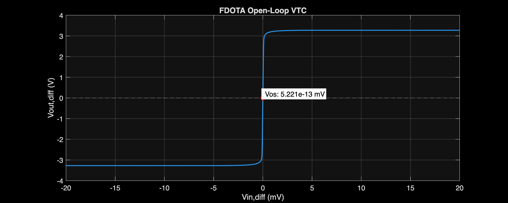

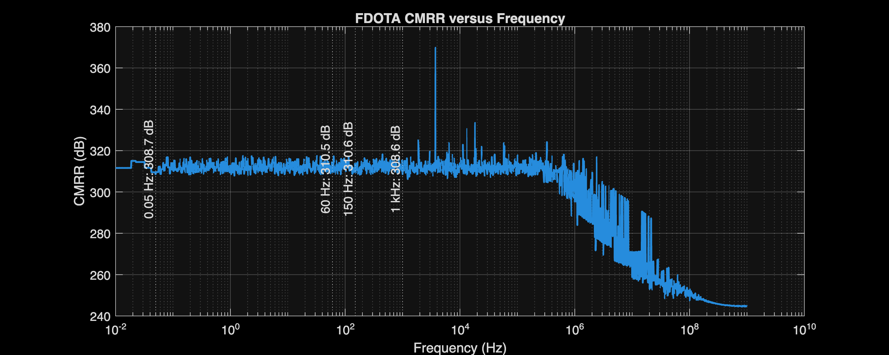

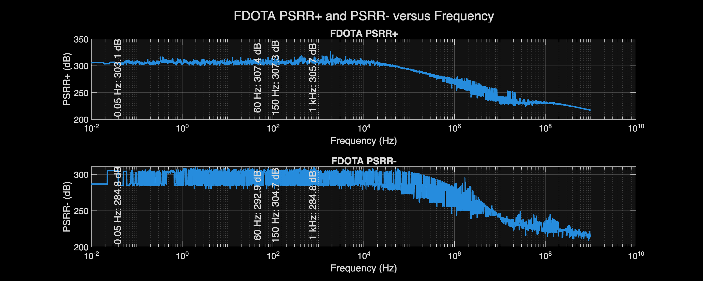

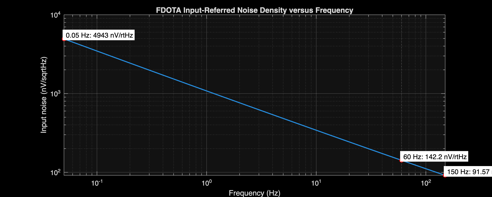

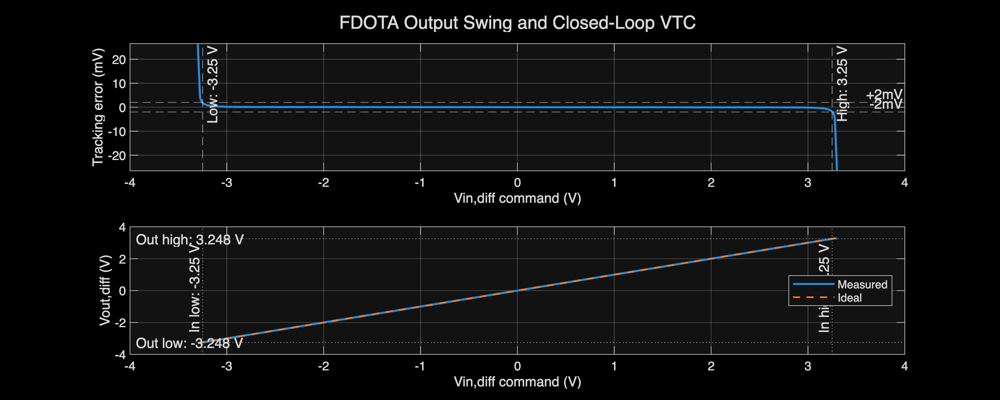

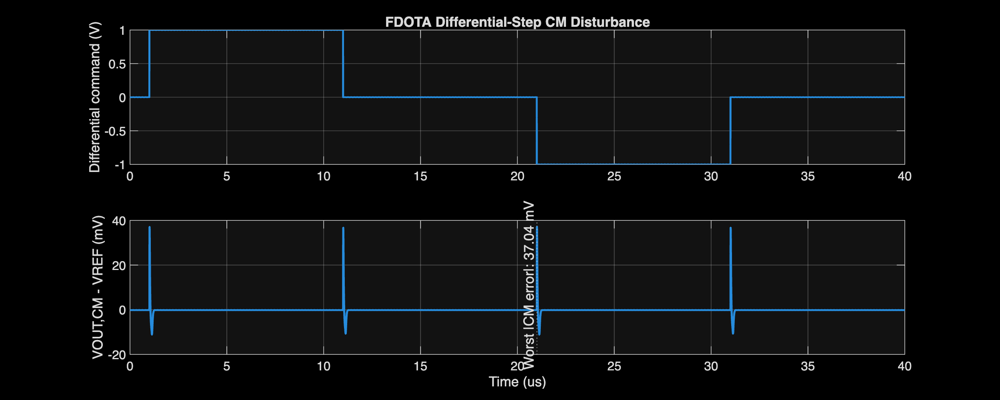

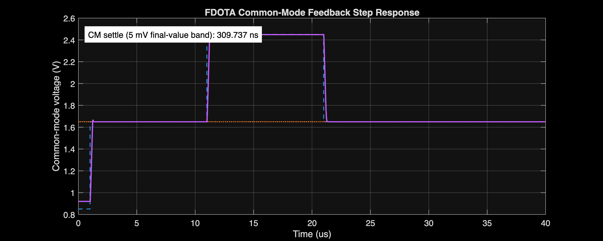

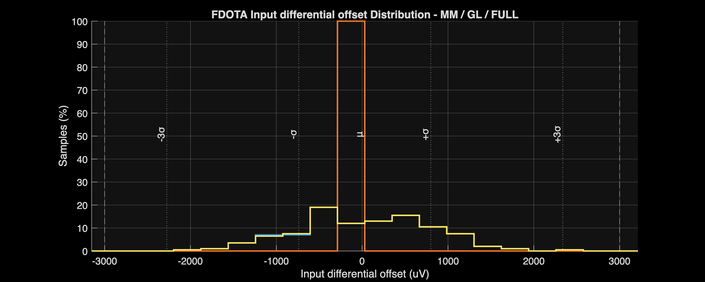

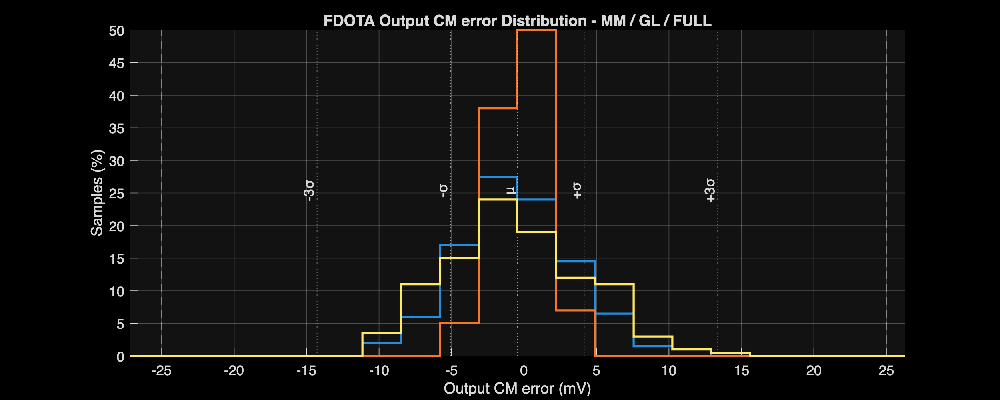

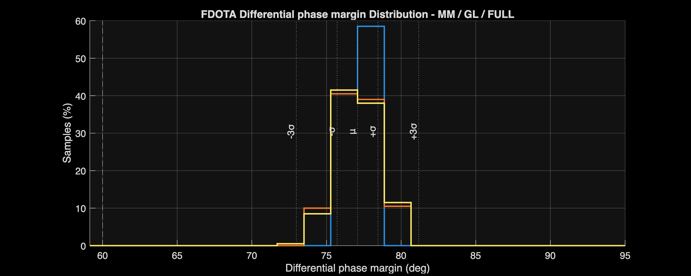

### All generated FDC and CMFB internal-testbench plots

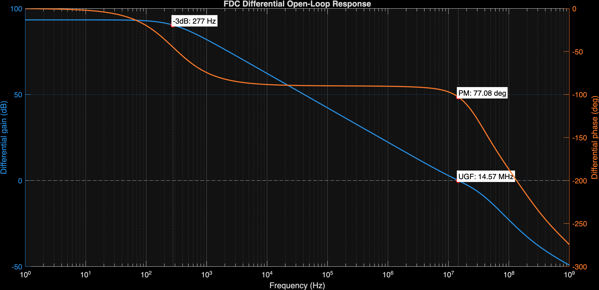

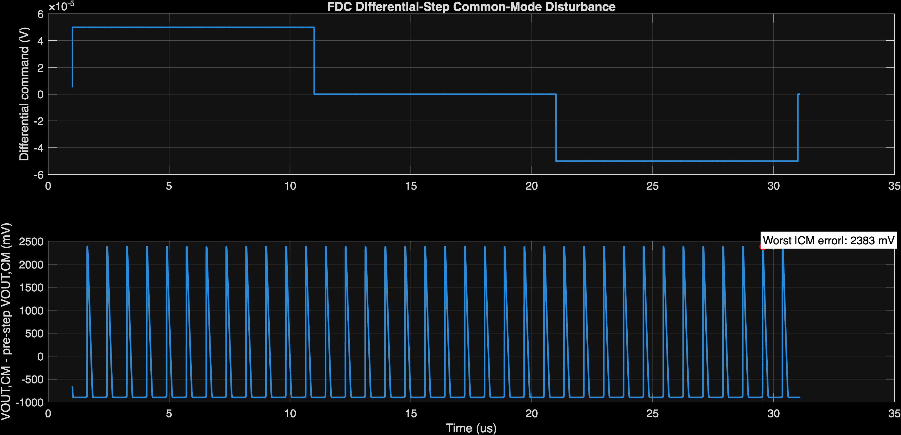

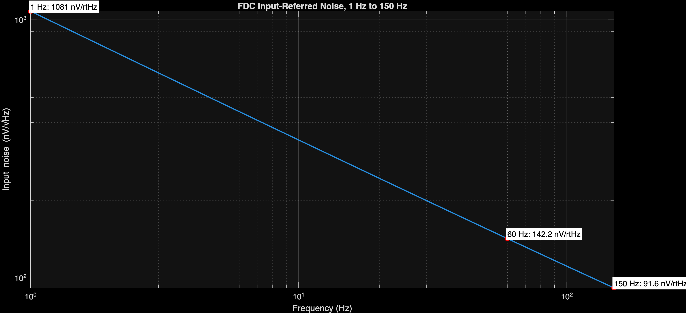

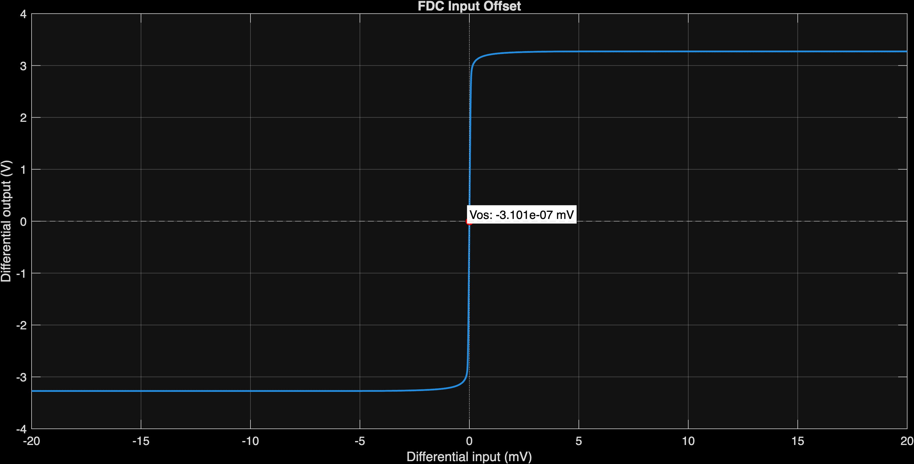

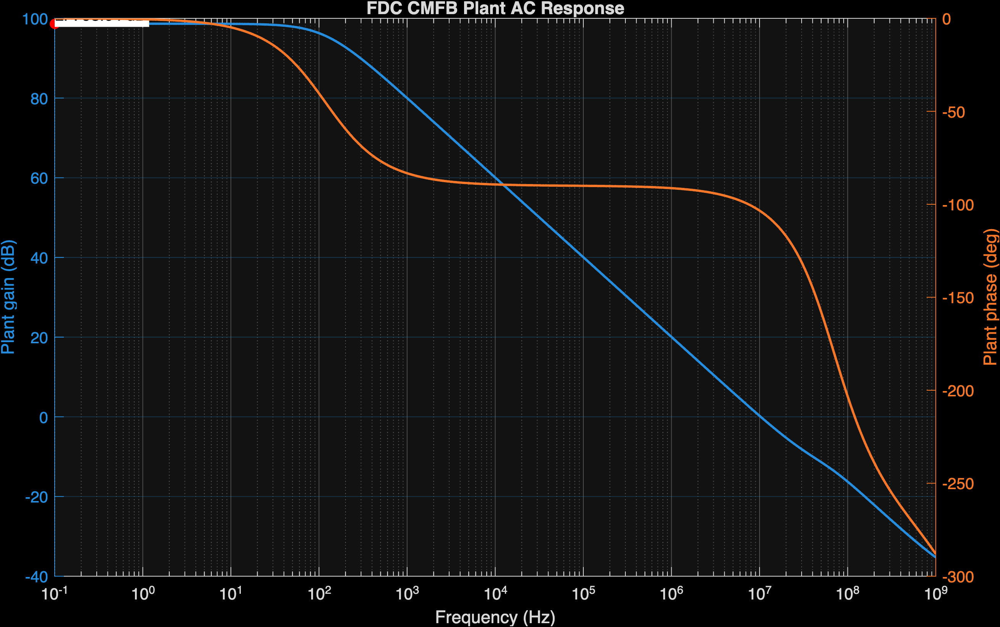

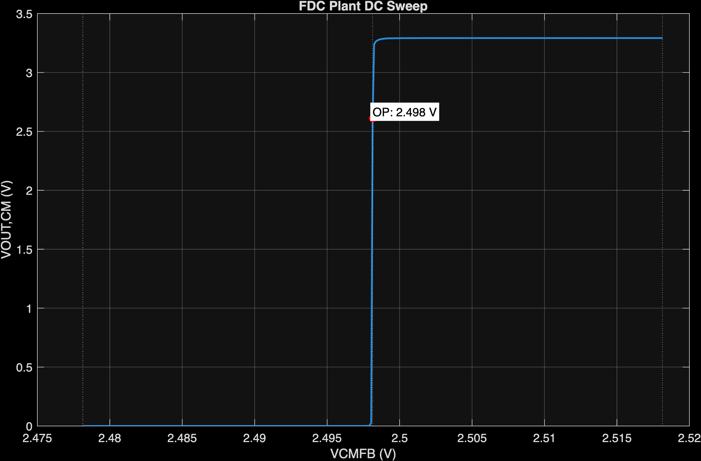

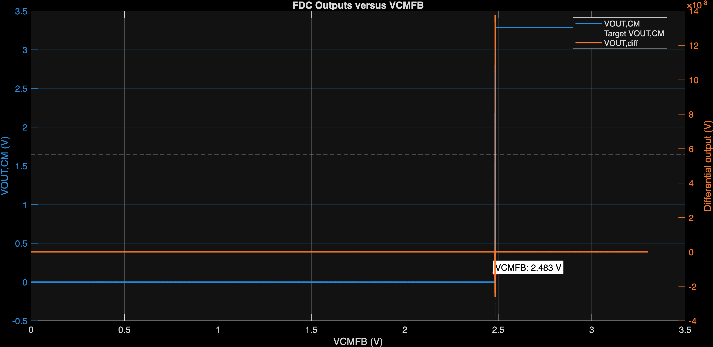

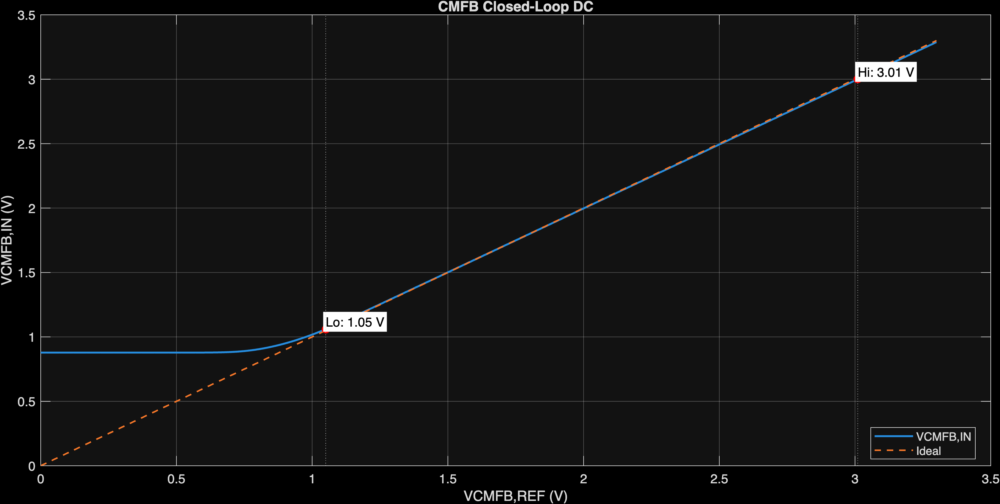

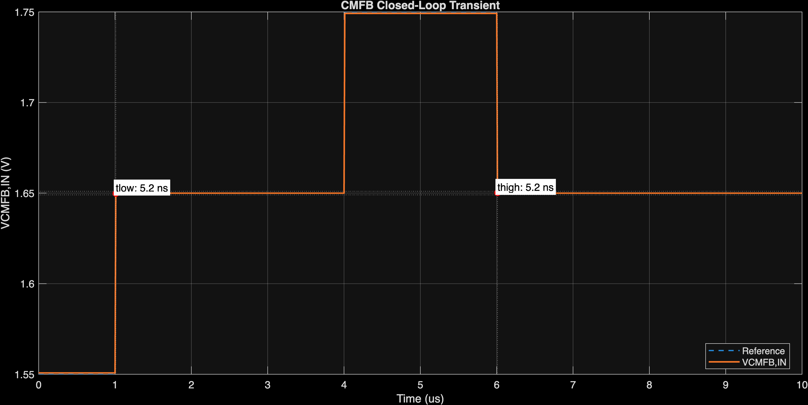

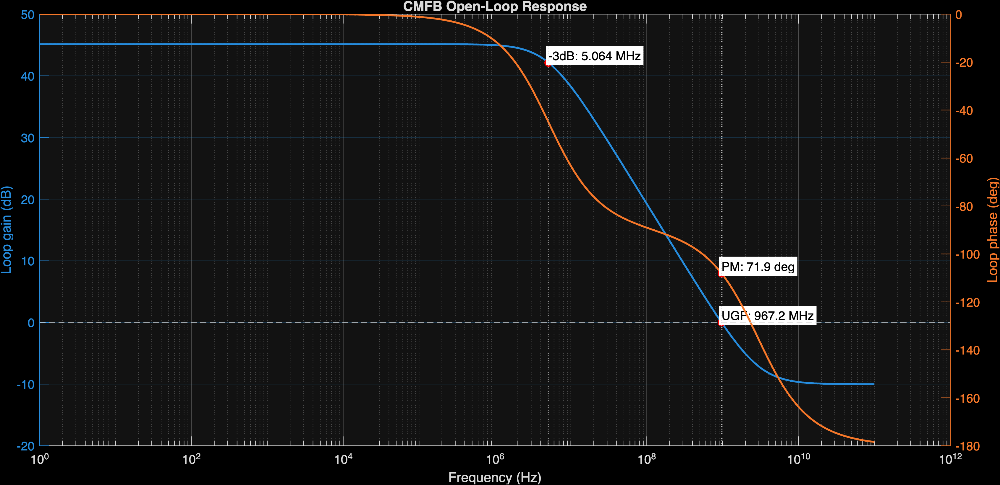

## All 45 PVT corners

### FD OTA: all 45 PVT corners

| Corner | Current (mA) | Gain (dB) | UGF (MHz) | PM (°) | CM error (mV) | Noise (µVrms) | Status |
| :--- | ---: | ---: | ---: | ---: | ---: | ---: | :---: |
| `NOMNOMNOM` | 1.604 | 88.699 | 12.447 | 72.649 | 0.395 | 3.086 | Pass |
| `NOMVLNOM` | 1.568 | 88.122 | 12.170 | 72.365 | 0.365 | 3.080 | Pass |
| `NOMVHNOM` | 1.633 | 89.195 | 12.662 | 72.892 | 0.415 | 3.091 | Pass |
| `NOMNOMTL` | 1.302 | 89.168 | 13.933 | 75.290 | -6.733 | 2.945 | Pass |
| `NOMNOMTH` | 1.861 | 87.741 | 10.253 | 69.080 | 10.536 | 3.356 | Pass |
| `NOMVLTL` | 1.269 | 88.659 | 13.588 | 74.999 | -6.769 | 2.935 | Pass |
| `NOMVLTH` | 1.825 | 87.088 | 10.059 | 68.858 | 10.504 | 3.354 | Pass |
| `NOMVHTL` | 1.329 | 89.601 | 14.211 | 75.543 | -6.702 | 2.954 | Pass |
| `NOMVHTH` | 1.890 | 88.308 | 10.402 | 69.273 | 10.555 | 3.358 | Pass |
| `FFNOMNOM` | 1.857 | 88.550 | 14.528 | 66.886 | -1.839 | 2.950 | Pass |
| `FFVLNOM` | 1.819 | 87.973 | 14.261 | 66.636 | -1.875 | 2.945 | Pass |
| `FFVHNOM` | 1.889 | 89.041 | 14.747 | 67.108 | -1.813 | 2.956 | Pass |
| `FFNOMTL` | 1.509 | 89.047 | 15.922 | 69.709 | -9.068 | 2.824 | Pass |
| `FFNOMTH` | 2.163 | 87.531 | 12.277 | 63.557 | 8.577 | 3.200 | Pass |
| `FFVLTL` | 1.474 | 88.537 | 15.600 | 69.419 | -9.112 | 2.815 | Pass |
| `FFVLTH` | 2.124 | 86.877 | 12.079 | 63.377 | 8.536 | 3.198 | Pass |
| `FFVHTL` | 1.539 | 89.474 | 16.195 | 69.968 | -9.030 | 2.832 | Pass |
| `FFVHTH` | 2.194 | 88.094 | 12.437 | 63.721 | 8.601 | 3.203 | Pass |
| `SSNOMNOM` | 1.400 | 88.731 | 10.764 | 77.375 | 2.748 | 3.222 | Pass |
| `SSVLNOM` | 1.362 | 88.152 | 10.448 | 77.055 | 2.724 | 3.215 | Pass |
| `SSVHNOM` | 1.427 | 89.234 | 10.983 | 77.633 | 2.762 | 3.228 | Pass |
| `SSNOMTL` | 1.136 | 89.203 | 12.319 | 79.673 | -4.287 | 3.066 | Pass |
| `SSNOMTH` | 1.619 | 87.784 | 8.645 | 73.673 | 12.633 | 3.512 | Pass |
| `SSVLTL` | 1.103 | 88.692 | 11.920 | 79.407 | -4.313 | 3.055 | Pass |
| `SSVLTH` | 1.581 | 87.126 | 8.435 | 73.396 | 12.610 | 3.511 | Pass |
| `SSVHTL` | 1.161 | 89.643 | 12.610 | 79.898 | -4.265 | 3.076 | Pass |
| `SSVHTH` | 1.645 | 88.358 | 8.788 | 73.895 | 12.643 | 3.514 | Pass |
| `FSNOMNOM` | 1.652 | 88.379 | 12.619 | 71.851 | 1.747 | 3.035 | Pass |
| `FSVLNOM` | 1.611 | 87.775 | 12.319 | 71.548 | 1.692 | 3.031 | Pass |
| `FSVHNOM` | 1.682 | 88.917 | 12.840 | 72.104 | 1.781 | 3.041 | Pass |
| `FSNOMTL` | 1.341 | 88.829 | 14.122 | 74.463 | -5.139 | 2.901 | Pass |
| `FSNOMTH` | 1.914 | 87.441 | 10.390 | 68.299 | 11.505 | 3.299 | Pass |
| `FSVLTL` | 1.306 | 88.295 | 13.765 | 74.159 | -5.189 | 2.892 | Pass |
| `FSVLTH` | 1.870 | 86.753 | 10.166 | 68.053 | 11.426 | 3.299 | Pass |
| `FSVHTL` | 1.369 | 89.304 | 14.405 | 74.723 | -5.100 | 2.909 | Pass |
| `FSVHTH` | 1.944 | 88.050 | 10.544 | 68.501 | 11.544 | 3.302 | Pass |
| `SFNOMNOM` | 1.556 | 88.952 | 12.257 | 73.436 | -1.017 | 3.135 | Pass |
| `SFVLNOM` | 1.520 | 88.413 | 11.978 | 73.161 | -1.018 | 3.128 | Pass |
| `SFVHNOM` | 1.583 | 89.369 | 12.471 | 73.672 | -1.017 | 3.141 | Pass |
| `SFNOMTL` | 1.263 | 89.453 | 13.722 | 76.111 | -8.393 | 2.989 | Pass |
| `SFNOMTH` | 1.808 | 87.953 | 10.106 | 69.853 | 9.515 | 3.411 | Pass |
| `SFVLTL` | 1.230 | 88.981 | 13.369 | 75.826 | -8.411 | 2.978 | Pass |
| `SFVLTH` | 1.773 | 87.337 | 9.916 | 69.642 | 9.530 | 3.409 | Pass |
| `SFVHTL` | 1.289 | 89.804 | 14.000 | 76.358 | -8.373 | 2.999 | Pass |
| `SFVHTH` | 1.835 | 88.443 | 10.254 | 70.037 | 9.502 | 3.414 | Pass |

## Generated artifacts

- [Analyzer](../../Measurement_Results/IC_Simulation/ANALOG_BLOCKS/FDOTA/FDOTA_Analyze.m)
- [Comparison table](../../Measurement_Results/IC_Simulation/ANALOG_BLOCKS/FDOTA/Results/FDOTA_table_report.csv)
- [Nominal summary](../../Measurement_Results/IC_Simulation/ANALOG_BLOCKS/FDOTA/Results/NOM.FDOTA_summary.csv)
- [Worst-case table](../../Measurement_Results/IC_Simulation/ANALOG_BLOCKS/FDOTA/Results/FDOTA_worst_case_report.csv)
- [MC run summary](../../Measurement_Results/IC_Simulation/ANALOG_BLOCKS/FDOTA/Results/FDOTA_MC_Run_Summary.csv)
- [MM summary](../../Measurement_Results/IC_Simulation/ANALOG_BLOCKS/FDOTA/Results/MM_FDOTA_MC_Summary.csv)
- [GL summary](../../Measurement_Results/IC_Simulation/ANALOG_BLOCKS/FDOTA/Results/GL_FDOTA_MC_Summary.csv)
- [FULL summary](../../Measurement_Results/IC_Simulation/ANALOG_BLOCKS/FDOTA/Results/FULL_FDOTA_MC_Summary.csv)
- [FDC nominal summary](../../Measurement_Results/IC_Simulation/ANALOG_BLOCKS/FDOTA/FDC/NOM.FDC_summary.csv)
- [CMFB nominal summary](../../Measurement_Results/IC_Simulation/ANALOG_BLOCKS/FDOTA/CMFB/NOM.CMFB_summary.csv)

## Scope limitation

These results are schematic-level simulations. Layout parasitics, package effects, extracted verification, and measured-silicon behavior are not included.
