# SEOTA Design and Verification Report

[← System-level project report](../../Project_Report.md)

| Item | Result |
| :--- | :--- |
| Verification level | Pre-layout schematic |
| Deterministic coverage | 45/45 PVT corners pass |
| Statistical coverage | MM, GL, and FULL: 200/200 valid runs each |
| Overall status | **Pass** |

## 1. Architecture

The SEOTA is a two-stage, Miller-compensated voltage amplifier.

- M1/M2 form the NMOS differential input pair.
- M3/M4 provide the PMOS first-stage active load; M5 supplies the tail current.
- M6/M7 form the second stage; M8 is the bias-reference device.
- A series $R_z$–$C_c$ path provides pole splitting and zero control.

Schematic source: [SEOTA](<../../Design_Files/IC Design/Schematic/ANALOG_BLOCKS/SEOTA/SEOTA.sch>).

The schematic shows the differential input stage, single-ended second stage, bias path, and Miller compensation network.

## 2. Audited sizing method

The supplied sizing worksheet provided the correct overall flow: specification, $g_m$, current, current density, width, estimated performance, and simulation. Its transistor polarities did not match the implemented SEOTA, and its fixed second-stage multiplier was not a general two-stage OTA equation. The calculation below uses the actual NMOS-input topology and treats the second-stage requirement as a pole/phase-margin constraint.

### 2.1 Design targets

The 15-MHz sizing target provides margin over the formal 8-MHz UGF requirement.

| Quantity | Value used for sizing | Signoff specification |
| :--- | ---: | ---: |
| Supply, $V_{DD}$ | 3.3 V | 3.0–3.6 V in PVT |
| Load, $C_L$ | 10 pF | 10 pF |
| Miller capacitor, $C_c$ | 2.00 pF | Implemented value |
| UGF, $f_u$ | 15 MHz target | $\ge 8$ MHz |
| Phase margin | 60° design target | $\ge 55^\circ$ |
| DC gain | — | $\ge 88$ dB |
| Slew rate | — | $\ge 6.5/5.0$ V/µs rise/fall |
| Bias reference | 40 µA | $40\pm10$ µA |

### 2.2 Governing equations

The $g_m/I_D$ method uses transconductance efficiency and normalized current density to convert a circuit requirement into device current and width [Silveira, Flandre, and Jespers](https://people.engr.tamu.edu/spalermo/ecen474/gm_ID_methodology_silveira_jssc_1996.pdf):

$$
I_D=\frac{g_m}{g_m/I_D},
\qquad
J_D=\frac{I_D}{W_{eff}},
\qquad
W_{eff}=\frac{I_D}{J_D}.
$$

For a conventional two-stage Miller-compensated OTA, the first-order unity-gain relation is [Berkeley EE 140, Lecture 22](https://www-inst.cs.berkeley.edu/~ee140/sp12/lectures/Lec22w.CMOSOpAmpCompensation.ee140.s12.ctn.pdf)

$$
\omega_u\approx\frac{g_{m1}}{C_c},
\qquad
g_{m1}\approx2\pi f_uC_c.
$$

The stage gains are estimated from lookup-table $g_m/g_{ds}$ values:

$$
A_1\approx\frac{g_{m1}}{g_{ds,1}+g_{ds,L1}},
\qquad
A_2\approx\frac{g_{m2}}{g_{ds,2}+g_{ds,L2}},
\qquad
A_0\approx A_1A_2.
$$

Ignoring the compensation zero and higher poles gives

$$
f_{p2}\approx\frac{g_{m2}}{2\pi(C_L+C_c)},
\qquad
PM\approx90^\circ-\tan^{-1}\left(\frac{f_u}{f_{p2}}\right).
$$

Therefore a useful lower bound is

$$
g_{m2}\gtrsim2\pi f_u(C_L+C_c)\tan(PM_{target}).
$$

This replaces the worksheet's empirical `kp2` multiplier. The non-dominant-pole approximation follows the classical two-stage model summarized by [P. E. Allen](https://www.pallen.ece.gatech.edu/Academic/ECE_6412/Spring_2004/L120-CompOpAmpsI%282UP%29.pdf).

The local 180-nm tables use `nfet_03v3` and `pfet_03v3` devices at a 1.65-V drain-to-source magnitude. Representative values at $g_m/I_D=10\ \text{V}^{-1}$ are:

| $L$ (µm) | NMOS $I_D/W$ (µA/µm) | NMOS $g_m/g_{ds}$ (dB) | NMOS $(g_m/I_D)f_T$ (GHz/V) | PMOS $I_D/W$ (µA/µm) | PMOS $g_m/g_{ds}$ (dB) | PMOS $(g_m/I_D)f_T$ (GHz/V) |
| ---: | ---: | ---: | ---: | ---: | ---: | ---: |
| 0.5 | 4.381 | 44.80 | 54.34 | 1.265 | 48.34 | 12.62 |
| 1.0 | 2.257 | 51.75 | 13.75 | 0.5309 | 56.26 | 2.668 |
| 2.0 | 1.055 | 55.27 | 3.067 | 0.2390 | 61.99 | 0.6172 |
| 4.0 | 0.4959 | 58.41 | 0.7020 | 0.1128 | 67.40 | 0.1501 |

At $g_m/I_D=10\ \text{V}^{-1}$, NMOS current density falls from 4.381 to 0.4959 µA/µm as length increases from 0.5 to 4 µm.

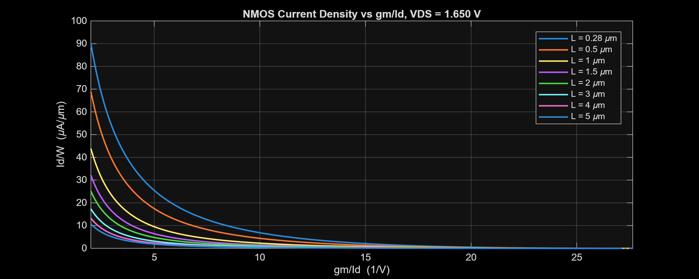

Over the same length change, NMOS intrinsic gain rises from 44.80 to 58.41 dB.

At $g_m/I_D=10\ \text{V}^{-1}$, PMOS current density falls from 1.265 to 0.1128 µA/µm as length increases from 0.5 to 4 µm.

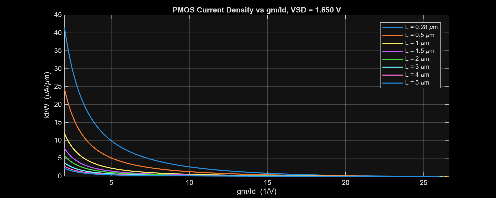

PMOS intrinsic gain rises from 48.34 to 67.40 dB over the same length range.

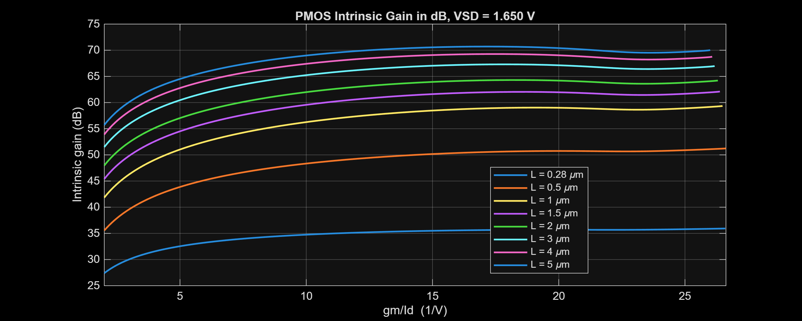

These tables guide sizing; they do not replace final-hierarchy operating-point data. Exact device $g_m/I_D$ depends on its in-circuit terminal and body voltages.

## 3. Input-stage calculation

### 3.1 Required input transconductance

The formal 8-MHz requirement needs

$$
g_{m1,min}=2\pi(8\ \text{MHz})(2.00\ \text{pF})
=100.5\ \mu\text{S}.
$$

Using the 15-MHz design target gives

$$
g_{m1,target}=2\pi(15\ \text{MHz})(2.00\ \text{pF})
=188.5\ \mu\text{S}.
$$

### 3.2 M1/M2 current and width

For M1/M2, select $L=4$ µm and $g_m/I_D=20\ \text{V}^{-1}$. The local NMOS table gives $J_D=0.03271\ \mu\text{A}/\mu\text{m}$ and $g_m/g_{ds}=707.60$.

$$
I_{D1}=\frac{188.5\ \mu\text{S}}{20\ \text{V}^{-1}}
=9.425\ \mu\text{A},
$$

$$
W_{1,calc}=\frac{9.425\ \mu\text{A}}
{0.03271\ \mu\text{A}/\mu\text{m}}
=288.1\ \mu\text{m}.
$$

The implemented $W_{eff}=400$ µm adds noise and mismatch margin. The 40.092-µA bias mirror predicts a 20.046-µA tail current and approximately 10.023 µA per input branch. Its current density is therefore

$$
J_{D1,impl}\approx\frac{10.023}{400}
=0.0251\ \mu\text{A}/\mu\text{m}.
$$

This density is below the printed $g_m/I_D=20\ \text{V}^{-1}$ row. Exact inversion level must therefore come from the final operating point, not extrapolation.

### 3.3 M3/M4 active-load width

Select $L=4$ µm and $g_m/I_D=8\ \text{V}^{-1}$ for the PMOS load. The table gives $J_D=0.1875\ \mu\text{A}/\mu\text{m}$.

$$
W_{3,calc}=\frac{9.425\ \mu\text{A}}
{0.1875\ \mu\text{A}/\mu\text{m}}
=50.3\ \mu\text{m}.
$$

The implemented value is 60 µm per device.

### 3.4 Implemented first-stage devices

`W_eff` is $W\times m$ because the listed devices use `nf=1`.

| Function | Devices | Type | $L$ (µm) | $W$ (µm) | $m$ | $W_{eff}$ (µm) |
| :--- | :---: | :---: | ---: | ---: | ---: | ---: |
| Input pair | M1, M2 | NMOS | 4.0 | 100 | 4 | 400 |
| Active load | M3, M4 | PMOS | 4.0 | 30 | 2 | 60 |
| Tail source | M5 | NMOS | 2.0 | 10 | 1 | 10 |
| Bias reference | M8 | NMOS | 2.0 | 20 | 1 | 20 |

The 4-µm devices favor intrinsic gain and matching. M5/M8 use a 1:2 width ratio, producing approximately 20 µA tail current from the 40-µA reference.

### 3.5 First-stage gain estimate

At the selected lookup points,

$$
g_{ds1}=\frac{188.5\ \mu\text{S}}{707.60}=0.266\ \mu\text{S},
$$

$$
g_{m3}=(8)(9.425\ \mu\text{A})=75.40\ \mu\text{S},
\qquad
g_{ds3}=\frac{75.40}{2017.65}=0.0374\ \mu\text{S}.
$$

Thus

$$
A_1\approx\frac{188.5}{0.266+0.0374}
=620.5\ \text{V/V}=55.86\ \text{dB}.
$$

## 4. Second-stage and compensation calculation

| Function | Device or element | Type | Implemented value |
| :--- | :---: | :---: | ---: |
| Second-stage pull-up | M6 | PMOS | $L=0.5$ µm, $W=50$ µm, $m=8$ |
| Second-stage pull-down | M7 | NMOS | $L=0.5$ µm, $W=100$ µm, $m=1$ |
| Miller capacitor | $C_c$ | MIM | Approximately 2.00 pF |
| Zero-setting resistor | $R_z$ | Poly | Approximately 3.8 kΩ |

### 4.1 Transconductance and current

For a 60° design target,

$$
g_{m2,min}=2\pi(15\ \text{MHz})(10\ \text{pF}+2\ \text{pF})\tan60^\circ
=1.959\ \text{mS}.
$$

Using the nominal total current as a current-budget check gives approximately

$$
I_{stage2}\approx825-40.092-20.046
=764.9\ \mu\text{A}.
$$

The implemented M6/M7 current densities are about 1.91 and 7.65 µA/µm. Both correspond to roughly $g_m/I_D\approx8\ \text{V}^{-1}$ near the lookup bias, so

$$
g_{m2}\approx(8)(764.9\ \mu\text{A})
=6.12\ \text{mS}>g_{m2,min}.
$$

### 4.2 Gain estimate

Using the $L=0.5$ µm lookup values $g_m/g_{ds}=225.52$ for PMOS and 165.52 for NMOS,

$$
A_2\approx
\frac{6.12\ \text{mS}}
{6.12\ \text{mS}/225.52+6.12\ \text{mS}/165.52}
=95.46\ \text{V/V}=39.60\ \text{dB}.
$$

The estimated total gain is

$$
A_0\approx(620.5)(95.46)=5.923\times10^4\ \text{V/V}
=95.45\ \text{dB}.
$$

### 4.3 Pole and phase-margin estimate

$$
f_{p2}\approx\frac{6.12\ \text{mS}}
{2\pi(12\ \text{pF})}=81.15\ \text{MHz},
$$

$$
PM_{2pole}\approx90^\circ-\tan^{-1}\left(\frac{15}{81.15}\right)
=79.53^\circ.
$$

This is an optimistic two-pole estimate. Device capacitances, the compensation zero, and higher poles are included only in simulation.

### 4.4 Nulling resistor

For the conventional series-$R_z$ Miller network, the signed zero is [Geiger, Allen, and Strader, Chapter 6](https://class.ece.iastate.edu/ee508/GAS_book/chap6.pdf)

$$
\omega_z\approx\frac{1}{C_c(1/g_{m2}-R_z)}.
$$

$R_z=1/g_{m2}$ moves the feed-forward zero to infinity; $R_z>1/g_{m2}$ moves it to the left half-plane. Here,

$$
\frac{1}{g_{m2}}\approx163\ \Omega,
$$

while the implemented $R_z\approx3.8$ kΩ gives the first-order estimate

$$
f_z\approx-21.9\ \text{MHz}.
$$

The negative sign denotes a left-half-plane zero. The large difference from $1/g_{m2}$ is intentional lead compensation and is closed by loop simulation, consistent with the compensation principles in [Ahuja's original paper](https://doi.org/10.1109/JSSC.1983.1052012).

### 4.5 Slew-rate check

For a classical Miller-compensated two-stage OTA, the first-stage current limits the large-signal charging rate [Johns and Martin, Chapter 6](https://www.d.umn.edu/~htang/ECE5211_doc_files/ECE5211_files/Chapter6.pdf):

$$
SR\approx\frac{I_{tail}}{C_c}.
$$

The required currents are

$$
I_{tail,rise}\ge(6.5\ \text{V}/\mu\text{s})(2\ \text{pF})=13\ \mu\text{A},
$$

$$
I_{tail,fall}\ge(5.0\ \text{V}/\mu\text{s})(2\ \text{pF})=10\ \mu\text{A}.
$$

The mirrored 20.046-µA tail predicts $SR\approx10.02$ V/µs. The 10-pF output load needs only 65 µA to meet the 6.5-V/µs rise specification, well below the estimated second-stage current.

### 4.6 Estimate-to-simulation comparison

| Metric | First-order estimate | Nominal simulation | Specification |
| :--- | ---: | ---: | ---: |
| DC gain | 95.45 dB | 96.522 dB | $\ge88$ dB |
| UGF | 15 MHz sizing target | 12.835 MHz | $\ge8$ MHz |
| Phase margin | 79.53° | 67.767° | $\ge55^\circ$ |
| Slew rate | 10.02 V/µs | 9.814 / 7.966 V/µs | $\ge6.5/5.0$ V/µs |
| Output range | Must be simulated | 0.108–3.235 V | Low $\le0.6$ V; high $\ge2.75$ V |

The gain estimate is close. The phase-margin estimate is deliberately optimistic because it omits parasitic poles and the exact zero. The square-law shortcut $V_{OV}\approx2/(g_m/I_D)$ is not used for range signoff; it is inaccurate in moderate/weak inversion and does not include body effect or real saturation voltage.

## 5. Integrated SEOTA verification

All 45 process, supply, and temperature corners pass.

| Metric | Specification | Nominal | Full-PVT worst case | Corner |
| :--- | :---: | ---: | ---: | :---: |
| Total current | ≤1.25 mA | 0.825 mA | 1.106 mA | `FFVHTH` |
| Total power | ≤4.5 mW | 2.721 mW | 3.982 mW | `FFVHTH` |
| DC gain | ≥88 dB | 96.522 dB | 93.988 dB | `FSVLTH` |
| UGF | ≥8 MHz | 12.835 MHz | 8.762 MHz | `SSVLTH` |
| Phase margin | ≥55° | 67.767° | 56.368° | `FFVLTH` |
| Input offset | ±2 mV | 3.193 µV | 12.092 µV | `FSVLTH` |
| CMRR, 60 / 150 Hz | ≥105 / 105 dB | 111.957 / 111.957 dB | 109.711 / 109.711 dB | `SSVLTH` |
| PSRR+, 60 / 150 Hz | ≥100 / 95 dB | 103.379 / 99.232 dB | 101.385 / 96.565 dB | `SSVLTL` / `SSVLTH` |
| PSRR−, 60 / 150 Hz | ≥100 / 95 dB | 103.379 / 99.232 dB | 101.385 / 96.565 dB | `SSVLTL` / `SSVLTH` |
| Input noise, 0.05–150 Hz | ≤2.5 µVrms | 1.873 µVrms | 2.189 µVrms | `SSVLTH` |
| Gain error | ±0.01% | −0.001% | −0.001% | `FSVLTH` |
| Input range | Low ≤0.6 V; high ≥2.75 V | 0.106–3.237 V | 0.429–2.815 V | `SSVHTL` / `FSVLTH` |
| Output range | Low ≤0.6 V; high ≥2.75 V | 0.108–3.235 V | 0.431–2.813 V | `SSVHTL` / `FSVLTH` |
| Slew rate, rise / fall | ≥6.5 / 5.0 V/µs | 9.814 / 7.966 V/µs | 6.927 / 5.636 V/µs | `SSVLTL` |
| Settling time | ≤225 ns | 163.4 ns | 213.4 ns | `SSVLTL` |

### 5.1 Open-loop response

At nominal conditions, the SEOTA provides 96.522 dB gain, 12.835 MHz UGF, and 67.767° phase margin. Full-PVT minima are 93.988 dB, 8.762 MHz, and 56.368°.

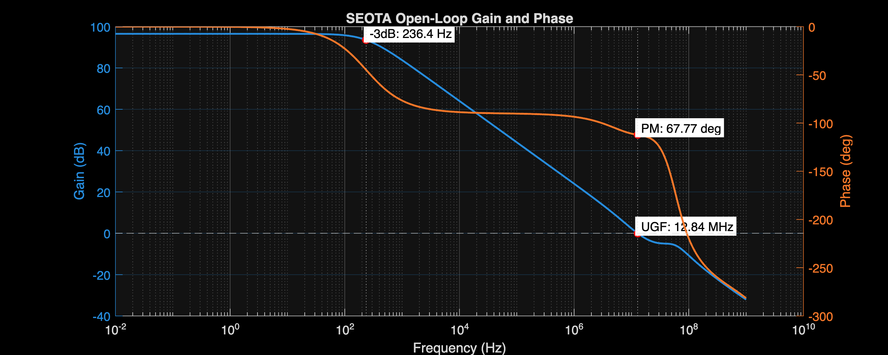

The nominal zero crossing gives 3.193 µV input offset. The largest deterministic offset is 12.092 µV, well inside the ±2-mV limit.

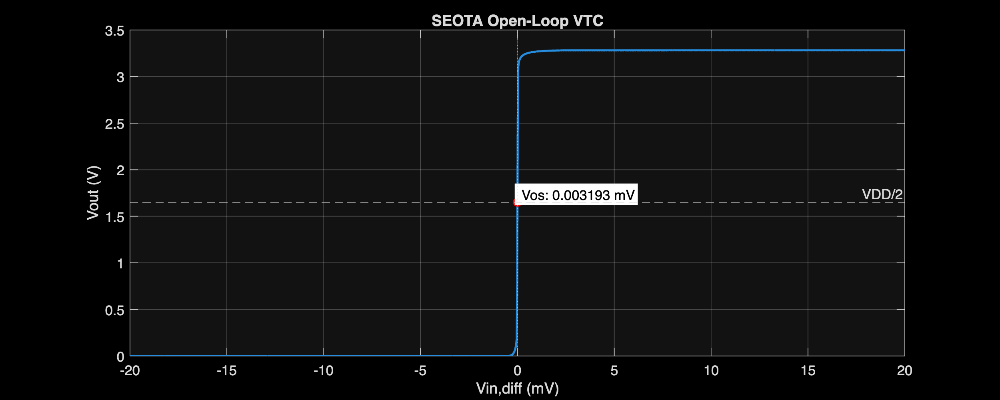

### 5.2 Rejection and noise

CMRR is 111.957 dB at 60 and 150 Hz nominal, with a 109.711-dB full-PVT minimum.

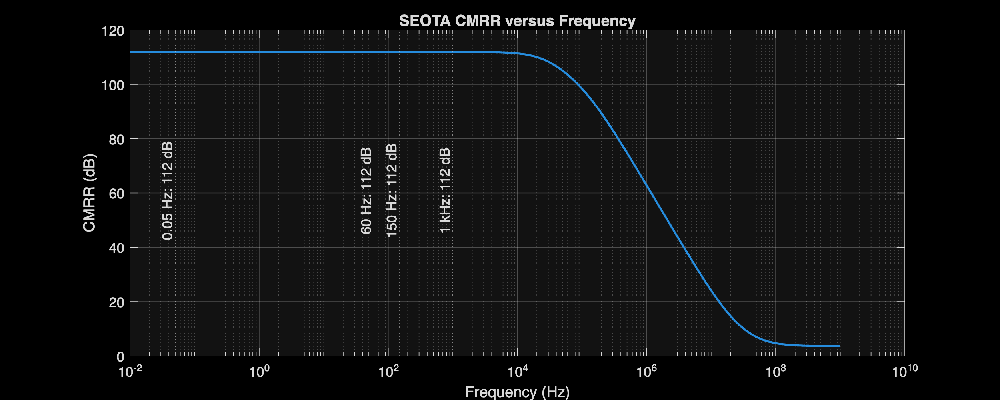

Nominal PSRR is 103.379 dB at 60 Hz and 99.232 dB at 150 Hz. The worst PVT values remain 101.385 dB and 96.565 dB for both supply polarities.

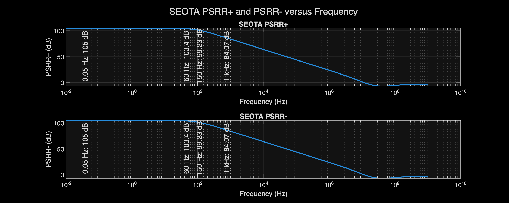

Integrated input noise is 1.873 µVrms nominal and 2.189 µVrms worst case over 0.05–150 Hz.

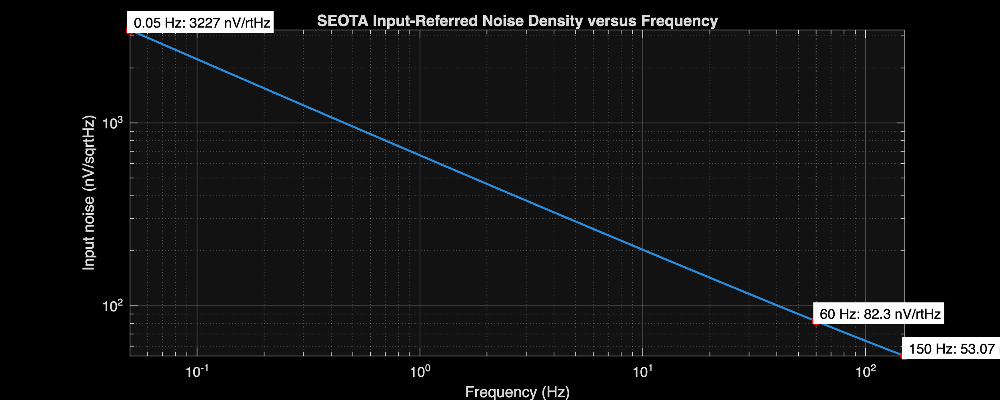

### 5.3 Closed-loop range

At nominal conditions, the usable input range is 0.106–3.237 V and the output range is 0.108–3.235 V. Every headroom limit passes across PVT.

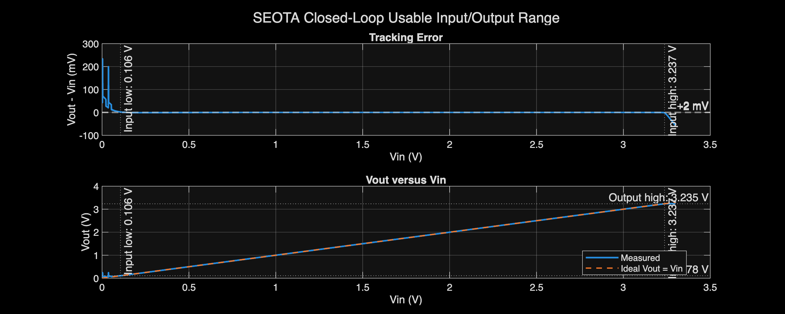

### 5.4 Transient response

With a 10-pF load, settling is 163.4 ns nominal and 213.4 ns worst case. Nominal rise/fall slew rates are 9.814/7.966 V/µs; worst-case values are 6.927/5.636 V/µs.

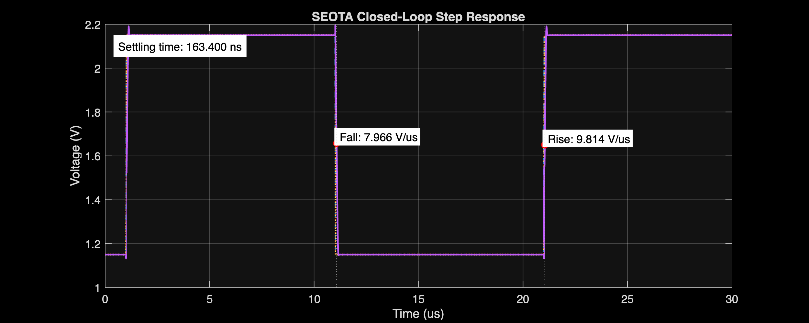

## 6. Monte Carlo verification

MM applies local mismatch, GL applies global variation, and FULL combines both. All 600 runs are valid and pass the joint limits.

| Mode | Valid runs | Current maximum (mA) | Gain minimum (dB) | UGF minimum (MHz) | PM minimum (°) | Offset range (µV) | Yield |
| :---: | ---: | ---: | ---: | ---: | ---: | :---: | ---: |
| MM | 200/200 | 0.869 | 96.382 | 12.285 | 67.374 | −976.478 to +1182.960 | 100% |
| GL | 200/200 | 0.871 | 95.477 | 11.947 | 64.251 | −11.636 to +15.683 | 100% |
| FULL | 200/200 | 0.895 | 95.488 | 11.764 | 64.231 | −970.439 to +1177.630 | 100% |

FULL-MC offset spans −970.439 to +1177.630 µV. The $\mu\pm3\sigma$ interval is −1.234 to +1.243 mV against the ±2-mV limit.

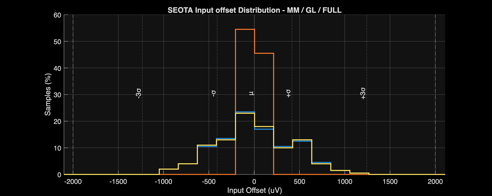

FULL-MC gain spans 95.488–97.396 dB. Its $\mu-3\sigma$ value is 95.256 dB against the 88-dB minimum.

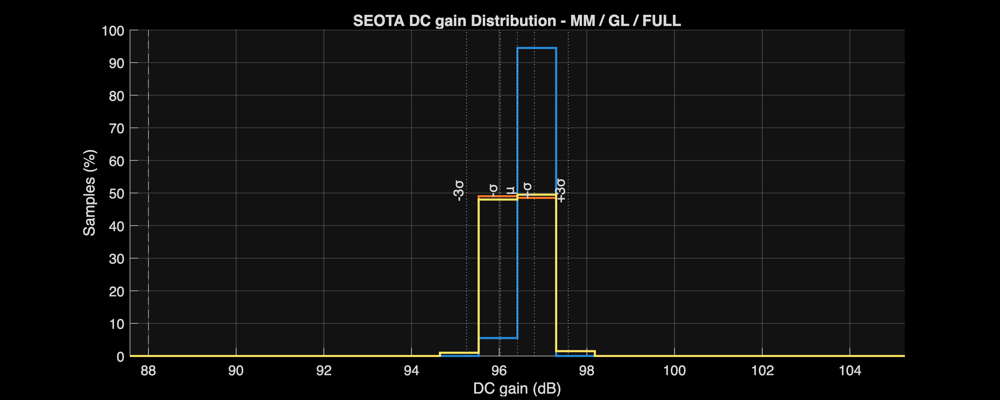

FULL-MC UGF spans 11.764–13.961 MHz. Its $\mu-3\sigma$ value is 11.613 MHz against the 8-MHz minimum.

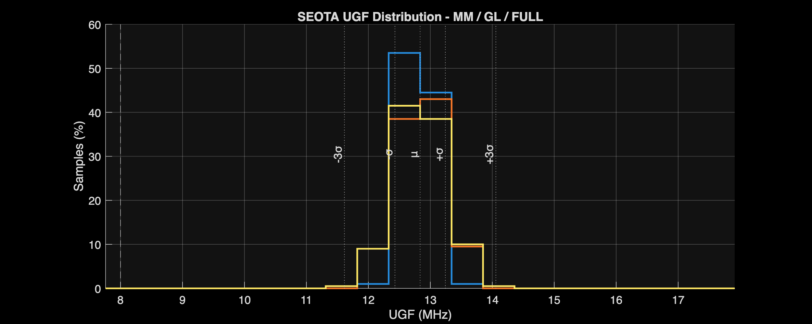

FULL-MC phase margin spans 64.231–73.006°. Its $\mu-3\sigma$ value is 63.334° against the 55° minimum.

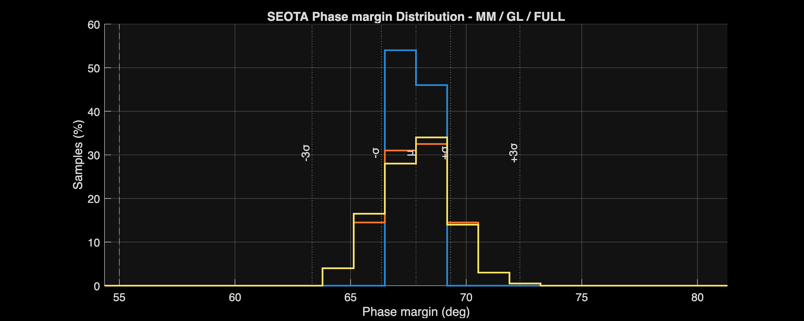

FULL-MC gain error spans −0.0025% to 0%, within the ±0.01% limit.

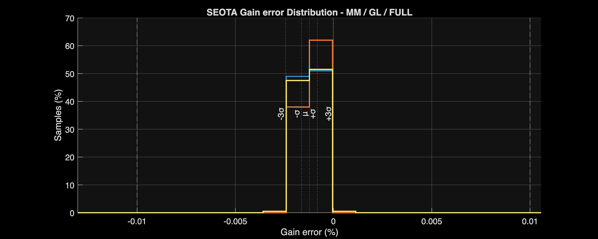

## 7. References and generated artifacts

### Design-method references

- F. Silveira, D. Flandre, and P. G. A. Jespers, “A $g_m/I_D$ Based Methodology for the Design of CMOS Analog Circuits and Its Application to the Synthesis of a Silicon-on-Insulator Micropower OTA,” *IEEE Journal of Solid-State Circuits*, 1996. [DOI: 10.1109/4.535416](https://doi.org/10.1109/4.535416)
- P. G. A. Jespers and B. Murmann, “Basic Sizing Using the $g_m/I_D$ Methodology,” in *Systematic Design of Analog CMOS Circuits*, Cambridge University Press, 2017. [DOI: 10.1017/9781108125840.003](https://doi.org/10.1017/9781108125840.003)
- P. G. A. Jespers and B. Murmann, “Lookup Table Generation and Usage,” in *Systematic Design of Analog CMOS Circuits*, 2017. [DOI: 10.1017/9781108125840.008](https://doi.org/10.1017/9781108125840.008)
- A. A. Youssef, B. Murmann, and H. Omran, “Analog IC Design Using Precomputed Lookup Tables: Challenges and Solutions,” *IEEE Access*, 2020. [DOI: 10.1109/ACCESS.2020.3010875](https://doi.org/10.1109/ACCESS.2020.3010875)
- B. K. Ahuja, “An Improved Frequency Compensation Technique for CMOS Operational Amplifiers,” *IEEE Journal of Solid-State Circuits*, 1983. [DOI: 10.1109/JSSC.1983.1052012](https://doi.org/10.1109/JSSC.1983.1052012)
- P. E. Allen, “Compensation of Op Amps—I,” Georgia Institute of Technology, ECE 6412 lecture notes. [PDF](https://www.pallen.ece.gatech.edu/Academic/ECE_6412/Spring_2004/L120-CompOpAmpsI%282UP%29.pdf)
- University of California, Berkeley, “CMOS Op Amp Compensation,” EE 140 Lecture 22. [PDF](https://www-inst.cs.berkeley.edu/~ee140/sp12/lectures/Lec22w.CMOSOpAmpCompensation.ee140.s12.ctn.pdf)
- D. A. Johns and K. Martin, *Analog Integrated Circuit Design*, Chapter 6 course copy hosted by the University of Minnesota Duluth. [PDF](https://www.d.umn.edu/~htang/ECE5211_doc_files/ECE5211_files/Chapter6.pdf)

### Generated artifacts

- [SEOTA analyzer](../../Measurement_Results/IC_Simulation/ANALOG_BLOCKS/SEOTA/SEOTA_Analyze.m)
- [Nominal and representative-corner results](../../Measurement_Results/IC_Simulation/ANALOG_BLOCKS/SEOTA/Reports/NOM.SEOTA_summary.csv)
- [Full-PVT worst-case results](../../Measurement_Results/IC_Simulation/ANALOG_BLOCKS/SEOTA/Reports/SEOTA_worst_case_report.csv)
- [Representative PVT table](../../Measurement_Results/IC_Simulation/ANALOG_BLOCKS/SEOTA/Reports/SEOTA_table_report.csv)
- [Monte Carlo run summary](../../Measurement_Results/IC_Simulation/ANALOG_BLOCKS/SEOTA/Reports/SEOTA_MC_Run_Summary.csv)
- [MM](../../Measurement_Results/IC_Simulation/ANALOG_BLOCKS/SEOTA/Reports/MM_SEOTA_MC_Summary.csv), [GL](../../Measurement_Results/IC_Simulation/ANALOG_BLOCKS/SEOTA/Reports/GL_SEOTA_MC_Summary.csv), and [FULL](../../Measurement_Results/IC_Simulation/ANALOG_BLOCKS/SEOTA/Reports/FULL_SEOTA_MC_Summary.csv) statistical summaries

## 8. Scope

These are schematic-level results. Layout parasitics, package effects, extracted verification, and measured-silicon behavior are not included.
