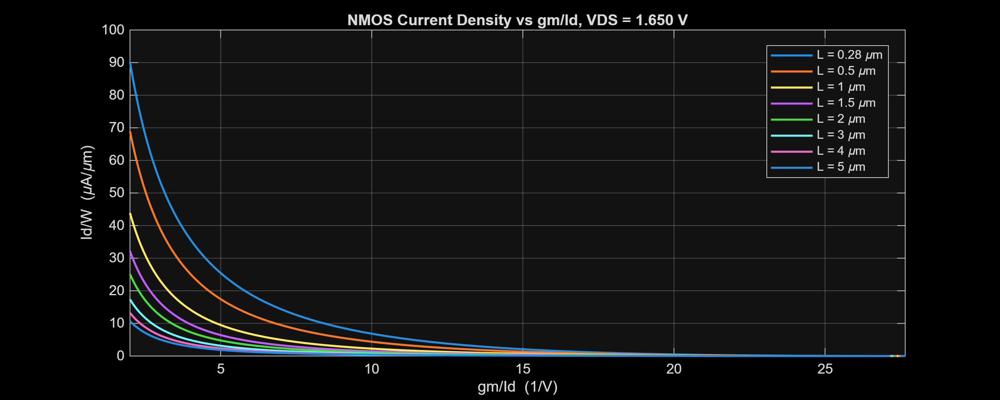
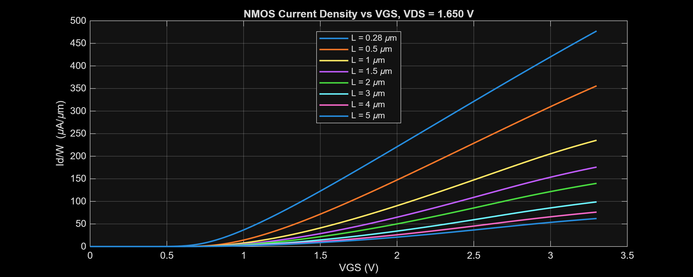
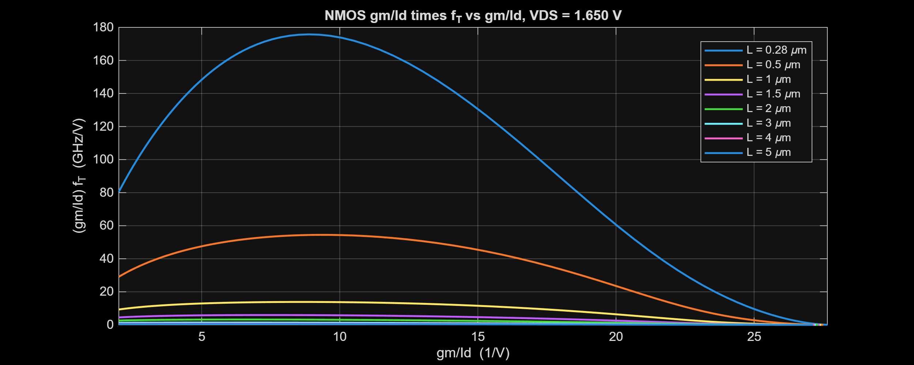
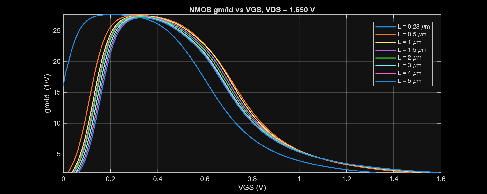
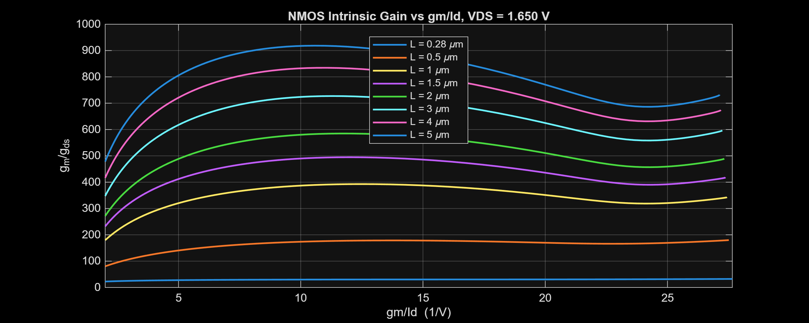
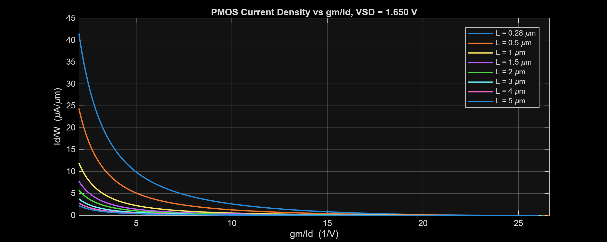
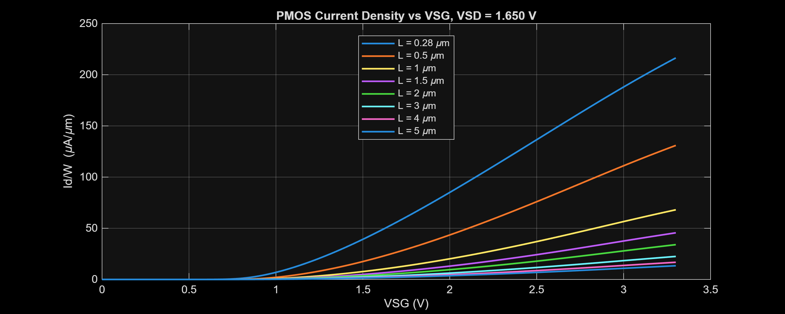
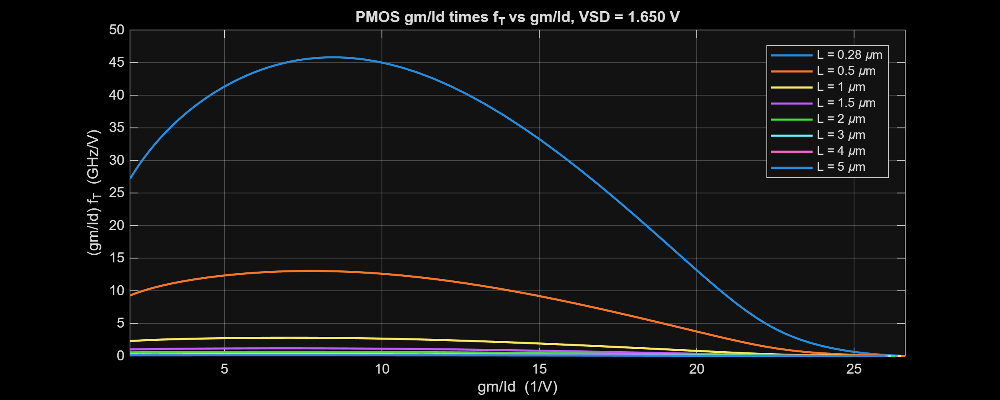
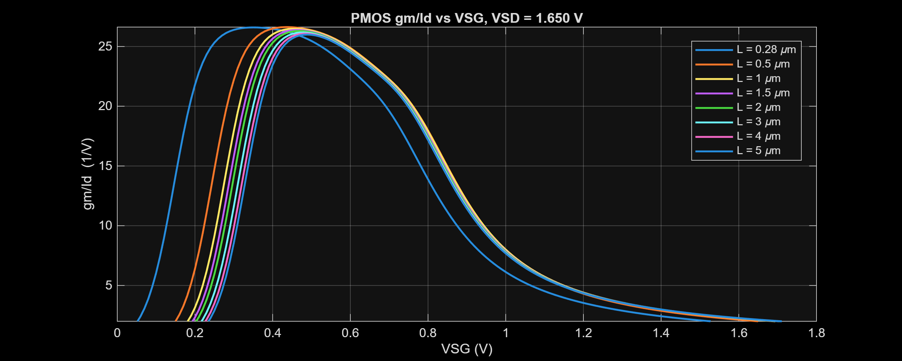
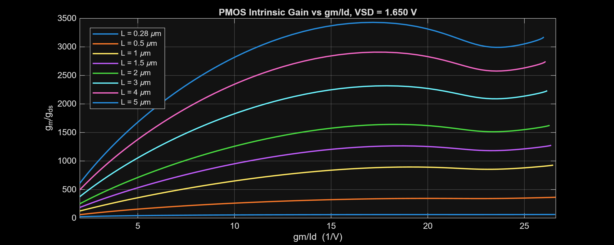

# $g_m/I_D$ Characterization Report

[← System-level project report](../../Project_Report.md)

## Purpose

The NMOS and PMOS characterization utilities provide the lookup data used to size the bias network and OTA devices. They report transconductance efficiency, current density, transition frequency, and intrinsic gain for the GlobalFoundries 180 nm MCU devices.

| Device | Analyzer | Status |
| :--- | :--- | :---: |
| NMOS | [`NMOS_Gm_Id.m`](../../Measurement_Results/IC_Simulation/Gm_Id/NMOS_Gm_Id/NMOS_Gm_Id.m) | Available |
| PMOS | [`PMOS_Gm_Id.m`](../../Measurement_Results/IC_Simulation/Gm_Id/PMOS_Gm_Id/PMOS_Gm_Id.m) | Available |

## NMOS plots

## PMOS plots

## Scope limitation

These plots are design-characterization aids rather than block-level pass/fail results. Device models and extracted-layout effects must be rechecked at the final physical-design stage.
